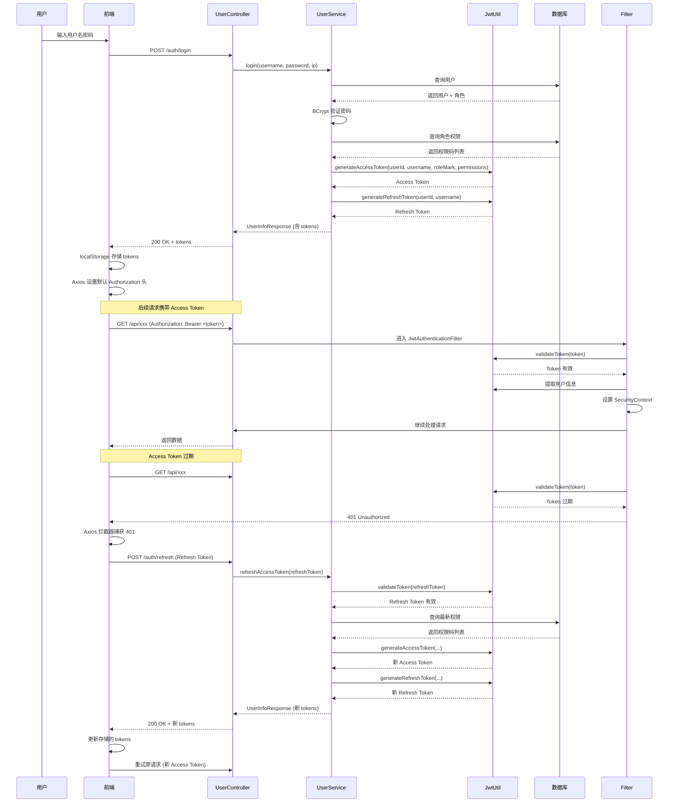

Process-Card 采用 **JWT（JSON Web Token）** 实现无状态认证，支持 Access Token 和 Refresh Token 双 Token 机制。

## Token 类型

### Access Token

**用途**：用于访问受保护的 API 资源
**有效期**：1 小时（3600000 毫秒）
**包含信息**：

- `userId`：用户 ID
- `username`：用户名
- `roleMark`：角色标识（多个角色用逗号分隔）
- `permissions`：权限码列表
- `type`：`"access"`

### Refresh Token

**用途**：用于刷新 Access Token
**有效期**：7 天（604800000 毫秒）
**包含信息**：

- `userId`：用户 ID
- `username`：用户名
- `type`：`"refresh"`

## Token 结构

JWT 由三部分组成（用 `.` 分隔）：

```plaintext
Header.Payload.Signature
```

### Access Token Payload 示例

```json
{
  "sub": "admin",
  "userId": 1,
  "roleMark": "admin,developer",
  "permissions": ["11", "12", "13", "21", "22", "31", "41", "42"],
  "type": "access",
  "iat": 1706000000,
  "exp": 1706003600
}
```

### Refresh Token Payload 示例

```json
{
  "sub": "admin",
  "userId": 1,
  "type": "refresh",
  "iat": 1706000000,
  "exp": 1706604800
}
```

## 核心组件

### 1. JwtUtil - JWT 工具类

**文件路径**：`process-card-backend/src/main/java/com/ustb/develop/util/JwtUtil.java`

负责生成、解析、验证 JWT Token。

#### 关键配置

```java
@Component
public class JwtUtil {
    private final SecretKey secretKey;
    private final long accessTokenExpiration;  // 3600000 ms (1小时)
    private final long refreshTokenExpiration; // 604800000 ms (7天)

    public JwtUtil(
            @Value("${jwt.secret}") String secret,
            @Value("${jwt.access-token-expiration}") long accessTokenExpiration,
            @Value("${jwt.refresh-token-expiration}") long refreshTokenExpiration
    ) {
        this.secretKey = Keys.hmacShaKeyFor(secret.getBytes(StandardCharsets.UTF_8));
        this.accessTokenExpiration = accessTokenExpiration;
        this.refreshTokenExpiration = refreshTokenExpiration;
    }
}
```

#### 生成 Access Token

```java
public String generateAccessToken(Integer userId, String username,
                                   String roleMark, List<String> permissionCodes) {
    return Jwts.builder()
            .subject(username)
            .claim("userId", userId)
            .claim("roleMark", roleMark)
            .claim("permissions", permissionCodes)
            .claim("type", "access")
            .issuedAt(new Date())
            .expiration(new Date(System.currentTimeMillis() + accessTokenExpiration))
            .signWith(secretKey)  // HS256 签名
            .compact();
}
```

#### 生成 Refresh Token

```java
public String generateRefreshToken(Integer userId, String username) {
    return Jwts.builder()
            .subject(username)
            .claim("userId", userId)
            .claim("type", "refresh")
            .issuedAt(new Date())
            .expiration(new Date(System.currentTimeMillis() + refreshTokenExpiration))
            .signWith(secretKey)
            .compact();
}
```

#### 验证和解析 Token

```java
public boolean validateToken(String token) {
    try {
        parseToken(token);
        return true;
    } catch (JwtException | IllegalArgumentException e) {
        return false;
    }
}

public Claims parseToken(String token) {
    return Jwts.parser()
            .verifyWith(secretKey)
            .build()
            .parseSignedClaims(token)
            .getPayload();
}

public List<String> getPermissions(String token) {
    return parseToken(token).get("permissions", List.class);
}
```

### 2. JwtAuthenticationFilter - JWT 认证过滤器

**文件路径**：`process-card-backend/src/main/java/com/ustb/develop/filter/JwtAuthenticationFilter.java`

拦截所有请求，验证 JWT Token，并将用户信息设置到 `SecurityContext`。

#### 过滤器逻辑

```java
@Component
@RequiredArgsConstructor
public class JwtAuthenticationFilter extends OncePerRequestFilter {

    private final JwtUtil jwtUtil;

    @Override
    protected void doFilterInternal(HttpServletRequest request,
                                    HttpServletResponse response,
                                    FilterChain filterChain) throws ServletException, IOException {
        // 1. 提取 Authorization 头
        String authHeader = request.getHeader("Authorization");
        if (authHeader == null || !authHeader.startsWith("Bearer ")) {
            filterChain.doFilter(request, response);
            return;
        }

        String token = authHeader.substring(7);  // 去掉 "Bearer "

        try {
            // 2. 验证 Token 签名和有效期，确保是 Access Token
            if (jwtUtil.validateToken(token) && "access".equals(jwtUtil.getTokenType(token))) {
                // 3. 从 Token 中提取用户信息
                String username = jwtUtil.getUsername(token);
                Integer userId = jwtUtil.getUserId(token);
                String roleMark = jwtUtil.getRoleMark(token);
                List<String> permissions = jwtUtil.getPermissions(token);

                // 4. 创建 JwtUserDetails 对象
                JwtUserDetails userDetails = new JwtUserDetails(userId, username, roleMark, permissions);

                // 5. 创建认证令牌并设置到 SecurityContext
                UsernamePasswordAuthenticationToken authentication =
                        new UsernamePasswordAuthenticationToken(userDetails, null, userDetails.getAuthorities());
                authentication.setDetails(new WebAuthenticationDetailsSource().buildDetails(request));
                SecurityContextHolder.getContext().setAuthentication(authentication);
            }
        } catch (Exception e) {
            log.warn("JWT 认证失败: {}", e.getMessage());
            // 不设置 SecurityContext，后续会返回 401 Unauthorized
        }

        filterChain.doFilter(request, response);
    }
}
```

**关键点**：

- 继承 `OncePerRequestFilter` 确保每个请求只过滤一次
- 验证 Token 类型必须是 `access`（防止使用 Refresh Token 访问 API）
- 验证失败时不抛异常，而是让 Spring Security 返回 401

### 3. JwtUserDetails - 用户详情

**文件路径**：`process-card-backend/src/main/java/com/ustb/develop/dto/JwtUserDetails.java`

实现 Spring Security 的 `UserDetails` 接口，用于在 `SecurityContext` 中存储用户信息。

```java
public class JwtUserDetails implements UserDetails {

    private final Integer userId;
    private final String username;
    private final String roleMark;
    private final List<String> permissionCodes;

    public JwtUserDetails(Integer userId, String username, String roleMark, List<String> permissionCodes) {
        this.userId = userId;
        this.username = username;
        this.roleMark = roleMark;
        this.permissionCodes = permissionCodes;
    }

    @Override
    public Collection<? extends GrantedAuthority> getAuthorities() {
        // 将权限码转换为 Spring Security 权限
        return permissionCodes.stream()
                .map(code -> new SimpleGrantedAuthority("PERMISSION_" + code))
                .toList();
    }

    @Override
    public String getPassword() {
        return null; // JWT 无状态，不需要密码
    }

    // 其他方法均返回 true（账户未过期、未锁定、凭证未过期、已启用）
}
```

### 4. SecurityConfig - 安全配置

**文件路径**：`process-card-backend/src/main/java/com/ustb/develop/config/SecurityConfig.java`

配置 Spring Security 安全链，集成 JWT 过滤器。

```java
@Configuration
@EnableWebSecurity
@RequiredArgsConstructor
public class SecurityConfig {

    private final JwtAuthenticationFilter jwtAuthenticationFilter;

    @Bean
    public SecurityFilterChain securityFilterChain(HttpSecurity http) throws Exception {
        http
                .cors(cors -> cors.configurationSource(corsConfigurationSource()))
                .csrf(AbstractHttpConfigurer::disable)  // 无状态 API，禁用 CSRF
                .sessionManagement(session ->
                    session.sessionCreationPolicy(SessionCreationPolicy.STATELESS))  // 无状态
                .authorizeHttpRequests(auth -> auth
                        // 公开路径：登录、注册、刷新、健康检查等
                        .requestMatchers(
                                new AntPathRequestMatcher(contextPath + "/auth/login"),
                                new AntPathRequestMatcher(contextPath + "/auth/register"),
                                new AntPathRequestMatcher(contextPath + "/auth/refresh"),
                                new AntPathRequestMatcher(contextPath + "/database/health-check"),
                                new AntPathRequestMatcher("/swagger-ui/**")
                        ).permitAll()
                        .anyRequest().authenticated()  // 其余路径需要认证
                )
                .exceptionHandling(ex -> ex
                        // 未认证请求返回 401（而非 403）
                        .authenticationEntryPoint(new HttpStatusEntryPoint(HttpStatus.UNAUTHORIZED))
                )
                .addFilterBefore(jwtAuthenticationFilter, UsernamePasswordAuthenticationFilter.class);
        return http.build();
    }

    @Bean
    public PasswordEncoder passwordEncoder() {
        return new BCryptPasswordEncoder();  // 密码加密
    }
}
```

**关键点**：

- **无状态**：`SessionCreationPolicy.STATELESS` 禁用 Session
- **CSRF 禁用**：无状态 API 不需要 CSRF 防护
- **401 错误**：未认证返回 401，触发前端刷新 Token
- **过滤器顺序**：JWT 过滤器在 `UsernamePasswordAuthenticationFilter` 之前

## 完整认证流程



## 登录实现

### UserService.login()

**文件路径**：`process-card-backend/src/main/java/com/ustb/develop/service/UserService.java:39-86`

```java
public UserInfoResponse login(String username, String password, String ipAddress) {
    // 1. 查询用户
    User user = userRepository.findUserByUsername(username)
            .orElseThrow(() -> {
                loginAttemptService.recordAttempt(username, ipAddress, false);
                return new ResourceNotFoundException("用户名 " + username + " 不存在");
            });

    // 2. 检查账户是否被锁定
    if (loginAttemptService.isAccountLocked(user)) {
        log.warn("账户 {} 已被锁定，拒绝登录", username);
        throw new ResourceNotFoundException("账户已被锁定，请稍后再试");
    }

    // 3. 验证密码（BCrypt）
    if (passwordEncoder.matches(password, user.getPassword())) {
        // 4. 记录成功登录
        loginAttemptService.recordAttempt(username, ipAddress, true);

        // 5. 获取用户所有角色标识
        List<String> roleMarks = user.getRoles().stream()
                .map(Role::getRoleMark)
                .toList();

        // 6. 聚合所有角色的权限码列表
        List<String> permissionCodes = user.getRoles().stream()
                .flatMap(role -> roleService.getRolePermissionCodes(role.getRoleId()).stream())
                .distinct()
                .toList();

        // 7. 生成 JWT
        String accessToken = jwtUtil.generateAccessToken(
            user.getUserId(),
            user.getUsername(),
            String.join(",", roleMarks),  // 多个角色用逗号分隔
            permissionCodes
        );
        String refreshToken = jwtUtil.generateRefreshToken(user.getUserId(), user.getUsername());

        // 8. 返回用户信息和 tokens
        return new UserInfoResponse(
                user.getUsername(),
                user.getEmail(),
                user.getTelephone(),
                user.getDisplayName(),
                roleMarks,
                accessToken,
                refreshToken
        );
    } else {
        // 记录失败登录
        loginAttemptService.recordAttempt(username, ipAddress, false);
        throw new ResourceNotFoundException("用户名或密码错误");
    }
}
```

### UserController.login()

**文件路径**：`process-card-backend/src/main/java/com/ustb/develop/controller/UserController.java:32-37`

```java
@PostMapping("/login")
@Auditable(operationType = "LOGIN", targetResource = "USER", description = "用户登录")
public ResponseEntity<UserInfoResponse> login(@RequestBody LoginRequest loginRequest,
                                              jakarta.servlet.http.HttpServletRequest servletRequest) {
    String ipAddress = getClientIp(servletRequest);
    UserInfoResponse response = userService.login(loginRequest.username(), loginRequest.password(), ipAddress);
    return ResponseEntity.ok(response);
}
```

**API 端点**：`POST /auth/login`（注：实际路径取决于 `contextPath` 配置）

**请求体**：

```json
{
  "username": "admin",
  "password": "password123"
}
```

**响应体**：

```json
{
  "username": "admin",
  "email": "admin@example.com",
  "telephone": "13800138000",
  "displayName": "管理员",
  "roleMarks": ["admin", "developer"],
  "accessToken": "eyJhbGciOiJIUzI1NiJ9...",
  "refreshToken": "eyJhbGciOiJIUzI1NiJ9..."
}
```

## Token 刷新实现

### UserService.refreshAccessToken()

**文件路径**：`process-card-backend/src/main/java/com/ustb/develop/service/UserService.java:94-125`

```java
public UserInfoResponse refreshAccessToken(String refreshToken) {
    // 1. 验证 Refresh Token 签名、有效期和类型
    if (!jwtUtil.validateToken(refreshToken) || !"refresh".equals(jwtUtil.getTokenType(refreshToken))) {
        throw new ResourceNotFoundException("无效的 Refresh Token");
    }

    // 2. 从 Refresh Token 中提取用户名
    String username = jwtUtil.getUsername(refreshToken);
    User user = userRepository.findUserByUsername(username)
            .orElseThrow(() -> new ResourceNotFoundException("用户不存在"));

    // 3. 获取最新的角色和权限（可能已被管理员修改）
    List<String> roleMarks = user.getRoles().stream()
            .map(Role::getRoleMark)
            .toList();

    List<String> permissionCodes = user.getRoles().stream()
            .flatMap(role -> roleService.getRolePermissionCodes(role.getRoleId()).stream())
            .distinct()
            .toList();

    // 4. 生成新的 Access Token 和 Refresh Token
    String newAccessToken = jwtUtil.generateAccessToken(
        user.getUserId(),
        user.getUsername(),
        String.join(",", roleMarks),
        permissionCodes
    );
    String newRefreshToken = jwtUtil.generateRefreshToken(user.getUserId(), user.getUsername());

    return new UserInfoResponse(
            user.getUsername(),
            user.getEmail(),
            user.getTelephone(),
            user.getDisplayName(),
            roleMarks,
            newAccessToken,
            newRefreshToken
    );
}
```

**关键点**：

- 刷新时会重新查询数据库获取最新权限（支持动态权限更新）
- 同时生成新的 Refresh Token（双 Token 轮转）

### UserController.refresh()

**文件路径**：`process-card-backend/src/main/java/com/ustb/develop/controller/UserController.java:60-64`

```java
@PostMapping("/refresh")
public ResponseEntity<UserInfoResponse> refresh(@RequestBody RefreshTokenRequest request) {
    UserInfoResponse response = userService.refreshAccessToken(request.refreshToken());
    return ResponseEntity.ok(response);
}
```

**API 端点**：`POST /auth/refresh`

**请求体**：

```json
{
  "refreshToken": "eyJhbGciOiJIUzI1NiJ9..."
}
```

**响应体**：同登录响应（包含新的 Access Token 和 Refresh Token）

## 防暴力破解机制

### LoginAttemptService

**文件路径**：`process-card-backend/src/main/java/com/ustb/develop/service/LoginAttemptService.java`

#### 核心参数

- **最大失败次数**：5 次（`MAX_FAILED_ATTEMPTS`）
- **检测窗口**：30 分钟（`ATTEMPT_WINDOW_MINUTES`）
- **锁定时长**：15 分钟（`LOCK_DURATION_MINUTES`）

#### 实现逻辑

```java
@Service
@RequiredArgsConstructor
public class LoginAttemptService {

    private final LoginAttemptRepository loginAttemptRepository;
    private final UserRepository userRepository;

    private static final int MAX_FAILED_ATTEMPTS = 5;
    private static final int ATTEMPT_WINDOW_MINUTES = 30;
    private static final int LOCK_DURATION_MINUTES = 15;

    /**
     * 记录一次登录尝试
     */
    public void recordAttempt(String username, String ipAddress, boolean success) {
        LoginAttempt attempt = LoginAttempt.builder()
                .username(username)
                .ipAddress(ipAddress)
                .success(success)
                .build();
        loginAttemptRepository.save(attempt);

        if (!success) {
            checkAndLock(username);  // 失败时检查是否需要锁定
        }
    }

    /**
     * 检查连续失败次数，超过阈值则锁定账户
     */
    private void checkAndLock(String username) {
        LocalDateTime windowStart = LocalDateTime.now().minusMinutes(ATTEMPT_WINDOW_MINUTES);
        long failedCount = loginAttemptRepository.countByUsernameAndSuccessAndAttemptTimeAfter(
                username, false, windowStart);

        if (failedCount >= MAX_FAILED_ATTEMPTS) {
            log.warn("用户 {} 在 {} 分钟内连续登录失败 {} 次，账户将被锁定 {} 分钟",
                    username, ATTEMPT_WINDOW_MINUTES, failedCount, LOCK_DURATION_MINUTES);

            userRepository.findUserByUsername(username).ifPresent(user -> {
                user.setLockedUntil(LocalDateTime.now().plusMinutes(LOCK_DURATION_MINUTES));
                userRepository.save(user);
            });
        }
    }

    /**
     * 检查账户是否被锁定
     */
    public boolean isAccountLocked(User user) {
        if (user.getLockedUntil() == null) {
            return false;
        }
        if (user.getLockedUntil().isAfter(LocalDateTime.now())) {
            return true;  // 仍在锁定期内
        }
        // 锁定已过期，清除锁定标记
        user.setLockedUntil(null);
        userRepository.save(user);
        return false;
    }
}
```

#### 数据库表结构

**login_attempts** 表：

- `id`：主键
- `username`：登录用户名
- `ip_address`：登录 IP 地址
- `success`：是否成功
- `attempt_time`：尝试时间（默认当前时间）

**users** 表新增字段：

- `locked_until`：锁定截止时间（`DATETIME`，可为 NULL）

#### 工作流程

1. **记录尝试**：每次登录（成功/失败）都记录到 `login_attempts` 表
2. **失败计数**：失败时查询最近 30 分钟内的失败次数
3. **锁定账户**：达到 5 次失败，设置 `locked_until` 为当前时间 + 15 分钟
4. **检查锁定**：登录时先检查 `locked_until` 是否大于当前时间
5. **自动解锁**：锁定过期后自动清除 `locked_until` 字段

## 配置参数

在 `application.yaml` 中配置：

```yaml
jwt:
  secret: "your-256-bit-secret-key-here-must-be-at-least-32-characters"
  access-token-expiration: 3600000    # 1小时（毫秒）
  refresh-token-expiration: 604800000 # 7天（毫秒）

back-end:
  context_path: "/api/v1"  # API 路径前缀
```

## 常见问题

### 1. Token 被篡改会怎样？

JWT 使用 HMAC-SHA256 签名，篡改 Payload 会导致签名验证失败，`validateToken()` 返回 `false`，请求返回 401。

### 2. Token 泄露怎么办？

- **Access Token**：1 小时后自动过期
- **Refresh Token**：管理员可以在数据库中添加"黑名单"表，记录被泄露的 Token（需自行实现）
- **最佳实践**：
  - HTTPS 传输
  - 不在 URL 中传递 Token
  - 前端使用 `httpOnly` Cookie（可选）

### 3. 为什么刷新 Token 时重新查询权限？

支持动态权限更新：管理员修改用户角色/权限后，用户刷新 Token 即可生效，无需重新登录。

### 4. 为什么同时返回新的 Refresh Token？

双 Token 轮转（Token Rotation）：

- 每次刷新都生成新的 Refresh Token
- 旧 Refresh Token 失效（可选实现黑名单）
- 提高安全性，防止 Refresh Token 长期使用被窃取

### 5. 多设备登录如何处理？

当前实现支持多设备同时登录（无状态设计）。如需单设备登录：

- 在 Token 中添加 `deviceId`
- 登录时记录 `deviceId` 到数据库
- 验证时检查 `deviceId` 是否匹配

### 6. 如何强制用户下线？

实现 Token 黑名单（需自行开发）：

- 创建 `token_blacklist` 表
- 记录被吊销的 Token（JTI claim）
- `JwtAuthenticationFilter` 中检查黑名单

## 安全建议

1. **强密钥**：`jwt.secret` 至少 256 位，使用随机生成的密钥
2. **HTTPS**：生产环境必须使用 HTTPS 传输
3. **短有效期**：Access Token 不宜超过 1 小时
4. **敏感操作**：修改密码、绑定邮箱等操作需要重新验证密码
5. **日志审计**：使用 `@Auditable` 记录登录、刷新等操作
6. **IP 白名单**：对管理员账户可配置 IP 白名单

## 下一步

- 阅读 [权限系统](./permission-system) 了解权限验证流程
- 查看 [前端权限控制](../frontend/permission-control) 学习前端如何使用 Token
- 学习 [连接配置](../frontend/connection-config) 了解前端如何管理后端地址

---

**提示**：JWT 是无状态的，后端不存储 Token，所有认证信息都在 Token 中。这使得系统易于水平扩展，但也需要特别注意 Token 安全。
