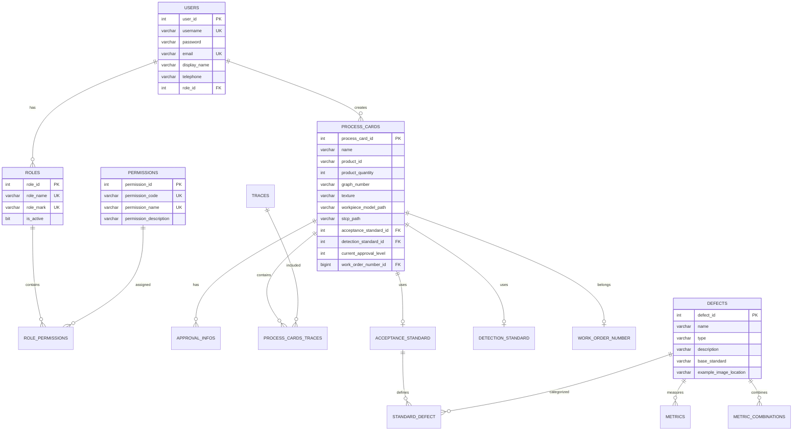

本文档介绍工艺卡管理系统的数据库设计，包括表结构、关系以及 Flyway 数据库迁移管理。

## 数据库概览

项目使用 **MySQL 8.0** 作为主数据库，不同环境下采用不同的数据库管理策略。

### 环境管理策略

::: info 开发流程
1. **开发环境**：基于 JPA 实体类，数据库表由 Hibernate 自动生成（`generate-ddl: true`）
2. **测试环境**：根据实体类编写 Flyway 迁移脚本，在测试数据库中验证
3. **生产环境**：使用 Flyway 迁移脚本进行数据库更新，先在本地生产环境测试，确认无误后部署到现场
:::

### 数据库配置

```yaml
spring:
  datasource:
    url: jdbc:mysql://127.0.0.1:3306/vt_process_card?createDatabaseIfNotExist=true
    username: vt_admin
    password: 123456
    driver-class-name: com.mysql.cj.jdbc.Driver
  jpa:
    properties:
      hibernate:
        dialect: org.hibernate.dialect.MySQL8Dialect
    generate-ddl: true
  flyway:
    enabled: true
    locations: classpath:db/migration
```

## 核心表结构

### 实体关系图



## 用户与权限模块

### users - 用户表

| 字段 | 类型 | 约束 | 说明 |
|------|------|------|------|
| `user_id` | INT | PK, AUTO_INCREMENT | 用户 ID |
| `username` | VARCHAR(255) | UNIQUE, NOT NULL | 用户名 |
| `password` | VARCHAR(255) | NOT NULL | 密码（BCrypt 加密） |
| `email` | VARCHAR(255) | UNIQUE, NOT NULL | 邮箱 |
| `display_name` | VARCHAR(255) | UNIQUE | 显示名称 |
| `telephone` | VARCHAR(255) | UNIQUE | 电话号码 |
| `role_id` | INT | FK | 关联角色 |

### roles - 角色表

| 字段 | 类型 | 约束 | 说明 |
|------|------|------|------|
| `role_id` | INT | PK, AUTO_INCREMENT | 角色 ID |
| `role_name` | VARCHAR(255) | UNIQUE, NOT NULL | 角色名称 |
| `role_mark` | VARCHAR(255) | UNIQUE, NOT NULL | 角色标识 |
| `is_active` | BIT | NOT NULL | 是否激活 |

**预置角色：**

| role_mark | role_name | 说明 |
|-----------|-----------|------|
| `developer` | 开发人员 | 拥有所有权限 |
| `admin` | 超级用户 | 管理员权限 |
| `process_engineer` | 编制人员 | 工艺卡编制 |
| `reviewer` | 审核人员 | 审核工艺卡 |
| `field_executor` | 操作人员 | 现场操作 |
| `user` | 访客人员 | 只读访问 |

### permissions - 权限表

| 字段 | 类型 | 约束 | 说明 |
|------|------|------|------|
| `permission_id` | INT | PK, AUTO_INCREMENT | 权限 ID |
| `permission_code` | VARCHAR(255) | UNIQUE, NOT NULL | 权限编码 |
| `permission_name` | VARCHAR(255) | UNIQUE, NOT NULL | 权限名称 |
| `permission_description` | VARCHAR(255) | | 权限描述 |

**权限编码规则：**

```
1 - 系统管理
├── 11 - 用户管理
├── 12 - 角色管理
├── 13 - 菜单管理
├── 14 - 权限管理
└── 15 - 用户密码修改

2 - 标定管理
├── 21 - 粗糙度标定信息查看
├── 22 - 长度标定信息查看
└── 23 - 标定信息管理

3 - 缺陷管理
├── 31 - 缺陷种类管理
├── 32 - 缺陷验收标准管理
└── 33 - 缺陷检测标准管理

4 - 产品轨迹规划
├── 41 - 新建工艺卡
├── 42 - 删除工艺卡
├── 43 - 修改工艺卡
├── 44 - 执行工艺卡
├── 45 - 审核工艺卡
├── 46 - 确认工艺卡
├── 47 - 导出工艺卡
└── 48 - 查看工艺卡
```

### role_permissions - 角色权限关联表

| 字段 | 类型 | 约束 | 说明 |
|------|------|------|------|
| `role_permission_id` | INT | PK, AUTO_INCREMENT | 关联 ID |
| `role_id` | INT | FK | 角色 ID |
| `permission_id` | INT | FK | 权限 ID |

## 工艺卡模块

### process_cards - 工艺卡表

| 字段 | 类型 | 约束 | 说明 |
|------|------|------|------|
| `process_card_id` | INT | PK, AUTO_INCREMENT | 工艺卡 ID |
| `name` | VARCHAR(255) | | 工艺卡名称 |
| `product_id` | VARCHAR(255) | | 产品编号 |
| `product_quantity` | INT | | 产品数量 |
| `graph_number` | VARCHAR(255) | | 图号 |
| `texture` | VARCHAR(255) | | 材质 |
| `description` | VARCHAR(255) | | 描述 |
| `workpiece_model_path` | VARCHAR(255) | | 工件模型路径（OBJ） |
| `stcp_path` | VARCHAR(255) | | STCP 文件路径 |
| `acceptance_standard_id` | INT | FK | 验收标准 ID |
| `detection_standard_id` | INT | FK | 检测标准 ID |
| `current_approval_level` | INT | | 当前审批级别 |
| `work_order_number_id` | BIGINT | FK | 工单号 ID |

### approval_infos - 审批信息表

| 字段 | 类型 | 约束 | 说明 |
|------|------|------|------|
| `id` | INT | PK, AUTO_INCREMENT | 审批 ID |
| `process_card_id` | INT | FK | 工艺卡 ID |
| `approved_by` | INT | FK | 审批人 ID |
| `approval_level` | INT | | 审批级别（0-创建, 1-审核, 3-确认） |
| `approval_type` | VARCHAR(255) | | 审批类型（create/review/confirm） |
| `approval_time` | DATETIME | | 审批时间 |
| `comments` | VARCHAR(255) | | 审批意见 |
| `sign_photo_path` | VARCHAR(255) | | 电子签名图片路径 |

### traces - 轨迹表

| 字段 | 类型 | 约束 | 说明 |
|------|------|------|------|
| `trace_id` | INT | PK, AUTO_INCREMENT | 轨迹 ID |
| `name` | VARCHAR(255) | | 轨迹名称 |
| `type` | VARCHAR(255) | | 轨迹类型（立式检测位/倾斜检测位） |
| `erd_file_path` | VARCHAR(255) | | ERD 文件路径 |
| `erp_file_path` | VARCHAR(255) | | ERP 文件路径 |

### work_order_number - 工单号表

| 字段 | 类型 | 约束 | 说明 |
|------|------|------|------|
| `id` | BIGINT | PK, AUTO_INCREMENT | 工单 ID |
| `searchable_number` | VARCHAR(255) | UNIQUE | 可搜索编号 |
| `customer_code` | INT | NOT NULL | 客户代码 |
| `order_date` | INT | NOT NULL | 订单日期 |
| `order_number` | INT | NOT NULL | 订单号 |
| `parts_number` | INT | NOT NULL | 零件号 |
| `product_unit` | TINYINT | NOT NULL | 产品单位 |

## 缺陷与标准模块

### defects - 缺陷类型表

| 字段 | 类型 | 约束 | 说明 |
|------|------|------|------|
| `defect_id` | INT | PK, AUTO_INCREMENT | 缺陷 ID |
| `name` | VARCHAR(255) | | 缺陷名称 |
| `type` | VARCHAR(255) | | 缺陷类型 |
| `description` | VARCHAR(255) | | 缺陷描述 |
| `base_standard` | VARCHAR(255) | | 基础标准（如 GB/T 41856.2-2012） |
| `example_image_location` | VARCHAR(255) | | 示例图片路径 |

**预置缺陷类型：**
- 擦伤、划伤、凹坑、氧化铁皮、裂纹

### metrics - 缺陷度量指标表

| 字段 | 类型 | 约束 | 说明 |
|------|------|------|------|
| `metric_id` | BIGINT | PK, AUTO_INCREMENT | 度量 ID |
| `defect_id` | INT | FK | 关联缺陷 |
| `name` | VARCHAR(255) | | 指标名称（长度/宽度/面积/长宽比） |
| `description` | VARCHAR(255) | | 描述 |
| `lower_limit` | FLOAT | | 下限值 |
| `upper_limit` | FLOAT | | 上限值 |

### acceptance_standard - 验收标准表

| 字段 | 类型 | 约束 | 说明 |
|------|------|------|------|
| `standard_id` | INT | PK, AUTO_INCREMENT | 标准 ID |
| `name` | VARCHAR(255) | | 标准名称 |
| `workpiece_name` | VARCHAR(255) | | 工件名称 |
| `inspect_method` | VARCHAR(255) | | 检测方法 |
| `inspect_equipment` | VARCHAR(255) | | 检测设备 |
| `inspect_state` | VARCHAR(255) | | 检测状态 |
| `inspect_surface_state` | VARCHAR(255) | | 表面状态 |
| `illumination_type` | VARCHAR(255) | | 光照类型 |
| `measurement_tool` | VARCHAR(255) | | 测量工具 |
| `inspect_personnel_qualification` | VARCHAR(255) | | 检验人员资质 |

### detection_standard - 检测标准表

| 字段 | 类型 | 约束 | 说明 |
|------|------|------|------|
| `id` | INT | PK, AUTO_INCREMENT | 标准 ID |
| `name` | VARCHAR(255) | UNIQUE, NOT NULL | 标准名称 |
| `validity_period` | DATETIME | NOT NULL | 有效期 |
| `robot_model` | VARCHAR(255) | NOT NULL | 机器人型号 |
| `rail_model` | VARCHAR(255) | NOT NULL | 轨道型号 |
| `camera_model` | VARCHAR(255) | NOT NULL | 相机型号 |
| `camera_lens_model` | VARCHAR(255) | NOT NULL | 镜头型号 |

## 标定模块

### roughness_calibration - 粗糙度标定表

| 字段 | 类型 | 约束 | 说明 |
|------|------|------|------|
| `id` | INT | PK, AUTO_INCREMENT | 标定 ID |
| `value` | FLOAT | | 粗糙度值（μm） |
| `erd_file_path` | VARCHAR(255) | | ERD 文件路径 |
| `erp_file_path` | VARCHAR(255) | | ERP 文件路径 |

### length_calibration - 长度标定表

| 字段 | 类型 | 约束 | 说明 |
|------|------|------|------|
| `id` | INT | PK, AUTO_INCREMENT | 标定 ID |
| `value` | FLOAT | | 长度值（mm） |

## Flyway 迁移管理

::: warning 使用范围
Flyway 迁移脚本仅用于 **测试环境** 和 **生产环境**。  
开发环境中，数据库表结构由 JPA 实体类自动生成。
:::

### 迁移文件命名规则

```
V{版本号}__{描述}.sql

示例：
V1__init_db.sql          # 初始化数据库
V2__add_file_table.sql   # 添加文件表
V3__update_user_role.sql # 更新用户角色
```

### 迁移文件位置

```
src/main/resources/
└── db/
    └── migration/
        └── V1__init_db.sql
```

### 执行迁移

Flyway 在应用启动时自动执行迁移：

```yaml
spring:
  flyway:
    enabled: true
    locations: classpath:db/migration
```

### 迁移历史表

Flyway 自动创建 `flyway_schema_history` 表记录迁移历史：

| 字段 | 说明 |
|------|------|
| `installed_rank` | 安装顺序 |
| `version` | 版本号 |
| `description` | 描述 |
| `type` | 类型（SQL/JAVA） |
| `script` | 脚本文件名 |
| `checksum` | 校验和 |
| `installed_by` | 安装者 |
| `installed_on` | 安装时间 |
| `execution_time` | 执行时间（毫秒） |
| `success` | 是否成功 |

### 常用 Flyway 命令

```bash
# 查看迁移状态
./mvnw flyway:info

# 执行迁移
./mvnw flyway:migrate

# 验证迁移
./mvnw flyway:validate

# 清理数据库（危险！）
./mvnw flyway:clean

# 修复迁移历史
./mvnw flyway:repair
```

## 数据库备份

系统通过定时任务自动备份数据库：

```yaml
database:
  back-up-dir: bk/  # 备份目录
```

备份文件命名：`backup_{yyyyMMdd_HHmmss}.sql`

备份存储位置：`process-card-backend/bk/`

## 最佳实践

### 1. 开发环境：实体类开发

在开发环境中，直接创建或修改 JPA 实体类：

```java
@Entity
@Table(name = "equipment")
public class Equipment {
    @Id
    @GeneratedValue(strategy = GenerationType.IDENTITY)
    private Integer equipmentId;
    
    @Column(nullable = false)
    private String name;
    
    // ... 其他字段
}
```

配置文件中启用自动建表：

```yaml
spring:
  jpa:
    generate-ddl: true
    hibernate:
      ddl-auto: update  # 开发环境使用
```

### 2. 测试环境：编写迁移脚本

根据实体类编写 Flyway 迁移脚本：

```sql
-- 使用事务（如果支持）
START TRANSACTION;

-- 添加新表
CREATE TABLE IF NOT EXISTS new_table (
    id INT PRIMARY KEY AUTO_INCREMENT,
    name VARCHAR(255) NOT NULL
);

-- 修改现有表
ALTER TABLE existing_table 
ADD COLUMN new_column VARCHAR(100) DEFAULT NULL;

COMMIT;
```

### 2. 回滚策略

由于 Flyway 社区版不支持自动回滚，建议：

1. 创建对应的撤销脚本 `U{版本号}__{描述}.sql`
2. 在 `V{版本号}` 脚本中添加注释说明如何手动回滚
3. 使用备份进行恢复

### 3. 生产环境注意事项

- 永远不要在生产环境使用 `flyway:clean`
- 迁移脚本一旦执行，不要修改
- 大表变更使用分批处理
- 添加列时提供默认值避免锁表

## 下一步

- [认证系统](/backend/authentication) - JWT 认证实现详解
- [权限系统](/backend/permission-system) - RBAC 权限控制机制
- [添加新权限](/development-guide/add-new-permission) - 如何添加新的权限
