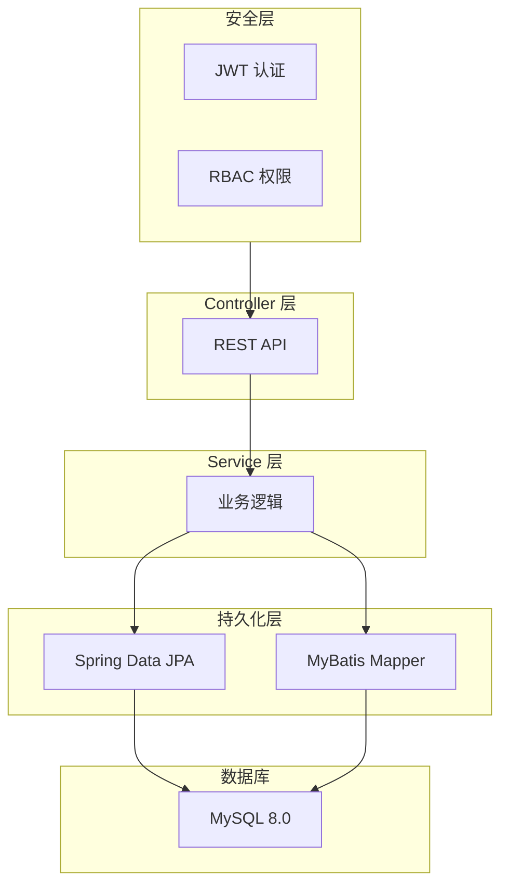

本章节介绍 Process-Card 后端的实现细节，包括项目结构、数据库设计、认证授权等核心功能。

## 章节概览

::card-group
  ::card{title="项目结构" icon="i-heroicons-folder-open" to="/backend/project-structure"}
  了解后端代码组织和分层架构
  ::

  ::card{title="数据库设计" icon="i-heroicons-circle-stack" to="/backend/database"}
  数据库表结构与 Flyway 迁移管理
  ::

  ::card{title="JWT 认证" icon="i-heroicons-key" to="/backend/authentication"}
  用户认证和 Token 管理机制
  ::

  ::card{title="权限系统" icon="i-heroicons-shield-check" to="/backend/permission-system"}
  三级权限控制完整实现 ⭐
  ::
::

## 技术栈

| 技术 | 版本 | 说明 |
|------|------|------|
| Java | 21 | LTS 版本，支持虚拟线程 |
| Spring Boot | 3.4.4 | 企业级开发框架 |
| Spring Security | 6.x | 安全框架 |
| Spring Data JPA | 3.x | ORM 框架 |
| MyBatis | 3.0.3 | SQL 映射框架 |
| MySQL | 8.0+ | 主数据库 |
| Flyway | 10.x | 数据库迁移 |
| JWT (jjwt) | 0.12.6 | Token 认证 |

## 架构图



## 核心概念

### 分层架构

后端采用经典的三层架构：

- **Controller**：处理 HTTP 请求，参数校验
- **Service**：业务逻辑，事务管理
- **Repository/Mapper**：数据持久化

### 双持久化方案

项目同时使用 JPA 和 MyBatis：

- **JPA**：简单 CRUD 操作
- **MyBatis**：复杂 SQL 查询

### RBAC 权限模型

采用用户 → 角色 → 权限的三级权限控制：

```plaintext
用户 (User)
  └── 角色 (Role)
        └── 权限 (Permission)
```

## 推荐阅读顺序

| 步骤 | 文档 | 说明 |
|------|------|------|
| 1 | [项目结构](/backend/project-structure) | 了解代码组织方式 |
| 2 | [数据库设计](/backend/database) | 理解数据模型 |
| 3 | [JWT 认证](/backend/authentication) | 掌握认证机制 |
| 4 | [权限系统](/backend/permission-system) | 深入权限控制 |

## 快速链接

- [前端开发](/frontend) - 了解前端实现
- [开发指南](/development-guide) - 学习如何扩展功能
- [环境搭建](/getting-started/environment-setup) - 配置开发环境
