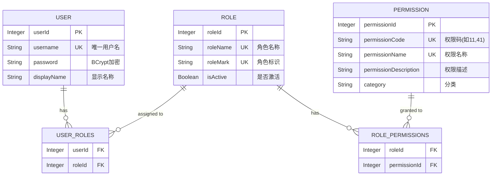
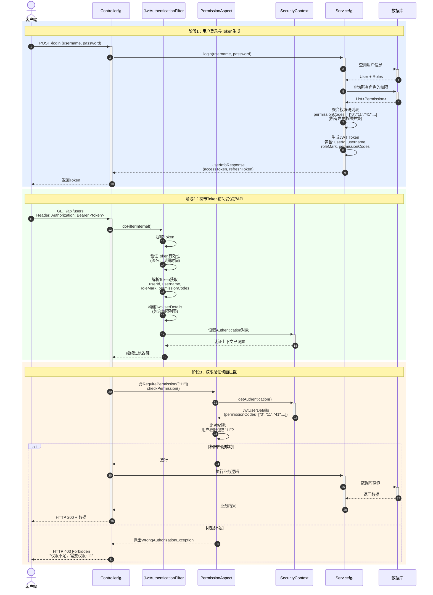

## 概述

Process-Card 实现了完整的 **RBAC（基于角色的访问控制）** 权限体系，采用三级模型：**用户 → 角色 → 权限**。

### 权限关系模型



**关系说明**：
- 一个用户可以拥有多个角色（多对多）
- 一个角色可以分配给多个用户（多对多）
- 一个角色可以拥有多个权限（多对多）
- 一个权限可以授予多个角色（多对多）
- 用户的最终权限 = 所有角色的权限并集

## 权限码体系

### 分级编码规则

权限码采用**数字字符串**编码，分为三个层级：

**文件路径**: `process-card-backend/src/main/java/com/ustb/develop/constant/PermissionCode.java`

```java
public class PermissionCode {
    // 第一级：系统首页
    public static final String DASHBOARD = "0";

    // 第二级：菜单组
    public static final String SYSTEM_MANAGEMENT = "1";          // 系统管理
    public static final String CALIBRATION_MANAGEMENT = "2";     // 标定管理
    public static final String DEFECT_MANAGEMENT = "3";          // 缺陷管理
    public static final String PROCESS_CARD_GROUP = "4";         // 工艺卡管理

    // 第三级：具体功能
    public static final String USER_MANAGEMENT = "11";           // 用户管理
    public static final String ROLE_MANAGEMENT = "12";           // 角色管理
    public static final String MENU_MANAGEMENT = "13";           // 菜单管理
    public static final String PERMISSION_MANAGEMENT = "14";     // 权限管理
    public static final String USER_PASSWORD_MANAGEMENT = "15";  // 密码管理

    public static final String ROUGHNESS_CALIBRATION_VIEW = "21";
    public static final String LENGTH_CALIBRATION_VIEW = "22";

    public static final String DEFECT_TYPE_MANAGEMENT = "31";
    public static final String DEFECT_ACCEPTANCE_STANDARD = "32";
    public static final String DEFECT_DETECTION_STANDARD = "33";
    public static final String MODEL_MANAGEMENT = "34";

    public static final String PROCESS_CARD_CREATE = "41";
    public static final String PROCESS_CARD_DELETE = "42";
    public static final String PROCESS_CARD_UPDATE = "43";
    public static final String PROCESS_CARD_EXECUTE = "44";
    public static final String PROCESS_CARD_REVIEW = "45";
    public static final String PROCESS_CARD_CONFIRM = "46";
    public static final String PROCESS_CARD_EXPORT = "47";
    public static final String PROCESS_CARD_VIEW = "48";
}
```

## 核心实体设计

### Permission（权限实体）

**文件路径**: `process-card-backend/src/main/java/com/ustb/develop/entity/Permission.java`

```java
@Entity
@Table(name = "permissions")
@Data
@Builder
@NoArgsConstructor
@AllArgsConstructor
public class Permission {
    @Id
    @GeneratedValue(strategy = GenerationType.IDENTITY)
    private Integer permissionId;

    @Column(unique = true, nullable = false)
    private String permissionCode;  // 权限码，如 "11", "41"

    @Column(unique = true, nullable = false)
    private String permissionName;  // 权限名称，如 "用户管理"

    private String permissionDescription;  // 权限描述

    @Column(nullable = false)
    private String category;  // 分类，如 "系统管理", "工艺卡管理"
}
```

### Role（角色实体）

**文件路径**: `process-card-backend/src/main/java/com/ustb/develop/entity/Role.java`

```java
@Entity
@Table(name = "roles")
@Data
@Builder
@NoArgsConstructor
@AllArgsConstructor
public class Role {
    @Id
    @GeneratedValue(strategy = GenerationType.IDENTITY)
    private Integer roleId;

    @Column(unique = true, nullable = false)
    private String roleName;  // 角色名称，如 "管理员"

    @Column(unique = true, nullable = false)
    private String roleMark;  // 角色标识，如 "admin", "reviewer"

    @Column(nullable = false)
    private Boolean isActive = true;

    @Transient  // 非持久化字段，运行时填充
    private List<Permission> permissions;
}
```

### User（用户实体）

```java
@Entity
@Table(name = "users")
public class User {
    @Id
    @GeneratedValue(strategy = GenerationType.IDENTITY)
    private Integer userId;

    @Column(unique = true, nullable = false)
    private String username;

    @Column(nullable = false)
    private String password;  // BCrypt 加密

    private String displayName;

    @ManyToMany(fetch = FetchType.EAGER)
    @JoinTable(
        name = "user_roles",
        joinColumns = @JoinColumn(name = "user_id"),
        inverseJoinColumns = @JoinColumn(name = "role_id")
    )
    private Set<Role> roles;  // 用户的角色集合
}
```

## 权限验证流程

### 流程图解



**流程说明**：

1. **登录阶段**：用户登录时，系统聚合所有角色的权限码，生成包含权限列表的JWT Token
2. **认证阶段**：每次API请求时，JWT过滤器验证Token并将用户信息（含权限）注入SecurityContext
3. **授权阶段**：权限切面拦截`@RequirePermission`注解的方法，验证用户是否拥有所需权限

### 1. JWT Token 生成

**登录时生成包含权限的 Token**：

**文件路径**: `process-card-backend/src/main/java/com/ustb/develop/service/UserService.java`

```java
public UserInfoResponse login(String username, String password) {
    // 1. 验证用户名密码
    User user = userRepository.findByUsername(username)
        .orElseThrow(() -> new IllegalArgumentException("用户不存在"));
    
    if (!passwordEncoder.matches(password, user.getPassword())) {
        throw new IllegalArgumentException("密码错误");
    }

    // 2. 聚合用户所有角色的权限码
    List<String> permissionCodes = user.getRoles().stream()
        .flatMap(role -> roleService.getRolePermissionCodes(role.getRoleId()).stream())
        .distinct()
        .toList();

    // 3. 生成 JWT Token（包含权限码列表）
    String accessToken = jwtUtil.generateAccessToken(
        user.getUserId(),
        user.getUsername(),
        String.join(",", roleMarks),
        permissionCodes  // 关键：权限码列表写入Token
    );

    return UserInfoResponse.builder()
        .accessToken(accessToken)
        .refreshToken(refreshToken)
        .build();
}
```

### 2. JWT 过滤器验证

**文件路径**: `process-card-backend/src/main/java/com/ustb/develop/filter/JwtAuthenticationFilter.java`

```java
@Component
public class JwtAuthenticationFilter extends OncePerRequestFilter {
    
    @Override
    protected void doFilterInternal(HttpServletRequest request, 
                                   HttpServletResponse response,
                                   FilterChain filterChain) {
        // 1. 从请求头提取 Token
        String token = extractToken(request);
        
        if (token != null && jwtUtil.validateToken(token)) {
            // 2. 从 Token 解析用户信息和权限
            String username = jwtUtil.getUsername(token);
            Integer userId = jwtUtil.getUserId(token);
            String roleMark = jwtUtil.getRoleMark(token);
            List<String> permissions = jwtUtil.getPermissions(token);  // 提取权限码列表
            
            // 3. 构建 Spring Security 认证对象
            JwtUserDetails userDetails = new JwtUserDetails(
                userId, username, roleMark, permissions
            );
            
            UsernamePasswordAuthenticationToken authentication = 
                new UsernamePasswordAuthenticationToken(
                    userDetails, null, userDetails.getAuthorities()
                );
            
            // 4. 设置到 SecurityContext
            SecurityContextHolder.getContext().setAuthentication(authentication);
        }
        
        filterChain.doFilter(request, response);
    }
}
```

### 3. 权限注解

**文件路径**: `process-card-backend/src/main/java/com/ustb/develop/annotation/RequirePermission.java`

```java
@Target(ElementType.METHOD)
@Retention(RetentionPolicy.RUNTIME)
@Documented
public @interface RequirePermission {
    /**
     * 所需权限码（支持多个，用户只需拥有其中任一即可）
     */
    String[] value();
}
```

### 4. 权限切面拦截

**文件路径**: `process-card-backend/src/main/java/com/ustb/develop/aspect/PermissionAspect.java`

```java
@Aspect
@Component
public class PermissionAspect {
    
    @Before("@annotation(requirePermission)")
    public void checkPermission(JoinPoint joinPoint, RequirePermission requirePermission) {
        // 1. 从 SecurityContext 获取当前用户
        Authentication authentication = SecurityContextHolder.getContext().getAuthentication();
        
        if (authentication == null || 
            !(authentication.getPrincipal() instanceof JwtUserDetails userDetails)) {
            throw new WrongAuthorizationException("未认证，请先登录");
        }
        
        // 2. 获取注解要求的权限
        String[] requiredPermissions = requirePermission.value();
        
        // 3. 获取用户拥有的权限
        List<String> userPermissions = userDetails.getPermissionCodes();
        
        // 4. 权限匹配（OR 逻辑：拥有任一权限即可）
        boolean hasPermission = Arrays.stream(requiredPermissions)
            .anyMatch(userPermissions::contains);
        
        if (!hasPermission) {
            throw new WrongAuthorizationException(
                "权限不足，需要以下权限之一：" + String.join(", ", requiredPermissions)
            );
        }
    }
}
```

## Controller 使用示例

### 权限管理 Controller

**文件路径**: `process-card-backend/src/main/java/com/ustb/develop/controller/PermissionController.java`

```java
@Tag(name = "权限管理")
@RestController
@RequiredArgsConstructor
@RequestMapping("${back-end.context_path}/permission")
public class PermissionController {

    private final PermissionService permissionService;

    /**
     * 获取所有权限
     * 要求：拥有权限管理权限（PermissionCode.PERMISSION_MANAGEMENT = "14"）
     */
    @RequirePermission(PermissionCode.PERMISSION_MANAGEMENT)
    @GetMapping("/all")
    public ResponseEntity<List<Permission>> findAllPermissions() {
        return ResponseEntity.ok(permissionService.findAllPermissions());
    }

    /**
     * 创建权限
     * 要求：拥有权限管理权限 + 记录审计日志
     */
    @Auditable(operationType = "CREATE", targetResource = "PERMISSION", description = "创建权限")
    @RequirePermission(PermissionCode.PERMISSION_MANAGEMENT)
    @PostMapping
    public ResponseEntity<Permission> createPermission(@RequestBody @Valid PermissionRequest request) {
        return ResponseEntity.ok(permissionService.createPermission(request));
    }

    /**
     * 更新权限
     */
    @Auditable(operationType = "UPDATE", targetResource = "PERMISSION")
    @RequirePermission(PermissionCode.PERMISSION_MANAGEMENT)
    @PutMapping("/{id}")
    public ResponseEntity<Permission> updatePermission(
            @PathVariable Integer id, 
            @RequestBody @Valid PermissionRequest request) {
        return ResponseEntity.ok(permissionService.updatePermission(id, request));
    }

    /**
     * 删除权限
     */
    @Auditable(operationType = "DELETE", targetResource = "PERMISSION")
    @RequirePermission(PermissionCode.PERMISSION_MANAGEMENT)
    @DeleteMapping("/{id}")
    public ResponseEntity<Void> deletePermission(@PathVariable Integer id) {
        permissionService.deletePermission(id);
        return ResponseEntity.ok().build();
    }
}
```

### 工艺卡 Controller（多权限示例）

```java
@RestController
@RequestMapping("${back-end.context_path}/process-card")
public class ProcessCardController {

    /**
     * 创建工艺卡
     * 要求：拥有创建权限（"41"）
     */
    @RequirePermission(PermissionCode.PROCESS_CARD_CREATE)
    @PostMapping
    public ResponseEntity<ProcessCard> create(@RequestBody ProcessCardRequest request) {
        // 业务逻辑
    }

    /**
     * 编辑工艺卡
     * 要求：拥有修改权限（"43"）或创建权限（"41"）
     * 注意：创建者可以编辑自己创建的工艺卡
     */
    @RequirePermission({
        PermissionCode.PROCESS_CARD_UPDATE,
        PermissionCode.PROCESS_CARD_CREATE
    })
    @PutMapping("/{id}")
    public ResponseEntity<ProcessCard> update(@PathVariable Long id, 
                                               @RequestBody ProcessCardRequest request) {
        // 业务逻辑：进一步检查是否为创建者
    }

    /**
     * 审核工艺卡
     * 要求：拥有审核权限（"45"）
     */
    @RequirePermission(PermissionCode.PROCESS_CARD_REVIEW)
    @PostMapping("/{id}/review")
    public ResponseEntity<Void> review(@PathVariable Long id) {
        // 审核逻辑
    }
}
```

## Service 层实现

### PermissionService（完整 CRUD）

**文件路径**: `process-card-backend/src/main/java/com/ustb/develop/service/PermissionService.java`

```java
@Service
@RequiredArgsConstructor
public class PermissionService {

    private final PermissionRepository permissionRepository;
    private final RolePermissionMapper rolePermissionMapper;

    /**
     * 创建权限（校验唯一性）
     */
    @Transactional
    public Permission createPermission(PermissionRequest request) {
        // 1. 校验权限码唯一性
        if (permissionRepository.existsByPermissionCode(request.getPermissionCode())) {
            throw new IllegalArgumentException("权限码已存在：" + request.getPermissionCode());
        }
        
        // 2. 校验权限名称唯一性
        if (permissionRepository.existsByPermissionName(request.getPermissionName())) {
            throw new IllegalArgumentException("权限名称已存在：" + request.getPermissionName());
        }
        
        // 3. 创建权限
        Permission permission = Permission.builder()
            .permissionCode(request.getPermissionCode())
            .permissionName(request.getPermissionName())
            .permissionDescription(request.getPermissionDescription())
            .category(request.getCategory())
            .build();
        
        return permissionRepository.save(permission);
    }

    /**
     * 更新权限
     */
    @Transactional
    public Permission updatePermission(Integer id, PermissionRequest request) {
        Permission permission = permissionRepository.findById(id)
            .orElseThrow(() -> new IllegalArgumentException("权限不存在"));
        
        // 校验权限名称唯一性（排除自身）
        permissionRepository.findByPermissionName(request.getPermissionName())
            .ifPresent(existing -> {
                if (!existing.getPermissionId().equals(id)) {
                    throw new IllegalArgumentException("权限名称已存在");
                }
            });
        
        // 更新（权限码不可修改）
        permission.setPermissionName(request.getPermissionName());
        permission.setPermissionDescription(request.getPermissionDescription());
        permission.setCategory(request.getCategory());
        
        return permissionRepository.save(permission);
    }

    /**
     * 删除权限（检查是否被角色使用）
     */
    @Transactional
    public void deletePermission(Integer id) {
        // 1. 检查权限是否被角色使用
        int count = rolePermissionMapper.countRolesByPermissionId(id);
        if (count > 0) {
            throw new IllegalStateException(
                "该权限正在被 " + count + " 个角色使用，无法删除"
            );
        }
        
        // 2. 删除权限
        permissionRepository.deleteById(id);
    }
}
```

## 数据库表结构

### role_permissions（角色权限关联表）

**MyBatis Mapper**: `process-card-backend/src/main/resources/mapper/RolePermissionMapper.xml`

```xml
<?xml version="1.0" encoding="UTF-8"?>
<!DOCTYPE mapper PUBLIC "-//mybatis.org//DTD Mapper 3.0//EN"
        "http://mybatis.org/dtd/mybatis-3-mapper.dtd">
<mapper namespace="com.ustb.develop.mapper.RolePermissionMapper">

    <!-- 查询角色的所有权限 -->
    <select id="findPermissionsByRoleId" resultType="Permission">
        SELECT p.*
        FROM permissions p
        INNER JOIN role_permissions rp ON p.permission_id = rp.permission_id
        WHERE rp.role_id = #{roleId}
    </select>

    <!-- 批量分配权限给角色 -->
    <insert id="insertBatch">
        INSERT INTO role_permissions (role_id, permission_id) VALUES
        <foreach collection="permissionIds" item="permissionId" separator=",">
            (#{roleId}, #{permissionId})
        </foreach>
    </insert>

    <!-- 删除角色的所有权限 -->
    <delete id="deleteByRoleId">
        DELETE FROM role_permissions WHERE role_id = #{roleId}
    </delete>

    <!-- 统计权限被使用的角色数 -->
    <select id="countRolesByPermissionId" resultType="int">
        SELECT COUNT(DISTINCT role_id)
        FROM role_permissions
        WHERE permission_id = #{permissionId}
    </select>
</mapper>
```

## 新增权限完整流程

### 后端步骤

1. **在 PermissionCode.java 添加常量**

```java
public static final String NEW_FEATURE = "99";
```

2. **数据库插入权限记录**

```sql
INSERT INTO permissions (permission_code, permission_name, permission_description, category)
VALUES ('99', '新功能', '新功能描述', '分类名称');
```

3. **Controller 方法添加注解**

```java
@RequirePermission(PermissionCode.NEW_FEATURE)
@GetMapping("/new-feature")
public ResponseEntity<?> newFeature() {
    // 业务逻辑
}
```

### 前端步骤（见前端权限控制文档）

## 常见问题

### Q1: 为什么权限检查用 OR 逻辑？

A: 允许灵活的权限组合。例如工艺卡编辑接口，拥有"修改权限"或"创建权限"的用户都可以访问，但在 Service 层进一步判断创建者身份。

### Q2: Token 中的权限列表如何更新？

A: Token 刷新时重新查询用户权限。权限变更后，用户需要重新登录或等待 Token 过期刷新才能生效。

### Q3: 如何实现数据级权限？

A: 在 Service 层增加逻辑判断。例如：

```java
if (!processCard.getCreatorId().equals(currentUserId) &&
    !userPermissions.contains(PermissionCode.PROCESS_CARD_UPDATE)) {
    throw new ForbiddenException("只能编辑自己创建的工艺卡");
}
```

## 下一步

- 阅读 [JWT 认证机制](./authentication) 了解 Token 生成
- 查看 [前端权限控制](../frontend/permission-control) 了解前端实现
- 实践 [新增权限指南](../development-guide/add-new-permission) 完成第一个功能

---

**提示**：权限系统是 Process-Card 的核心，务必理解 JWT Token 如何携带权限、切面如何拦截、如何新增权限。
