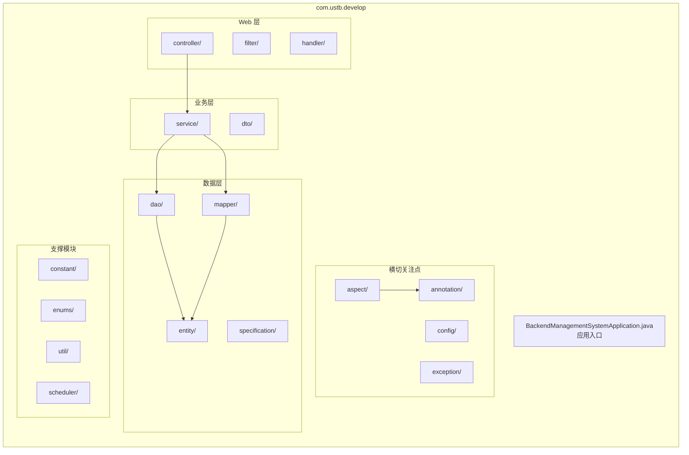
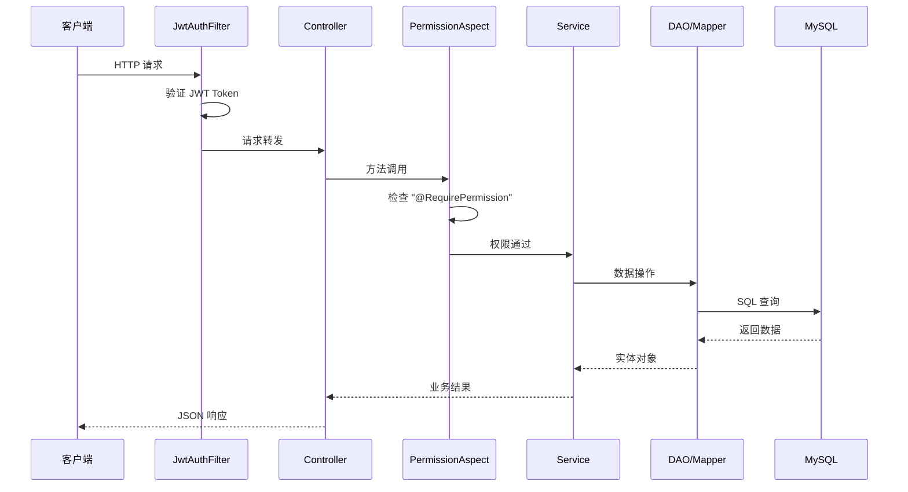

本文档介绍 `process-card-backend` 项目的目录结构和代码组织方式。

## 项目概览

```
process-card-backend/
├── src/
│   ├── main/
│   │   ├── java/com/ustb/develop/    # Java 源代码
│   │   └── resources/                 # 配置文件与资源
│   └── test/                          # 测试代码
├── bk/                                # 数据库备份文件
├── logs/                              # 日志文件
├── storage/                           # 文件存储
├── pom.xml                            # Maven 配置
└── mvnw                               # Maven Wrapper
```

## 源代码结构

项目采用标准的分层架构，源代码位于 `src/main/java/com/ustb/develop/` 目录下：



## 目录详解

### 📁 annotation/

自定义注解，用于 AOP 切面编程。

| 注解 | 说明 |
|------|------|
| `@RequirePermission` | 权限校验注解 |
| `@AuditLog` | 审计日志注解 |

```java
// 使用示例
@RequirePermission("PROCESS_CARD_CREATE")
@PostMapping("/process-cards")
public ResponseEntity<ProcessCard> create(@RequestBody ProcessCardDTO dto) {
    // ...
}
```

### 📁 aspect/

AOP 切面实现，处理横切关注点。

| 切面 | 说明 |
|------|------|
| `PermissionAspect` | 权限校验切面 |
| `AuditLogAspect` | 审计日志切面 |

### 📁 config/

Spring 配置类。

| 配置类 | 说明 |
|------|------|
| `SecurityConfig` | Spring Security 配置 |
| `JwtConfig` | JWT 配置 |
| `CorsConfig` | 跨域配置 |
| `WebSocketConfig` | WebSocket 配置 |
| `OpenApiConfig` | Swagger/OpenAPI 配置 |

### 📁 constant/

常量定义。

```java
public class ApiConstants {
    public static final String API_PREFIX = "/api/v1/vt-process-card-software";
    public static final String AUTH_HEADER = "Authorization";
    public static final String TOKEN_PREFIX = "Bearer ";
}
```

### 📁 controller/

REST API 控制器，处理 HTTP 请求。

| 控制器 | 路径 | 说明 |
|--------|------|------|
| `AuthController` | `/auth` | 认证相关 |
| `UserController` | `/users` | 用户管理 |
| `RoleController` | `/roles` | 角色管理 |
| `PermissionController` | `/permissions` | 权限管理 |
| `ProcessCardController` | `/process-cards` | 工艺卡管理 |
| `FileController` | `/files` | 文件管理 |
| `DefectController` | `/defects` | 缺陷管理 |
| `StandardController` | `/standards` | 标准管理 |
| `CalibrationController` | `/calibrations` | 校准管理 |

### 📁 dao/

数据访问对象，继承 `JpaRepository`。

```java
public interface ProcessCardRepository extends JpaRepository<ProcessCard, Integer> {
    List<ProcessCard> findByStatus(String status);
    
    @Query("SELECT p FROM ProcessCard p WHERE p.createdBy = :userId")
    List<ProcessCard> findByCreator(@Param("userId") Integer userId);
}
```

### 📁 dto/

数据传输对象，用于 API 请求/响应。

| DTO | 说明 |
|-----|------|
| `LoginRequest` / `LoginResponse` | 登录请求/响应 |
| `UserDTO` | 用户信息 |
| `ProcessCardDTO` | 工艺卡信息 |
| `FileUploadDTO` | 文件上传 |

### 📁 entity/

JPA 实体类，映射数据库表。

| 实体 | 对应表 | 说明 |
|------|--------|------|
| `User` | `users` | 用户 |
| `Role` | `roles` | 角色 |
| `Permission` | `permissions` | 权限 |
| `ProcessCard` | `process_cards` | 工艺卡 |
| `Defect` | `defects` | 缺陷 |
| `File` | `files` | 文件 |
| `AcceptanceStandard` | `acceptance_standard` | 验收标准 |
| `DetectionStandard` | `detection_standard` | 检测标准 |

### 📁 enums/

枚举类型定义。

```java
public enum ProcessCardStatus {
    DRAFT("草稿"),
    PENDING_REVIEW("待审核"),
    APPROVED("已批准"),
    REJECTED("已拒绝");
    
    private final String description;
}
```

### 📁 exception/

自定义异常与全局异常处理。

| 类 | 说明 |
|----|------|
| `BusinessException` | 业务异常 |
| `PermissionDeniedException` | 权限不足异常 |
| `GlobalExceptionHandler` | 全局异常处理器 |

### 📁 filter/

Servlet 过滤器。

| 过滤器 | 说明 |
|--------|------|
| `JwtAuthenticationFilter` | JWT 认证过滤器 |

### 📁 handler/

处理器类，如 WebSocket 消息处理。

### 📁 mapper/

MyBatis Mapper 接口，用于复杂 SQL 查询。

```java
@Mapper
public interface ProcessCardMapper {
    @Select("""
        SELECT p.*, u.username as creator_name 
        FROM process_cards p 
        LEFT JOIN users u ON p.created_by = u.id
        WHERE p.status = #{status}
        """)
    List<ProcessCardVO> findWithCreator(String status);
}
```

### 📁 scheduler/

定时任务。

| 任务 | 说明 |
|------|------|
| `DatabaseBackupScheduler` | 数据库定时备份 |
| `FileCleanupScheduler` | 过期文件清理 |
| `ChunkCleanupScheduler` | 分片上传清理 |

### 📁 service/

业务逻辑层，包含接口和实现。

```
service/
├── AuthService.java
├── UserService.java
├── ProcessCardService.java
├── FileService.java
└── impl/
    ├── AuthServiceImpl.java
    ├── UserServiceImpl.java
    ├── ProcessCardServiceImpl.java
    └── FileServiceImpl.java
```

### 📁 specification/

JPA Specification，用于动态查询。

```java
public class ProcessCardSpecification {
    public static Specification<ProcessCard> hasStatus(String status) {
        return (root, query, cb) -> 
            status == null ? null : cb.equal(root.get("status"), status);
    }
}
```

### 📁 util/

工具类。

| 工具类 | 说明 |
|--------|------|
| `JwtUtil` | JWT 生成与验证 |
| `FileUtil` | 文件操作工具 |
| `ExcelUtil` | Excel 导入导出 |
| `SecurityUtil` | 安全工具（获取当前用户等） |

## 资源文件结构

```
src/main/resources/
├── application.yaml          # 主配置文件
├── logback-spring.xml        # 日志配置
├── db/
│   └── migration/            # Flyway 迁移脚本
│       └── V1__init_db.sql
├── mapper/                   # MyBatis XML 映射
│   └── ProcessCardMapper.xml
├── template/                 # 模板文件
│   └── process_card_template.xlsx
└── static/                   # 静态资源
```

## 请求处理流程



## 代码规范

### 命名规范

| 类型 | 规范 | 示例 |
|------|------|------|
| 包名 | 全小写 | `com.ustb.develop.service` |
| 类名 | 大驼峰 | `ProcessCardService` |
| 方法名 | 小驼峰 | `findByStatus()` |
| 常量 | 全大写下划线 | `API_PREFIX` |

### 分层职责

| 层级 | 职责 | 禁止 |
|------|------|------|
| **Controller** | 参数校验、请求转发、响应封装 | 业务逻辑 |
| **Service** | 业务逻辑、事务管理 | 直接操作 HttpRequest |
| **DAO/Mapper** | 数据持久化 | 业务逻辑 |

### 异常处理

```java
// Service 层抛出业务异常
if (user == null) {
    throw new BusinessException("用户不存在", ErrorCode.USER_NOT_FOUND);
}

// GlobalExceptionHandler 统一处理
@ExceptionHandler(BusinessException.class)
public ResponseEntity<ApiResponse> handleBusinessException(BusinessException e) {
    return ResponseEntity.badRequest()
        .body(ApiResponse.error(e.getCode(), e.getMessage()));
}
```

## 下一步

- [数据库设计](/backend/database) - 数据库表结构与 Flyway 迁移
- [认证系统](/backend/authentication) - JWT 认证实现
- [权限系统](/backend/permission-system) - RBAC 权限控制
