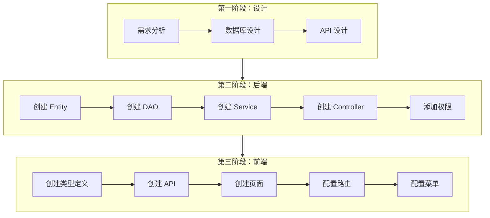

本指南将带你完成一个新功能模块的开发，以"设备管理"模块为例。

## 开发流程



## 第一阶段：设计

### 1. 需求分析

假设我们要开发一个"设备管理"模块，功能包括：

- 设备列表展示
- 新增/编辑设备
- 删除设备
- 设备状态管理

### 2. 数据库设计

创建 Flyway 迁移脚本：

```sql
-- V2__add_equipment_table.sql
CREATE TABLE equipment (
    equipment_id INT PRIMARY KEY AUTO_INCREMENT,
    name VARCHAR(255) NOT NULL,
    model VARCHAR(255),
    serial_number VARCHAR(255) UNIQUE,
    status ENUM('ACTIVE', 'INACTIVE', 'MAINTENANCE') DEFAULT 'ACTIVE',
    purchase_date DATE,
    description TEXT,
    created_at TIMESTAMP DEFAULT CURRENT_TIMESTAMP,
    updated_at TIMESTAMP DEFAULT CURRENT_TIMESTAMP ON UPDATE CURRENT_TIMESTAMP
) ENGINE=InnoDB DEFAULT CHARSET=utf8mb4;
```

### 3. API 设计

| 方法 | 路径 | 说明 |
|------|------|------|
| GET | `/equipment` | 获取设备列表 |
| GET | `/equipment/{id}` | 获取设备详情 |
| POST | `/equipment` | 创建设备 |
| PUT | `/equipment/{id}` | 更新设备 |
| DELETE | `/equipment/{id}` | 删除设备 |

## 第二阶段：后端开发

### 1. 创建 Entity

```java
// entity/Equipment.java
package com.ustb.develop.entity;

import jakarta.persistence.*;
import lombok.Data;
import java.time.LocalDate;
import java.time.LocalDateTime;

@Data
@Entity
@Table(name = "equipment")
public class Equipment {
    
    @Id
    @GeneratedValue(strategy = GenerationType.IDENTITY)
    private Integer equipmentId;
    
    @Column(nullable = false)
    private String name;
    
    private String model;
    
    @Column(unique = true)
    private String serialNumber;
    
    @Enumerated(EnumType.STRING)
    private EquipmentStatus status = EquipmentStatus.ACTIVE;
    
    private LocalDate purchaseDate;
    
    private String description;
    
    private LocalDateTime createdAt;
    
    private LocalDateTime updatedAt;
}
```

```java
// enums/EquipmentStatus.java
package com.ustb.develop.enums;

public enum EquipmentStatus {
    ACTIVE("运行中"),
    INACTIVE("停用"),
    MAINTENANCE("维护中");
    
    private final String description;
    
    EquipmentStatus(String description) {
        this.description = description;
    }
    
    public String getDescription() {
        return description;
    }
}
```

### 2. 创建 DAO

```java
// dao/EquipmentRepository.java
package com.ustb.develop.dao;

import com.ustb.develop.entity.Equipment;
import com.ustb.develop.enums.EquipmentStatus;
import org.springframework.data.jpa.repository.JpaRepository;
import org.springframework.stereotype.Repository;

import java.util.List;
import java.util.Optional;

@Repository
public interface EquipmentRepository extends JpaRepository<Equipment, Integer> {
    
    List<Equipment> findByStatus(EquipmentStatus status);
    
    Optional<Equipment> findBySerialNumber(String serialNumber);
    
    List<Equipment> findByNameContaining(String name);
}
```

### 3. 创建 Service

```java
// service/EquipmentService.java
package com.ustb.develop.service;

import com.ustb.develop.entity.Equipment;
import java.util.List;

public interface EquipmentService {
    List<Equipment> findAll();
    Equipment findById(Integer id);
    Equipment create(Equipment equipment);
    Equipment update(Integer id, Equipment equipment);
    void delete(Integer id);
}
```

```java
// service/impl/EquipmentServiceImpl.java
package com.ustb.develop.service.impl;

import com.ustb.develop.dao.EquipmentRepository;
import com.ustb.develop.entity.Equipment;
import com.ustb.develop.exception.BusinessException;
import com.ustb.develop.service.EquipmentService;
import lombok.RequiredArgsConstructor;
import org.springframework.stereotype.Service;
import org.springframework.transaction.annotation.Transactional;

import java.util.List;

@Service
@RequiredArgsConstructor
public class EquipmentServiceImpl implements EquipmentService {
    
    private final EquipmentRepository equipmentRepository;
    
    @Override
    public List<Equipment> findAll() {
        return equipmentRepository.findAll();
    }
    
    @Override
    public Equipment findById(Integer id) {
        return equipmentRepository.findById(id)
            .orElseThrow(() -> new BusinessException("设备不存在"));
    }
    
    @Override
    @Transactional
    public Equipment create(Equipment equipment) {
        return equipmentRepository.save(equipment);
    }
    
    @Override
    @Transactional
    public Equipment update(Integer id, Equipment equipment) {
        Equipment existing = findById(id);
        existing.setName(equipment.getName());
        existing.setModel(equipment.getModel());
        existing.setSerialNumber(equipment.getSerialNumber());
        existing.setStatus(equipment.getStatus());
        existing.setDescription(equipment.getDescription());
        return equipmentRepository.save(existing);
    }
    
    @Override
    @Transactional
    public void delete(Integer id) {
        equipmentRepository.deleteById(id);
    }
}
```

### 4. 创建 Controller

```java
// controller/EquipmentController.java
package com.ustb.develop.controller;

import com.ustb.develop.annotation.RequirePermission;
import com.ustb.develop.entity.Equipment;
import com.ustb.develop.service.EquipmentService;
import lombok.RequiredArgsConstructor;
import org.springframework.http.ResponseEntity;
import org.springframework.web.bind.annotation.*;

import java.util.List;

@RestController
@RequestMapping("${back-end.context_path}/equipment")
@RequiredArgsConstructor
public class EquipmentController {
    
    private final EquipmentService equipmentService;
    
    @GetMapping
    @RequirePermission("51")  // 设备查看权限
    public ResponseEntity<List<Equipment>> findAll() {
        return ResponseEntity.ok(equipmentService.findAll());
    }
    
    @GetMapping("/{id}")
    @RequirePermission("51")
    public ResponseEntity<Equipment> findById(@PathVariable Integer id) {
        return ResponseEntity.ok(equipmentService.findById(id));
    }
    
    @PostMapping
    @RequirePermission("52")  // 设备创建权限
    public ResponseEntity<Equipment> create(@RequestBody Equipment equipment) {
        return ResponseEntity.ok(equipmentService.create(equipment));
    }
    
    @PutMapping("/{id}")
    @RequirePermission("53")  // 设备修改权限
    public ResponseEntity<Equipment> update(
            @PathVariable Integer id, 
            @RequestBody Equipment equipment) {
        return ResponseEntity.ok(equipmentService.update(id, equipment));
    }
    
    @DeleteMapping("/{id}")
    @RequirePermission("54")  // 设备删除权限
    public ResponseEntity<Void> delete(@PathVariable Integer id) {
        equipmentService.delete(id);
        return ResponseEntity.ok().build();
    }
}
```

### 5. 添加权限

参考 [新增权限](/development-guide/add-new-permission) 添加设备管理相关权限。

## 第三阶段：前端开发

### 1. 创建类型定义

```typescript
// types/equipment.ts
export interface Equipment {
  equipmentId: number
  name: string
  model?: string
  serialNumber?: string
  status: 'ACTIVE' | 'INACTIVE' | 'MAINTENANCE'
  purchaseDate?: string
  description?: string
  createdAt?: string
  updatedAt?: string
}

export type EquipmentStatus = 'ACTIVE' | 'INACTIVE' | 'MAINTENANCE'

export const EquipmentStatusMap: Record<EquipmentStatus, string> = {
  ACTIVE: '运行中',
  INACTIVE: '停用',
  MAINTENANCE: '维护中'
}
```

### 2. 创建 API

```typescript
// api/equipment.ts
import request from '@/utils/request'
import type { Equipment } from '@/types/equipment'

export const getEquipmentList = () => {
  return request.get<Equipment[]>('/equipment')
}

export const getEquipment = (id: number) => {
  return request.get<Equipment>(`/equipment/${id}`)
}

export const createEquipment = (data: Partial<Equipment>) => {
  return request.post<Equipment>('/equipment', data)
}

export const updateEquipment = (id: number, data: Partial<Equipment>) => {
  return request.put<Equipment>(`/equipment/${id}`, data)
}

export const deleteEquipment = (id: number) => {
  return request.delete(`/equipment/${id}`)
}
```

### 3. 创建页面

```vue
<!-- views/equipment/index.vue -->
<script setup lang="ts">
import { ref, onMounted } from 'vue'
import { ElMessage, ElMessageBox } from 'element-plus'
import { getEquipmentList, deleteEquipment } from '@/api/equipment'
import type { Equipment } from '@/types/equipment'
import { EquipmentStatusMap } from '@/types/equipment'

const loading = ref(false)
const tableData = ref<Equipment[]>([])

const fetchData = async () => {
  loading.value = true
  try {
    const res = await getEquipmentList()
    tableData.value = res.data
  } finally {
    loading.value = false
  }
}

const handleDelete = async (row: Equipment) => {
  await ElMessageBox.confirm('确定删除该设备？', '提示')
  await deleteEquipment(row.equipmentId)
  ElMessage.success('删除成功')
  fetchData()
}

onMounted(fetchData)
</script>

<template>
  <div class="container">
    <div class="header">
      <h2>设备管理</h2>
      <el-button type="primary" @click="handleAdd">新增设备</el-button>
    </div>
    
    <el-table v-loading="loading" :data="tableData">
      <el-table-column prop="name" label="设备名称" />
      <el-table-column prop="model" label="型号" />
      <el-table-column prop="serialNumber" label="序列号" />
      <el-table-column prop="status" label="状态">
        <template #default="{ row }">
          {{ EquipmentStatusMap[row.status] }}
        </template>
      </el-table-column>
      <el-table-column label="操作" width="200">
        <template #default="{ row }">
          <el-button size="small" @click="handleEdit(row)">编辑</el-button>
          <el-button size="small" type="danger" @click="handleDelete(row)">
            删除
          </el-button>
        </template>
      </el-table-column>
    </el-table>
  </div>
</template>
```

### 4. 配置路由

```typescript
// router/index.ts
{
  path: 'equipment',
  name: 'Equipment',
  component: () => import('@/views/equipment/index.vue'),
  meta: { 
    title: '设备管理',
    permission: '51' 
  }
}
```

### 5. 配置菜单

在侧边栏菜单配置中添加设备管理入口。

## 完成检查

- [ ] 数据库迁移脚本已创建
- [ ] 后端 Entity、DAO、Service、Controller 已创建
- [ ] 权限已配置
- [ ] 前端类型、API、页面已创建
- [ ] 路由和菜单已配置
- [ ] 功能测试通过

## 下一步

- [扩展 Table 组件](/development-guide/extend-table) - 使用模板快速开发
- [新增权限](/development-guide/add-new-permission) - 添加细粒度权限控制
