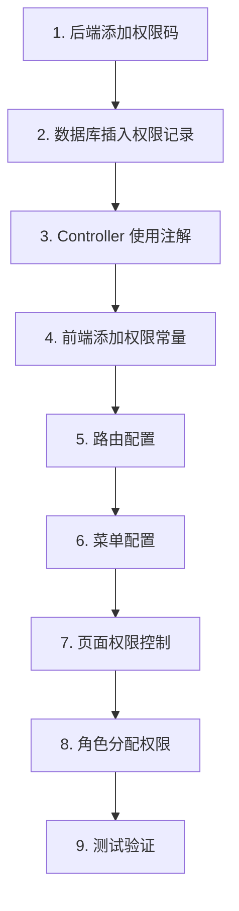

本指南提供了**从零开始新增一个权限**的完整步骤，涵盖后端、前端、数据库和测试验证。

## 应用场景

假设我们要为 Process-Card 添加一个新功能：**产品追溯（Product Trace）**，需要新增以下权限：

- **权限码**：`51`
- **权限名称**：产品追溯
- **权限描述**：查看和管理产品追溯信息
- **分类**：产品管理

## 完整流程图



---

## 后端步骤

### Step 1: 添加权限码常量

**文件路径**：`process-card-backend/src/main/java/com/ustb/develop/constant/PermissionCode.java`

在 `PermissionCode.java` 中添加新权限码：

```java
public class PermissionCode {
    // ... 其他权限码

    // ===== 产品管理 =====
    public static final String PRODUCT_MANAGEMENT = "5";

    /** 产品追溯 */
    public static final String PRODUCT_TRACE = "51";

    // 可选：细分权限
    /** 产品追溯 - 查看 */
    public static final String PRODUCT_TRACE_VIEW = "511";
    /** 产品追溯 - 导出 */
    public static final String PRODUCT_TRACE_EXPORT = "512";
}
```

**权限码命名规范**：
- 一级菜单：1 位数字（如 `"5"` 产品管理）
- 二级功能：2 位数字（如 `"51"` 产品追溯）
- 三级操作：3 位数字（如 `"511"` 查看、`"512"` 导出）

### Step 2: 数据库插入权限记录

#### 方式 1：直接执行 SQL

```sql
INSERT INTO permissions (permission_id, permission_code, permission_name, permission_description, category)
VALUES (DEFAULT, '51', '产品追溯', '查看和管理产品追溯信息', '产品管理');
```

**注意**：
- `permission_id` 使用 `DEFAULT` 自动生成
- `permission_code` 必须与后端 `PermissionCode.java` 一致
- `category` 用于权限管理页面的分组显示

#### 方式 2：使用权限管理页面

1. 登录系统（admin 账号）
2. 进入"系统管理" → "权限管理"
3. 点击"新增权限"
4. 填写：
   - 权限码：`51`
   - 权限名称：产品追溯
   - 权限描述：查看和管理产品追溯信息
   - 分类：产品管理
5. 保存

### Step 3: Controller 添加权限注解

**文件路径**：`process-card-backend/src/main/java/com/ustb/develop/controller/ProductTraceController.java`

创建新的 Controller 并使用 `@RequirePermission` 注解：

```java
package com.ustb.develop.controller;

import com.ustb.develop.annotation.RequirePermission;
import com.ustb.develop.constant.PermissionCode;
import com.ustb.develop.dto.ProductTraceResponse;
import com.ustb.develop.service.ProductTraceService;
import lombok.RequiredArgsConstructor;
import org.springframework.http.ResponseEntity;
import org.springframework.web.bind.annotation.*;

@RestController
@RequestMapping("/product-trace")
@RequiredArgsConstructor
public class ProductTraceController {

    private final ProductTraceService productTraceService;

    /**
     * 获取产品追溯列表
     * 需要 PRODUCT_TRACE 权限
     */
    @GetMapping
    @RequirePermission(PermissionCode.PRODUCT_TRACE)
    public ResponseEntity<List<ProductTraceResponse>> getTraceList(
            @RequestParam(defaultValue = "1") int page,
            @RequestParam(defaultValue = "10") int size
    ) {
        List<ProductTraceResponse> list = productTraceService.getTraceList(page, size);
        return ResponseEntity.ok(list);
    }

    /**
     * 获取单个产品追溯详情
     */
    @GetMapping("/{id}")
    @RequirePermission(PermissionCode.PRODUCT_TRACE)
    public ResponseEntity<ProductTraceResponse> getTraceById(@PathVariable Integer id) {
        ProductTraceResponse trace = productTraceService.getTraceById(id);
        return ResponseEntity.ok(trace);
    }

    /**
     * 导出产品追溯报告
     * 需要 PRODUCT_TRACE_EXPORT 权限（可选：细分权限）
     */
    @GetMapping("/export/{id}")
    @RequirePermission(PermissionCode.PRODUCT_TRACE_EXPORT)
    public ResponseEntity<byte[]> exportTrace(@PathVariable Integer id) {
        byte[] report = productTraceService.exportTrace(id);
        return ResponseEntity.ok()
                .header("Content-Disposition", "attachment; filename=trace-report.pdf")
                .body(report);
    }
}
```

**关键点**：
- `@RequirePermission` 注解用于方法级别的权限控制
- 支持单个权限码：`@RequirePermission(PermissionCode.PRODUCT_TRACE)`
- 支持多个权限码（OR 逻辑）：`@RequirePermission({PermissionCode.A, PermissionCode.B})`
- 没有该注解的接口不做权限检查

### Step 4: 实现 Service 和 Repository

**Service 示例**（`ProductTraceService.java`）：

```java
@Service
@RequiredArgsConstructor
public class ProductTraceService {

    private final ProductTraceRepository productTraceRepository;

    public List<ProductTraceResponse> getTraceList(int page, int size) {
        // 实现业务逻辑
        return productTraceRepository.findAll(PageRequest.of(page - 1, size))
                .stream()
                .map(this::convertToResponse)
                .toList();
    }

    public ProductTraceResponse getTraceById(Integer id) {
        ProductTrace trace = productTraceRepository.findById(id)
                .orElseThrow(() -> new ResourceNotFoundException("追溯记录不存在"));
        return convertToResponse(trace);
    }

    public byte[] exportTrace(Integer id) {
        // 实现导出逻辑
        return generatePdfReport(id);
    }

    private ProductTraceResponse convertToResponse(ProductTrace trace) {
        // 实体转 DTO
        return ProductTraceResponse.builder()
                .id(trace.getId())
                .productName(trace.getProductName())
                .traceData(trace.getTraceData())
                .build();
    }
}
```

**后端完成！** 现在 API 接口已受权限保护，没有 `PRODUCT_TRACE` 权限的用户无法访问。

---

## 前端步骤

### Step 5: 添加权限常量

**文件路径**：`process-card-frontend/src/constants/permission.ts`

在 `permission.ts` 中添加新权限码（与后端保持一致）：

```typescript
export const PermissionCode = {
    // ... 其他权限

    // ===== 产品管理 =====
    /** 产品管理（菜单组） */
    PRODUCT_MANAGEMENT: '5',
    /** 产品追溯 */
    PRODUCT_TRACE: '51',

    // 可选：细分权限
    /** 产品追溯 - 查看 */
    PRODUCT_TRACE_VIEW: '511',
    /** 产品追溯 - 导出 */
    PRODUCT_TRACE_EXPORT: '512',
} as const
```

**关键点**：
- 权限码必须与后端**完全一致**（字符串类型）
- 使用 `as const` 确保类型安全

### Step 6: 添加路由配置

**文件路径**：`process-card-frontend/src/router/index.ts`

在 `allRoutes` 数组中添加新路由：

```typescript
const allRoutes: RouteRecordRaw[] = [
    // ... 其他路由

    // 产品追溯路由
    {
        path: '/product-trace',
        name: 'product-trace',
        meta: {
            title: '产品追溯',
            permiss: PermissionCode.PRODUCT_TRACE  // 关键：指定权限码
        },
        component: () => import(/* webpackChunkName: "product-trace" */ '../views/product/trace.vue')
    }
]
```

**关键点**：
- `meta.permiss` 指定访问该路由所需的权限码
- 路由守卫会自动检查权限，无权限用户访问时跳转到 403 页面
- 懒加载：使用 `() => import()` 实现按需加载

### Step 7: 添加菜单配置

**文件路径**：`process-card-frontend/src/components/menu.ts`

在 `menuData` 数组中添加新菜单项：

```typescript
export const menuData: Menus[] = [
    // ... 其他菜单

    // 产品管理菜单
    {
        id: '51',  // 权限码（与 PermissionCode.PRODUCT_TRACE 一致）
        icon: 'Search',  // Element Plus 图标名称
        index: '/product-trace',  // 路由路径
        title: '产品追溯'
    }
]
```

**如果需要菜单组（二级菜单）**：

```typescript
{
    id: '5',  // 菜单组权限码
    title: '产品管理',
    index: '5',
    icon: 'Box',
    children: [
        {
            id: '51',
            pid: '5',
            index: '/product-trace',
            title: '产品追溯'
        },
        {
            id: '52',
            pid: '5',
            index: '/product-plan',
            title: '产品规划'
        }
    ]
}
```

**关键点**：
- `id` 必须与权限码一致
- `sidebar.vue` 会根据 `v-permiss="item.id"` 自动控制菜单显示
- 没有权限的用户看不到该菜单项

### Step 8: 创建页面组件

**文件路径**：`process-card-frontend/src/views/product/trace.vue`

使用 Table 组件快速开发页面：

```vue
<template>
  <div class="container">
    <!-- 搜索组件 -->
    <TableSearch :query="query" :options="searchOpt" :search="handleSearch"/>

    <!-- 表格组件 -->
    <TableCustom
        :columns="columns"
        :tableData="tableData"
        :total="page.total"
        :page-change="changePage"
    >
      <!-- 工具栏按钮 -->
      <template #toolbarBtn>
        <el-button
            type="primary"
            :icon="Plus"
            v-permiss="PermissionCode.PRODUCT_TRACE"
        >
          新增追溯记录
        </el-button>
      </template>
    </TableCustom>

    <!-- 查看详情弹窗 -->
    <el-dialog title="追溯详情" v-model="visible" width="800px">
      <TableDetail :data="viewData"/>
    </el-dialog>
  </div>
</template>

<script setup lang="ts">
import {ref, reactive, onMounted} from 'vue'
import {ElMessage} from 'element-plus'
import {Plus} from '@element-plus/icons-vue'
import {getProductTraceList, exportProductTrace} from '@/api/product-trace'
import TableCustom from '@/components/table-custom.vue'
import TableDetail from '@/components/table-detail.vue'
import TableSearch from '@/components/table-search.vue'
import {PermissionCode} from '@/constants/permission'
import {usePermissStore} from '@/store/permiss'

const permiss = usePermissStore()

// 搜索配置
const query = reactive({ productName: '' })
const searchOpt = ref([
  { type: 'input', label: '产品名称：', prop: 'productName' }
])

// 表格列配置
const columns = ref([
  { type: 'index', label: '序号', width: 55 },
  { prop: 'productName', label: '产品名称' },
  { prop: 'traceCode', label: '追溯码' },
  { prop: 'createdAt', label: '创建时间' },
  {
    prop: 'operator',
    label: '操作',
    customButtons: [
      {
        label: '查看',
        type: 'primary',
        handler: (row: any) => handleView(row)
      },
      {
        label: '导出',
        type: 'success',
        handler: (row: any) => handleExport(row),
        show: (row: any) => permiss.key.includes(PermissionCode.PRODUCT_TRACE_EXPORT)
      }
    ]
  }
])

// 分页和数据
const page = reactive({ index: 1, size: 10, total: 0 })
const tableData = ref([])

// 获取数据
const getData = async () => {
  const res = await getProductTraceList({ page: page.index, size: page.size, ...query })
  tableData.value = res.data.list
  page.total = res.data.total
}

// 分页变化
const changePage = (val: number) => {
  page.index = val
  getData()
}

// 搜索
const handleSearch = () => {
  page.index = 1
  getData()
}

// 查看详情
const visible = ref(false)
const viewData = ref({})
const handleView = (row: any) => {
  viewData.value = {
    '产品名称': row.productName,
    '追溯码': row.traceCode,
    '创建时间': row.createdAt,
    '追溯数据': row.traceData
  }
  visible.value = true
}

// 导出
const handleExport = async (row: any) => {
  try {
    const res = await exportProductTrace(row.id)
    // 下载文件
    const blob = new Blob([res.data], { type: 'application/pdf' })
    const link = document.createElement('a')
    link.href = URL.createObjectURL(blob)
    link.download = `trace-report-${row.id}.pdf`
    link.click()
    ElMessage.success('导出成功')
  } catch (error) {
    ElMessage.error('导出失败')
  }
}

onMounted(() => {
  getData()
})
</script>
```

**关键点**：
- 使用 `v-permiss` 指令控制按钮显示
- 在 `customButtons.show` 中检查细分权限
- 页面会自动集成到系统中（路由守卫、菜单）

### Step 9: 添加 API 接口

**文件路径**：`process-card-frontend/src/api/product-trace.ts`

```typescript
import request from '@/utils/request'

export interface ProductTraceResponse {
  id: number
  productName: string
  traceCode: string
  traceData: string
  createdAt: string
}

/**
 * 获取产品追溯列表
 */
export const getProductTraceList = (params: { page: number; size: number; productName?: string }) => {
  return request.get<{ list: ProductTraceResponse[]; total: number }>('/product-trace', { params })
}

/**
 * 获取单个产品追溯详情
 */
export const getProductTraceById = (id: number) => {
  return request.get<ProductTraceResponse>(`/product-trace/${id}`)
}

/**
 * 导出产品追溯报告
 */
export const exportProductTrace = (id: number) => {
  return request.get(`/product-trace/export/${id}`, { responseType: 'blob' })
}
```

**前端完成！** 用户刷新页面后，新功能会自动显示在菜单中（如果有权限）。

---

## 权限分配

### Step 10: 为角色分配权限

#### 方式 1：使用权限管理页面

1. 登录系统（admin 账号）
2. 进入"系统管理" → "角色管理"
3. 选择要分配权限的角色（如"reviewer"）
4. 点击"编辑"
5. 在权限列表中勾选"产品追溯"（权限码 `51`）
6. 保存

#### 方式 2：直接执行 SQL

```sql
-- 为 admin 角色（role_id=1）分配产品追溯权限（permission_id=51）
INSERT INTO role_permissions (role_id, permission_id)
VALUES (1, (SELECT permission_id FROM permissions WHERE permission_code = '51'));

-- 为 reviewer 角色（role_id=2）分配产品追溯权限
INSERT INTO role_permissions (role_id, permission_id)
VALUES (2, (SELECT permission_id FROM permissions WHERE permission_code = '51'));
```

**注意**：
- `permission_id` 需要从 `permissions` 表查询
- `role_id` 需要从 `roles` 表查询

### Step 11: 用户获取新权限

用户刷新页面后，`permissStore.initPermissions()` 会重新从后端获取最新权限，新权限自动生效。

如果使用 Refresh Token 刷新 Access Token，新 Token 会包含最新权限。

---

## 测试验证

### Step 12: 测试流程

#### 1. 后端 API 测试

使用 Postman 或 curl 测试：

```bash
# 1. 登录获取 Token
curl -X POST http://127.0.0.1:6062/api/v1/vt-process-card-software/auth/login \
  -H "Content-Type: application/json" \
  -d '{"username": "admin", "password": "password"}'

# 2. 使用 Token 访问新接口
curl -X GET http://127.0.0.1:6062/api/v1/vt-process-card-software/product-trace \
  -H "Authorization: Bearer <access_token>"
```

**预期结果**：
- ✅ admin 用户（有权限）：返回 200 OK + 数据
- ❌ 无权限用户：返回 403 Forbidden

#### 2. 前端权限测试

**场景 1：有权限的用户（admin）**

1. 使用 admin 账号登录
2. 刷新页面
3. 检查：
   - ✅ 侧边栏显示"产品追溯"菜单
   - ✅ 点击菜单，成功进入产品追溯页面
   - ✅ 页面显示数据
   - ✅ "新增"和"导出"按钮可见

**场景 2：无权限的用户（executor）**

1. 使用 executor 账号登录（假设未分配权限）
2. 刷新页面
3. 检查：
   - ❌ 侧边栏不显示"产品追溯"菜单
   - ❌ 直接访问 `/#/product-trace`，跳转到 403 页面

**场景 3：部分权限的用户（reviewer）**

1. 为 reviewer 角色分配 `PRODUCT_TRACE`，但不分配 `PRODUCT_TRACE_EXPORT`
2. 使用 reviewer 账号登录
3. 刷新页面
4. 检查：
   - ✅ 侧边栏显示"产品追溯"菜单
   - ✅ 可以访问产品追溯页面
   - ✅ "查看"按钮可见
   - ❌ "导出"按钮隐藏

#### 3. 权限验证清单

| 测试项 | admin | reviewer | executor |
|--------|-------|----------|----------|
| 菜单可见 | ✅ | ✅ | ❌ |
| 路由可访问 | ✅ | ✅ | ❌ |
| API 可调用 | ✅ | ✅ | ❌ |
| "新增"按钮 | ✅ | ❌ | ❌ |
| "导出"按钮 | ✅ | ❌ | ❌ |

---

## 常见问题

### 1. 添加权限后，用户看不到新菜单？

**原因**：用户的角色没有分配新权限。

**解决方案**：
1. 进入"角色管理"，编辑用户所属的角色
2. 勾选新权限
3. 用户刷新页面（或重新登录）

### 2. 前端菜单可见，但点击后跳转到 403？

**原因**：路由配置中的 `meta.permiss` 与菜单 `id` 不一致。

**解决方案**：
- 检查 `router/index.ts` 中的 `meta.permiss`
- 检查 `menu.ts` 中的 `id`
- 确保两者与 `permission.ts` 中的权限码一致

### 3. 后端 API 不受权限保护？

**原因**：Controller 方法缺少 `@RequirePermission` 注解。

**解决方案**：
- 在 Controller 方法上添加 `@RequirePermission(PermissionCode.XXX)`
- 重启后端服务

### 4. 权限码冲突？

**原因**：不同权限使用了相同的权限码。

**解决方案**：
- 检查 `permissions` 表，确保 `permission_code` 唯一
- 检查后端 `PermissionCode.java` 和前端 `permission.ts`，确保无重复

### 5. 如何支持"至少拥有其中一个权限"？

**后端**：使用 `@RequirePermission` 的数组形式（已支持）

```java
@RequirePermission({PermissionCode.ADMIN, PermissionCode.DEVELOPER})
public ResponseEntity<Void> specialOperation() {
    // 拥有 ADMIN 或 DEVELOPER 权限的用户可以访问
}
```

**前端**：修改 `v-permiss` 指令（需自定义）

```typescript
app.directive('permiss', {
    mounted(el, binding) {
        const requiredPermissions = Array.isArray(binding.value) ? binding.value : [binding.value]
        const hasPermission = requiredPermissions.some(p => permiss.key.includes(String(p)))
        if (!hasPermission) {
            el['hidden'] = true
        }
    }
})
```

使用：

```vue
<el-button v-permiss="[PermissionCode.ADMIN, PermissionCode.DEVELOPER]">
  管理员或开发者可见
</el-button>
```

---

## 最佳实践

1. **权限码规划**：
   - 一级菜单：个位数（如 `"5"` 产品管理）
   - 二级功能：十位数（如 `"51"` 产品追溯）
   - 三级操作：百位数（如 `"511"` 查看、`"512"` 导出）

2. **前后端同步**：
   - 后端修改 `PermissionCode.java` 后，立即同步前端 `permission.ts`
   - 使用 Git Hook 或 CI 脚本检查一致性

3. **权限粒度**：
   - **粗粒度**：适用于简单功能（如"用户管理"）
   - **细粒度**：适用于复杂功能（如工艺卡的"创建、删除、审核、确认、导出"）

4. **权限分类**：
   - 按业务模块分类（如"系统管理"、"标定管理"、"产品管理"）
   - 便于权限管理页面展示和搜索

5. **测试覆盖**：
   - 使用不同角色账号测试菜单、路由、按钮显示
   - 使用 Postman 测试 API 权限验证

---

## 总结

新增权限的完整步骤：

**后端**：
1. ✅ `PermissionCode.java` 添加常量
2. ✅ 数据库插入权限记录
3. ✅ Controller 使用 `@RequirePermission` 注解

**前端**：
4. ✅ `permission.ts` 添加常量
5. ✅ `router/index.ts` 添加路由（含 `meta.permiss`）
6. ✅ `menu.ts` 添加菜单（含 `id`）
7. ✅ 页面使用 `v-permiss` 控制按钮

**配置**：
8. ✅ 角色分配权限（数据库或管理页面）
9. ✅ 用户刷新页面获取新权限

**测试**：
10. ✅ 验证菜单显示、路由访问、API 调用、按钮权限

---

## 下一步

- 阅读 [后端权限系统](../backend/permission-system) 深入理解权限验证流程
- 查看 [前端权限控制](../frontend/permission-control) 学习权限指令用法
- 学习 [Table 组件复用](../frontend/table-components) 快速开发新页面

---

**提示**：新增权限后，一定要测试不同角色的访问效果！前端隐藏按钮不代表后端不会被调用，后端必须使用 `@RequirePermission` 注解保护 API。
