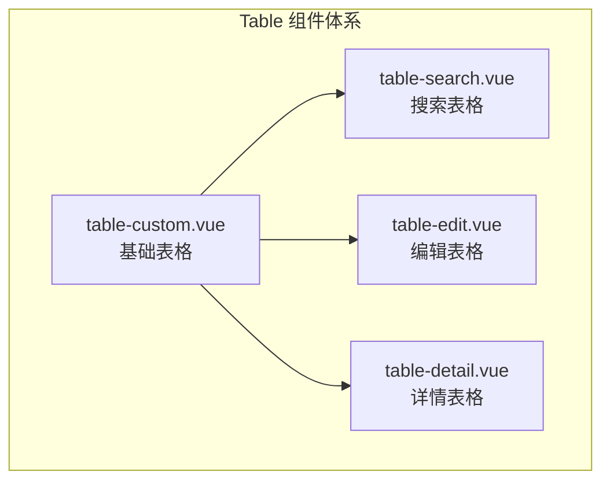

本指南将介绍如何使用项目中的 Table 组件模板，快速开发 CRUD 功能。

## 组件概览

项目提供了一套可复用的表格组件：

| 组件 | 说明 |
|------|------|
| `table-custom.vue` | 自定义表格，支持分页、排序 |
| `table-search.vue` | 带搜索功能的表格 |
| `table-edit.vue` | 支持行内编辑的表格 |
| `table-detail.vue` | 详情展示表格 |

## 组件结构



## 基础用法

### 1. 简单列表展示

```vue
<script setup lang="ts">
import { ref, onMounted } from 'vue'
import { getEquipmentList } from '@/api/equipment'
import type { Equipment } from '@/types/equipment'

const tableData = ref<Equipment[]>([])
const loading = ref(false)

const columns = [
  { prop: 'name', label: '设备名称' },
  { prop: 'model', label: '型号' },
  { prop: 'serialNumber', label: '序列号' },
  { prop: 'status', label: '状态' }
]

const fetchData = async () => {
  loading.value = true
  try {
    const res = await getEquipmentList()
    tableData.value = res.data
  } finally {
    loading.value = false
  }
}

onMounted(fetchData)
</script>

<template>
  <el-table v-loading="loading" :data="tableData">
    <el-table-column
      v-for="col in columns"
      :key="col.prop"
      :prop="col.prop"
      :label="col.label"
    />
  </el-table>
</template>
```

### 2. 带搜索和分页

```vue
<script setup lang="ts">
import { ref, reactive, onMounted } from 'vue'
import { getEquipmentList } from '@/api/equipment'
import type { Equipment } from '@/types/equipment'

const tableData = ref<Equipment[]>([])
const loading = ref(false)
const total = ref(0)

const pagination = reactive({
  current: 1,
  pageSize: 10
})

const searchForm = reactive({
  name: '',
  status: ''
})

const fetchData = async () => {
  loading.value = true
  try {
    const res = await getEquipmentList({
      ...searchForm,
      page: pagination.current,
      size: pagination.pageSize
    })
    tableData.value = res.data.content
    total.value = res.data.totalElements
  } finally {
    loading.value = false
  }
}

const handleSearch = () => {
  pagination.current = 1
  fetchData()
}

const handleReset = () => {
  Object.assign(searchForm, { name: '', status: '' })
  handleSearch()
}

const handlePageChange = (page: number) => {
  pagination.current = page
  fetchData()
}

onMounted(fetchData)
</script>

<template>
  <div class="container">
    <!-- 搜索区域 -->
    <el-form :model="searchForm" inline>
      <el-form-item label="设备名称">
        <el-input v-model="searchForm.name" placeholder="请输入" />
      </el-form-item>
      <el-form-item label="状态">
        <el-select v-model="searchForm.status" placeholder="请选择">
          <el-option label="运行中" value="ACTIVE" />
          <el-option label="停用" value="INACTIVE" />
          <el-option label="维护中" value="MAINTENANCE" />
        </el-select>
      </el-form-item>
      <el-form-item>
        <el-button type="primary" @click="handleSearch">搜索</el-button>
        <el-button @click="handleReset">重置</el-button>
      </el-form-item>
    </el-form>
    
    <!-- 表格 -->
    <el-table v-loading="loading" :data="tableData">
      <el-table-column prop="name" label="设备名称" />
      <el-table-column prop="model" label="型号" />
      <el-table-column prop="status" label="状态" />
      <el-table-column label="操作" width="200">
        <template #default="{ row }">
          <el-button size="small" @click="handleEdit(row)">编辑</el-button>
          <el-button size="small" type="danger" @click="handleDelete(row)">
            删除
          </el-button>
        </template>
      </el-table-column>
    </el-table>
    
    <!-- 分页 -->
    <el-pagination
      v-model:current-page="pagination.current"
      :page-size="pagination.pageSize"
      :total="total"
      @current-change="handlePageChange"
    />
  </div>
</template>
```

## 高级用法

### 1. 自定义列渲染

```vue
<el-table-column prop="status" label="状态">
  <template #default="{ row }">
    <el-tag :type="getStatusType(row.status)">
      {{ EquipmentStatusMap[row.status] }}
    </el-tag>
  </template>
</el-table-column>
```

### 2. 行内编辑

```vue
<script setup lang="ts">
const editingRow = ref<number | null>(null)

const handleEdit = (row: Equipment) => {
  editingRow.value = row.equipmentId
}

const handleSave = async (row: Equipment) => {
  await updateEquipment(row.equipmentId, row)
  editingRow.value = null
  ElMessage.success('保存成功')
}

const handleCancel = () => {
  editingRow.value = null
  fetchData() // 重新加载数据
}
</script>

<template>
  <el-table-column prop="name" label="设备名称">
    <template #default="{ row }">
      <el-input
        v-if="editingRow === row.equipmentId"
        v-model="row.name"
      />
      <span v-else>{{ row.name }}</span>
    </template>
  </el-table-column>
  
  <el-table-column label="操作">
    <template #default="{ row }">
      <template v-if="editingRow === row.equipmentId">
        <el-button size="small" type="primary" @click="handleSave(row)">
          保存
        </el-button>
        <el-button size="small" @click="handleCancel">取消</el-button>
      </template>
      <template v-else>
        <el-button size="small" @click="handleEdit(row)">编辑</el-button>
      </template>
    </template>
  </el-table-column>
</template>
```

### 3. 批量操作

```vue
<script setup lang="ts">
const selectedRows = ref<Equipment[]>([])

const handleSelectionChange = (rows: Equipment[]) => {
  selectedRows.value = rows
}

const handleBatchDelete = async () => {
  if (selectedRows.value.length === 0) {
    ElMessage.warning('请选择要删除的数据')
    return
  }
  
  await ElMessageBox.confirm(
    `确定删除选中的 ${selectedRows.value.length} 条数据？`,
    '提示'
  )
  
  const ids = selectedRows.value.map(row => row.equipmentId)
  await batchDeleteEquipment(ids)
  ElMessage.success('删除成功')
  fetchData()
}
</script>

<template>
  <div class="toolbar">
    <el-button 
      type="danger" 
      :disabled="selectedRows.length === 0"
      @click="handleBatchDelete"
    >
      批量删除
    </el-button>
  </div>
  
  <el-table @selection-change="handleSelectionChange">
    <el-table-column type="selection" width="55" />
    <!-- 其他列 -->
  </el-table>
</template>
```

### 4. 导出功能

```vue
<script setup lang="ts">
import * as XLSX from 'xlsx'

const handleExport = () => {
  const data = tableData.value.map(row => ({
    '设备名称': row.name,
    '型号': row.model,
    '序列号': row.serialNumber,
    '状态': EquipmentStatusMap[row.status]
  }))
  
  const ws = XLSX.utils.json_to_sheet(data)
  const wb = XLSX.utils.book_new()
  XLSX.utils.book_append_sheet(wb, ws, '设备列表')
  XLSX.writeFile(wb, '设备列表.xlsx')
}
</script>

<template>
  <el-button @click="handleExport">导出 Excel</el-button>
</template>
```

## 封装复用组件

### 1. 创建可复用的 Table 组件

```vue
<!-- components/BaseTable.vue -->
<script setup lang="ts">
import { computed } from 'vue'

interface Column {
  prop: string
  label: string
  width?: number | string
  fixed?: boolean | 'left' | 'right'
  sortable?: boolean
  formatter?: (row: any) => string
}

interface Props {
  data: any[]
  columns: Column[]
  loading?: boolean
  showSelection?: boolean
  showIndex?: boolean
}

const props = withDefaults(defineProps<Props>(), {
  loading: false,
  showSelection: false,
  showIndex: false
})

const emit = defineEmits<{
  (e: 'selection-change', rows: any[]): void
}>()
</script>

<template>
  <el-table
    v-loading="loading"
    :data="data"
    @selection-change="(rows) => emit('selection-change', rows)"
  >
    <el-table-column v-if="showSelection" type="selection" width="55" />
    <el-table-column v-if="showIndex" type="index" label="序号" width="60" />
    
    <el-table-column
      v-for="col in columns"
      :key="col.prop"
      :prop="col.prop"
      :label="col.label"
      :width="col.width"
      :fixed="col.fixed"
      :sortable="col.sortable"
    >
      <template v-if="col.formatter" #default="{ row }">
        {{ col.formatter(row) }}
      </template>
      <template v-else-if="$slots[col.prop]" #default="scope">
        <slot :name="col.prop" v-bind="scope" />
      </template>
    </el-table-column>
    
    <el-table-column v-if="$slots.actions" label="操作" fixed="right">
      <template #default="scope">
        <slot name="actions" v-bind="scope" />
      </template>
    </el-table-column>
  </el-table>
</template>
```

### 2. 使用封装的组件

```vue
<script setup lang="ts">
import BaseTable from '@/components/BaseTable.vue'
import { EquipmentStatusMap } from '@/types/equipment'

const columns = [
  { prop: 'name', label: '设备名称' },
  { prop: 'model', label: '型号' },
  { prop: 'serialNumber', label: '序列号' },
  { 
    prop: 'status', 
    label: '状态',
    formatter: (row) => EquipmentStatusMap[row.status]
  }
]
</script>

<template>
  <BaseTable
    :data="tableData"
    :columns="columns"
    :loading="loading"
    show-selection
    show-index
  >
    <template #actions="{ row }">
      <el-button size="small" @click="handleEdit(row)">编辑</el-button>
      <el-button size="small" type="danger" @click="handleDelete(row)">
        删除
      </el-button>
    </template>
  </BaseTable>
</template>
```

## 最佳实践

### 1. 列配置分离

```typescript
// config/table-columns.ts
export const equipmentColumns = [
  { prop: 'name', label: '设备名称', sortable: true },
  { prop: 'model', label: '型号' },
  { prop: 'serialNumber', label: '序列号' },
  { prop: 'status', label: '状态' }
]
```

### 2. 使用组合函数封装逻辑

```typescript
// composables/useTable.ts
import { ref, reactive } from 'vue'

export function useTable<T>(fetchFn: () => Promise<T[]>) {
  const data = ref<T[]>([])
  const loading = ref(false)
  const selectedRows = ref<T[]>([])
  
  const pagination = reactive({
    current: 1,
    pageSize: 10,
    total: 0
  })
  
  const fetchData = async () => {
    loading.value = true
    try {
      data.value = await fetchFn()
    } finally {
      loading.value = false
    }
  }
  
  const handleSelectionChange = (rows: T[]) => {
    selectedRows.value = rows
  }
  
  return {
    data,
    loading,
    selectedRows,
    pagination,
    fetchData,
    handleSelectionChange
  }
}
```

### 3. 权限控制

```vue
<script setup lang="ts">
import { useProcessCardPermission } from '@/composables/useProcessCardPermission'

const { canEdit, canDelete } = useProcessCardPermission()
</script>

<template>
  <el-table-column label="操作">
    <template #default="{ row }">
      <el-button v-if="canEdit" size="small" @click="handleEdit(row)">
        编辑
      </el-button>
      <el-button v-if="canDelete" size="small" type="danger" @click="handleDelete(row)">
        删除
      </el-button>
    </template>
  </el-table-column>
</template>
```

## 下一步

- [Table 组件详解](/frontend/table-components) - 深入了解组件用法
- [新增功能模块](/development-guide/add-new-feature) - 完整开发流程
- [权限控制](/frontend/permission-control) - 前端权限实现
