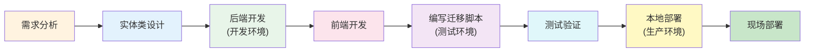

本章节提供实用的开发指南，帮助你快速扩展系统功能。

## 章节概览

::card-group
  ::card{title="新增权限" icon="i-heroicons-plus-circle" to="/development-guide/add-new-permission"}
  完整的新增权限流程 🔥
  ::

  ::card{title="新增功能模块" icon="i-heroicons-puzzle-piece" to="/development-guide/add-new-feature"}
  从零开发新功能
  ::

  ::card{title="扩展 Table 组件" icon="i-heroicons-table-cells" to="/development-guide/extend-table"}
  基于模板快速开发 CRUD
  ::
::

## 开发流程

## 常用开发任务

| 任务 | 指南 | 难度 |
|------|------|------|
| 添加新权限 | [新增权限](/development-guide/add-new-permission) | ⭐ 简单 |
| 开发新模块 | [新增功能模块](/development-guide/add-new-feature) | ⭐⭐ 中等 |
| 扩展表格组件 | [扩展 Table 组件](/development-guide/extend-table) | ⭐⭐ 中等 |

## 最佳实践

### 后端开发

1. **分层清晰**：Controller 只做参数校验和响应封装
2. **事务管理**：在 Service 层使用 `@Transactional`
3. **异常处理**：使用全局异常处理器
4. **权限注解**：使用 `@RequirePermission` 控制访问

### 前端开发

1. **组件复用**：优先使用已有组件
2. **类型安全**：定义完整的 TypeScript 类型
3. **状态管理**：全局状态用 Pinia，局部状态用 ref
4. **权限控制**：使用 `useProcessCardPermission` 等组合函数

### 数据库与实体类

1. **开发环境**：基于实体类设计，数据库表由 JPA 自动创建（不使用 Flyway）
2. **测试环境**：根据实体类编写 Flyway 迁移脚本，在测试数据库中验证
3. **生产环境**：先在本地生产环境部署测试，确认无误后部署到现场
4. **命名规范**：表名小写下划线，字段名小写下划线
5. **索引优化**：为常用查询字段添加索引

## 推荐阅读

- [权限系统](/backend/permission-system) - 理解权限模型
- [项目结构](/backend/project-structure) - 了解代码组织
- [Table 组件](/frontend/table-components) - 掌握组件用法
