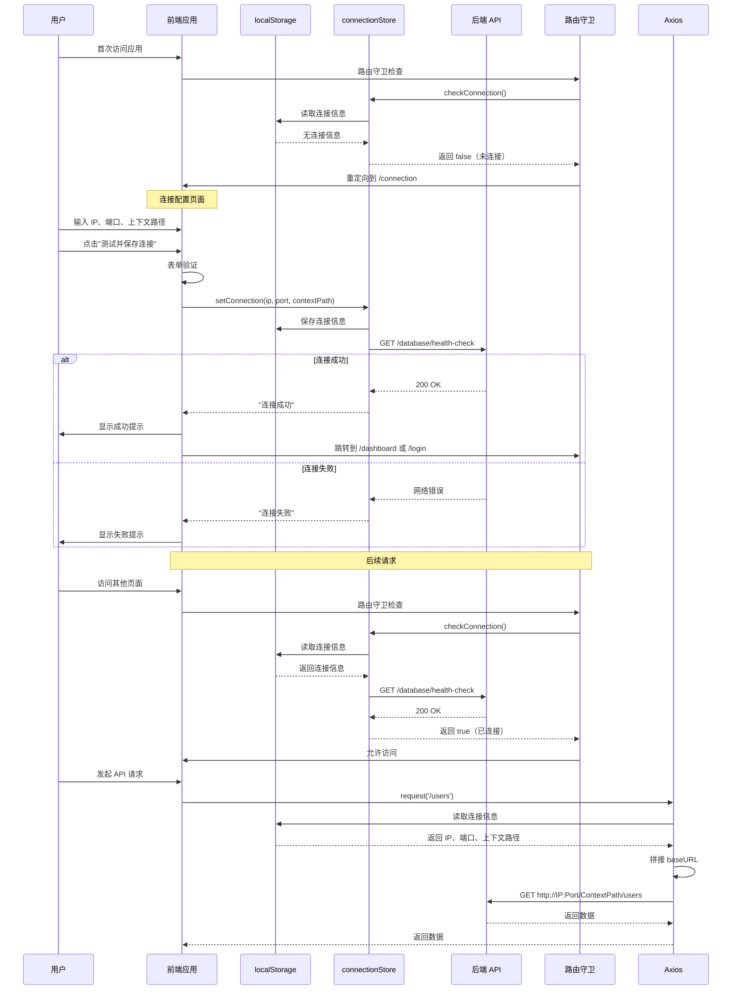

Process-Card 前端支持**动态配置后端地址**，无需重新打包即可切换不同环境（开发、测试、生产），实现真正的前后端分离部署。

## 设计理念

### 为什么需要连接配置？

传统前后端分离项目通常在前端代码中硬编码后端地址（如 `baseURL = "http://localhost:8080/api"`），这导致：

1. **环境切换困难**：切换环境需要修改代码并重新打包
2. **多环境部署复杂**：需要维护多份构建产物
3. **灵活性差**：客户无法自行配置后端地址

Process-Card 的解决方案：
- **首次访问时配置**：用户首次打开应用时，引导配置后端地址
- **存储到 localStorage**：配置信息持久化，刷新页面不丢失
- **动态 baseURL**：Axios 请求拦截器动态读取连接信息
- **连接检查**：路由守卫自动检查连接状态，未连接则跳转到配置页面

## 核心组件

### 1. connectionStore - 连接状态管理

**文件路径**：`process-card-frontend/src/store/connection.ts`

使用 Pinia 管理后端连接信息和状态。

```typescript
export const useConnectionStore = defineStore("connection", () => {
    // 工艺卡后端是否连接
    const connected = ref(false);

    // 从 localStorage 获取存储的连接信息
    const backendIp = ref(localStorage.getItem("backendIp") || "");
    const backendPort = ref(localStorage.getItem("backendPort") || "");
    const backendContextPath = ref(localStorage.getItem("backendContextPath") || "");

    // 后端 HTTP 访问请求的根 URL
    const backendURL = computed(() => {
        return `http://${backendIp.value}:${backendPort.value}${backendContextPath.value}`;
    });

    // 检查连接状态
    async function checkConnection() {
        try {
            const response = await testConnection();
            connected.value = response.success;
            return connected.value;
        } catch {
            connected.value = false;
            return false;
        }
    }

    // 设置后端连接
    async function setConnection(ip: string, port = "6060", contextPath = "/api/v1/vt-process-card-software") {
        backendIp.value = ip;
        backendPort.value = port;
        backendContextPath.value = contextPath;

        // 保存到 localStorage
        localStorage.setItem("backendIp", ip);
        localStorage.setItem("backendPort", port);
        localStorage.setItem("backendContextPath", contextPath);

        // 连通性测试
        const isConnected = await checkConnection();
        if (isConnected) {
            return "连接成功";
        }

        // 连接失败时，不清除 localStorage 中的连接信息，方便用户排查
        return "连接失败";
    }

    return {
        connected,
        backendURL,
        backendIp,
        backendPort,
        backendContextPath,
        checkConnection,
        setConnection
    };
});
```

**关键点**：
- **localStorage 持久化**：连接信息存储在浏览器本地，刷新不丢失
- **计算属性 backendURL**：自动拼接完整的后端地址
- **连接测试**：`checkConnection()` 调用健康检查 API 验证连接
- **连接失败不清除**：方便用户排查错误（检查 IP、端口、网络等）

### 2. 动态 baseURL - Axios 请求拦截器

**文件路径**：`process-card-frontend/src/utils/request.ts:12-18, 39-63`

在每次 HTTP 请求前，动态读取 localStorage 中的连接信息，设置 Axios `baseURL`。

```typescript
// 动态获取 baseURL 的函数
function getBaseURL() {
    const backendIp = localStorage.getItem("backendIp") || ""
    const backendPort = localStorage.getItem("backendPort") || ""
    const backendContextPath = localStorage.getItem("backendContextPath") || ""
    return `http://${backendIp}:${backendPort}${backendContextPath}`
}

// 请求拦截器
service.interceptors.request.use(
    async (config: InternalAxiosRequestConfig) => {
        // 1. 在每次请求时动态设置 baseURL
        config.baseURL = getBaseURL()

        // 2. 检查是否是连接测试请求
        const isConnectionTest = config.url === '/' || config.url === '/database/health-check'

        // 3. 如果不是连接测试且 localStorage 中没有连接信息，则阻止请求
        if (!isConnectionTest && !localStorage.getItem("backendIp")) {
            return Promise.reject(new Error('后端未连接，请先配置连接'))
        }

        // 4. 添加 JWT Authorization 头
        const token = localStorage.getItem('jwt_token')
        if (token) {
            config.headers.Authorization = `Bearer ${token}`
        }

        return config
    },
    (error: AxiosError) => {
        console.log(error)
        return Promise.reject(error)
    }
)
```

**关键点**：
- **每次请求动态读取**：不依赖静态配置，支持运行时修改
- **连接测试特殊处理**：健康检查 API 不受连接状态限制
- **阻止未连接请求**：未配置连接时，阻止所有非连接测试的请求

### 3. 连接配置页面

**文件路径**：`process-card-frontend/src/views/connection/connection.vue`

用户界面，用于配置和测试后端连接。

#### 页面结构

- **配置表单**：IP 地址、端口、上下文路径
- **连接状态**：显示当前连接状态和完整 URL
- **测试按钮**：测试并保存连接
- **历史记录**：最近 5 条连接测试记录

#### 表单验证

```typescript
const rules: FormRules = {
    ip: [
        { required: true, message: '请输入IP地址', trigger: 'blur' },
        {
            pattern: /^(\d{1,3}\.){3}\d{1,3}$/,
            message: '请输入正确的IP地址格式',
            trigger: 'blur'
        }
    ],
    port: [
        { required: true, message: '请输入端口号', trigger: 'blur' },
        { pattern: /^\d+$/, message: '端口号必须为数字', trigger: 'blur' },
        {
            pattern: /^([1-9]\d{0,3}|[1-5]\d{4}|6[0-4]\d{3}|65[0-4]\d{2}|655[0-2]\d|6553[0-5])$/,
            message: '端口号必须在1-65535之间',
            trigger: 'blur'
        }
    ],
    contextPath: [
        { required: true, message: '请输入上下文路径', trigger: 'blur' },
        {
            pattern: /^\/.*[^/]$/,
            message: '上下文路径必须以/开头，且不能以/结尾',
            trigger: 'blur'
        }
    ]
}
```

#### 测试连接逻辑

```typescript
const testConnection = async () => {
    if (!formRef.value) return

    try {
        // 1. 验证表单
        await formRef.value.validate()
        loading.value = true

        // 2. 调用 connectionStore 设置连接
        const result = await connectionStore.setConnection(
            form.ip,
            form.port,
            form.contextPath
        )

        // 3. 连接成功
        if (result === '连接成功') {
            ElMessage.success(result)
            isConnected.value = true
            addConnectionHistory(true, `连接成功：${form.ip}:${form.port}`)

            // 4. 延迟跳转
            setTimeout(() => {
                const name = localStorage.getItem('vuems_name')
                // 已登录 → 跳转到 dashboard
                if (name) {
                    router.push('/dashboard')
                }
                // 未登录 → 跳转到登录页
                else {
                    router.push('/login')
                }
            }, 1000)
        }
        // 5. 连接失败
        else {
            ElMessage.error('后端连接异常')
            isConnected.value = false
            addConnectionHistory(false, `连接失败：${form.ip}:${form.port}`)
        }
    } catch (error) {
        console.error('表单验证失败:', error)
    } finally {
        loading.value = false
    }
}
```

**关键点**：
- **表单验证**：确保 IP、端口、上下文路径格式正确
- **连接测试**：调用健康检查 API（`/database/health-check`）
- **成功跳转**：连接成功后根据登录状态跳转到不同页面
- **历史记录**：记录最近 5 次连接测试结果

### 4. 路由守卫 - 自动检查连接

**文件路径**：`process-card-frontend/src/router/index.ts:229-242`

在路由跳转前自动检查连接状态，未连接则强制跳转到连接配置页面。

```typescript
router.beforeEach(async (to, from, next) => {
    NProgress.start()
    const connectionStore = useConnectionStore()
    const permiss = usePermissStore()
    const username = localStorage.getItem('vuems_name')

    // 1. 检查后端连接状态
    const isConnected = await connectionStore.checkConnection()

    // 2. 如果未连接且不是访问连接配置页面，重定向到连接配置
    if (!isConnected && to.path !== '/connection') {
        next('/connection')
        return
    }

    // 3. 其他权限检查...
    // ...
})
```

**关键点**：
- **自动检查**：每次路由跳转前检查连接状态
- **强制配置**：未连接时，除 `/connection` 外的所有路由都重定向
- **避免死循环**：`to.path !== '/connection'` 避免无限重定向

## 完整连接流程



## 环境配置示例

### 开发环境

```
IP 地址: 127.0.0.1
端口: 6062
上下文路径: /api/v1/vt-process-card-software
```

完整 URL: `http://127.0.0.1:6062/api/v1/vt-process-card-software`

### 测试环境

```
IP 地址: 192.168.1.100
端口: 6061
上下文路径: /api/v1/vt-process-card-software
```

完整 URL: `http://192.168.1.100:6061/api/v1/vt-process-card-software`

### 生产环境

```
IP 地址: 10.0.0.50
端口: 6060
上下文路径: /api/v1/vt-process-card-software
```

完整 URL: `http://10.0.0.50:6060/api/v1/vt-process-card-software`

## 健康检查 API

**后端端点**：`GET /database/health-check`

**文件路径**：`process-card-backend/src/main/java/com/ustb/develop/controller/DatabaseController.java`（推测）

**响应示例**：

```json
{
  "success": true,
  "message": "数据库连接正常"
}
```

**特点**：
- **无需认证**：`SecurityConfig` 中配置为公开路径
- **快速响应**：仅检查数据库连接状态
- **用于连接测试**：前端用此判断后端是否可达

## localStorage 存储结构

| Key | 值示例 | 说明 |
|-----|--------|------|
| `backendIp` | `"127.0.0.1"` | 后端 IP 地址 |
| `backendPort` | `"6062"` | 后端端口号 |
| `backendContextPath` | `"/api/v1/vt-process-card-software"` | 上下文路径（URL 前缀） |
| `vuems_name` | `"admin"` | 当前登录用户名 |
| `jwt_token` | `"eyJhbGc..."` | Access Token |
| `jwt_refresh_token` | `"eyJhbGc..."` | Refresh Token |

**查看方式**：
- 浏览器开发者工具 → Application → Local Storage → `http://localhost:5173`（开发环境）

## 常见问题

### 1. 修改连接信息后需要重新登录吗？

**需要**。修改连接信息意味着切换到不同的后端服务器，用户数据、权限、Token 都不同，因此需要重新登录。

流程：
1. 用户修改连接配置并测试成功
2. 系统检测到 `localStorage.getItem('vuems_name')` 存在（已登录）
3. 跳转到 `/dashboard`
4. 路由守卫发现 Token 无效（新服务器不认可旧 Token）
5. 跳转到 `/login`

### 2. 如何支持 HTTPS？

修改 `getBaseURL()` 和 `backendURL` 计算属性，添加协议选择：

```typescript
// store/connection.ts
const protocol = ref(localStorage.getItem("backendProtocol") || "http");

const backendURL = computed(() => {
    return `${protocol.value}://${backendIp.value}:${backendPort.value}${backendContextPath.value}`;
});
```

页面添加协议选择器：

```vue
<el-form-item label="协议">
  <el-radio-group v-model="form.protocol">
    <el-radio label="http">HTTP</el-radio>
    <el-radio label="https">HTTPS</el-radio>
  </el-radio-group>
</el-form-item>
```

### 3. 如何添加多后端配置切换？

扩展 localStorage 存储结构，支持多套配置：

```typescript
// 存储多套配置
const configs = [
    { name: "开发环境", ip: "127.0.0.1", port: "6062", contextPath: "/api/v1/..." },
    { name: "测试环境", ip: "192.168.1.100", port: "6061", contextPath: "/api/v1/..." },
    { name: "生产环境", ip: "10.0.0.50", port: "6060", contextPath: "/api/v1/..." }
]
localStorage.setItem("backendConfigs", JSON.stringify(configs))

// 当前选中的配置索引
localStorage.setItem("currentConfigIndex", "0")
```

页面添加下拉选择器：

```vue
<el-select v-model="currentConfigIndex" @change="switchConfig">
  <el-option
      v-for="(config, index) in configs"
      :key="index"
      :label="config.name"
      :value="index"
  />
</el-select>
```

### 4. 连接信息会泄露吗？

**不会泄露敏感信息**。连接信息存储在用户本地浏览器的 localStorage 中，不会发送到服务器，也不会被其他网站访问（同源策略保护）。

但需要注意：
- **不要存储密码**：localStorage 是明文存储，不要存储密码或敏感凭证
- **JWT Token 有过期时间**：即使 Token 泄露，也有时间限制（1 小时）

### 5. 前端打包后如何修改连接信息？

**无需修改代码或重新打包**，这正是动态连接配置的优势：

1. 将前端打包产物（`dist/` 目录）部署到任何静态服务器
2. 用户访问应用时，首次引导到连接配置页面
3. 用户输入实际的后端地址（IP、端口、上下文路径）
4. 系统自动保存到 localStorage，后续请求使用该地址

**适用场景**：
- 客户自行部署（不知道客户的后端地址）
- 多环境切换（开发、测试、生产）
- 灰度发布（部分用户访问新后端）

## 最佳实践

1. **提供默认值**：首次访问时，填充合理的默认值（如 `127.0.0.1:6062`）
2. **连接历史记录**：记录最近的连接测试结果，方便排查问题
3. **错误提示**：连接失败时，提供详细的错误信息（网络错误、超时、404 等）
4. **快速切换**：为常用环境（开发、测试、生产）提供快捷切换按钮
5. **定期检查**：每隔一段时间（如 5 分钟）自动调用 `checkConnection()`，检测连接状态

## 下一步

- 阅读 [权限控制](./permission-control) 了解前端权限实现
- 查看 [Table 组件复用](./table-components) 学习快速开发新功能
- 学习 [JWT 认证](../backend/authentication) 了解后端认证机制

---

**提示**：连接配置是前后端分离部署的关键。通过 localStorage + 动态 baseURL，实现了**一次打包，多环境部署**的目标，极大提高了灵活性。
