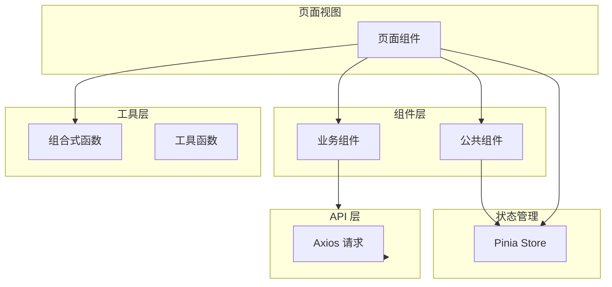

本章节介绍 Process-Card 前端的实现细节，包括项目结构、组件开发、状态管理等核心内容。

## 章节概览

::card-group
  ::card{title="项目结构" icon="i-heroicons-folder-open" to="/frontend/project-structure"}
  了解前端代码组织和目录结构
  ::

  ::card{title="连接配置" icon="i-heroicons-link" to="/frontend/connection-config"}
  动态后端连接配置 ⭐
  ::

  ::card{title="权限控制" icon="i-heroicons-shield-check" to="/frontend/permission-control"}
  前端权限管理实现 ⭐
  ::

  ::card{title="Table 组件" icon="i-heroicons-table-cells" to="/frontend/table-components"}
  快速开发 CRUD 功能 ⭐
  ::
::

## 技术栈

| 技术 | 版本 | 说明 |
|------|------|------|
| Vue.js | 3.4.5 | 渐进式框架 |
| TypeScript | 5.x | 类型安全 |
| Vite | 3.0 | 构建工具 |
| Pinia | 2.1.7 | 状态管理 |
| Element Plus | 2.6.3 | UI 组件库 |
| Axios | 1.6.8 | HTTP 请求 |
| Tailwind CSS | 3.x | 原子化 CSS |
| Tauri | 2.1.0 | 桌面应用 |

## 架构图



## 核心概念

### 组合式 API

项目使用 Vue 3 Composition API：

```vue
<script setup lang="ts">
import { ref, computed, onMounted } from 'vue'
import { useUserStore } from '@/store/user'

const userStore = useUserStore()
const loading = ref(false)

const isAdmin = computed(() => userStore.hasPermission('1'))

onMounted(() => {
  // 初始化逻辑
})
</script>
```

### 权限控制

前端通过权限码控制：

- **路由守卫**：控制页面访问
- **指令控制**：控制按钮显示
- **组合函数**：复用权限逻辑

### 状态管理

使用 Pinia 管理全局状态：

- `user.ts` - 用户状态
- `permiss.ts` - 权限状态
- `connection.ts` - 连接状态
- `sidebar.ts` - 侧边栏状态

## 推荐阅读顺序

| 步骤 | 文档 | 说明 |
|------|------|------|
| 1 | [项目结构](/frontend/project-structure) | 了解代码组织 |
| 2 | [连接配置](/frontend/connection-config) | 配置后端连接 |
| 3 | [权限控制](/frontend/permission-control) | 实现权限管理 |
| 4 | [Table 组件](/frontend/table-components) | 快速开发 CRUD |

## 快速链接

- [后端开发](/backend) - 了解后端实现
- [开发指南](/development-guide) - 学习如何扩展功能
- [环境搭建](/getting-started/environment-setup) - 配置开发环境
