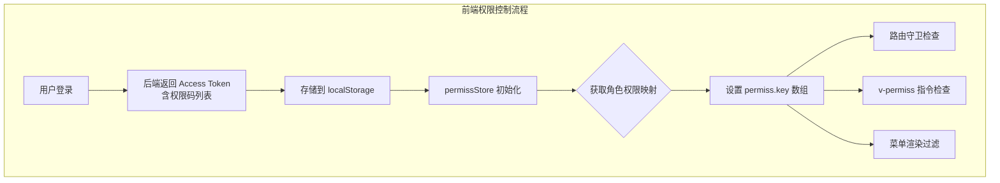
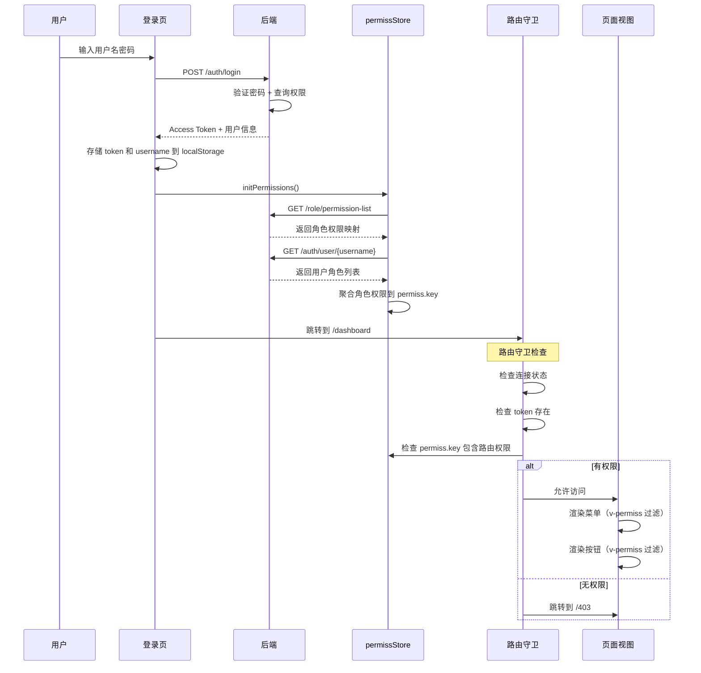

Process-Card 前端实现了多层次的权限控制，包括**路由权限**、**菜单权限**和**按钮权限**，确保用户只能访问和操作自己有权限的功能。

## 权限控制架构



## 核心组件

### 1. PermissionCode 常量

**文件路径**：`process-card-frontend/src/constants/permission.ts`

定义前端权限码常量，与后端 `PermissionCode.java` **完全一致**。

```typescript
/**
 * 权限码常量，与后端 PermissionCode.java 和数据库 permissions 表一一对应。
 */
export const PermissionCode = {
    // ===== 系统管理 =====
    /** 系统首页 */
    DASHBOARD: '0',
    /** 系统管理（菜单组） */
    SYSTEM_MANAGEMENT: '1',
    /** 用户管理 */
    USER_MANAGEMENT: '11',
    /** 角色管理 */
    ROLE_MANAGEMENT: '12',
    /** 菜单管理 */
    MENU_MANAGEMENT: '13',
    /** 权限管理 */
    PERMISSION_MANAGEMENT: '14',
    /** 用户密码修改（管理员重置） */
    USER_PASSWORD_MANAGEMENT: '15',

    // ===== 标定管理 =====
    /** 标定管理（菜单组） */
    CALIBRATION_MANAGEMENT: '2',
    /** 粗糙度标定信息查看 */
    ROUGHNESS_CALIBRATION_VIEW: '21',
    /** 长度标定信息查看 */
    LENGTH_CALIBRATION_VIEW: '22',
    /** 标定信息管理 */
    CALIBRATION_INFO_MANAGEMENT: '23',

    // ===== 缺陷管理 =====
    /** 缺陷管理（菜单组） */
    DEFECT_MANAGEMENT: '3',
    /** 缺陷种类管理 */
    DEFECT_TYPE_MANAGEMENT: '31',
    /** 缺陷验收标准管理 */
    DEFECT_ACCEPTANCE_STANDARD: '32',
    /** 缺陷检测标准管理 */
    DEFECT_DETECTION_STANDARD: '33',
    /** 模型管理 */
    MODEL_MANAGEMENT: '34',

    // ===== 工艺卡管理 =====
    /** 产品轨迹规划（菜单组） */
    PROCESS_CARD_GROUP: '4',
    /** 新建工艺卡 */
    PROCESS_CARD_CREATE: '41',
    /** 删除工艺卡 */
    PROCESS_CARD_DELETE: '42',
    /** 修改工艺卡 */
    PROCESS_CARD_UPDATE: '43',
    /** 执行工艺卡 */
    PROCESS_CARD_EXECUTE: '44',
    /** 审核工艺卡 */
    PROCESS_CARD_REVIEW: '45',
    /** 确认工艺卡 */
    PROCESS_CARD_CONFIRM: '46',
    /** 导出工艺卡 */
    PROCESS_CARD_EXPORT: '47',
    /** 查看工艺卡 */
    PROCESS_CARD_VIEW: '48',

    // ===== 前端特殊权限 =====
    /** 连接配置 */
    CONNECTION: '5',
} as const

export type PermissionCodeType = typeof PermissionCode[keyof typeof PermissionCode]
```

**关键点**：
- 权限码必须与后端保持同步
- 使用 `as const` 确保类型安全
- `CONNECTION` 是前端特有的权限码，用于连接配置页面

### 2. permissStore - 权限状态管理

**文件路径**：`process-card-frontend/src/store/permiss.ts`

使用 Pinia 管理权限状态，核心是 `key` 数组（用户拥有的权限码列表）。

```typescript
interface PermissState {
    key: string[]              // 当前用户的权限码列表
    initialized: boolean       // 是否已初始化
    defaultList: Record<string, string[]>  // 角色 -> 权限码映射
}

export const usePermissStore = defineStore('permiss', {
    state: (): PermissState => ({
        key: [],
        initialized: false,
        defaultList: {}
    }),
    actions: {
        async initPermissions() {
            // 1. 检查后端连接状态
            const connectionStore = useConnectionStore()
            const isConnected = await connectionStore.checkConnection()
            if (!isConnected) {
                this.resetPermissions()
                return false
            }

            if (this.initialized) {
                return true
            }

            // 2. 获取当前用户名
            const vuems_name = localStorage.getItem('vuems_name')
            if (!vuems_name) {
                this.resetPermissions()
                return false
            }

            try {
                // 3. 获取所有角色的权限映射
                await this.fetchPermissionList()

                // 4. 获取当前用户信息（含角色列表）
                const response = await request.get(`/auth/user/${vuems_name}`)
                const user = response.data
                // 兼容旧的 role_mark 和新的 role_marks
                const roleMarks = user.role_marks || (user.role_mark ? [user.role_mark] : [])

                // 5. 根据角色设置权限
                await this.setPermissionsForUser(roleMarks)
                this.initialized = true
                return true
            } catch (error) {
                console.error('Failed to initialize permissions:', error)
                this.resetPermissions()
                return false
            }
        },

        async fetchPermissionList() {
            // 获取 { roleMark: [permissionCodes...] } 映射
            try {
                const response = await request.get('/role/permission-list')
                this.defaultList = response.data || {}
            } catch (error) {
                console.error('Error fetching permission list:', error)
                this.defaultList = {}
                throw error
            }
        },

        async setPermissionsForUser(userRoles: string | string[]) {
            const roles = Array.isArray(userRoles) ? userRoles : [userRoles]
            const allPermissions = new Set<string>()

            // 聚合所有角色的权限码
            roles.forEach(role => {
                if (this.defaultList[role]) {
                    this.defaultList[role].forEach(p => allPermissions.add(p))
                }
            })

            if (allPermissions.size === 0 && roles.length > 0) {
                console.warn('No permissions found for roles:', roles)
            }

            this.key = Array.from(allPermissions)
            // 临时加上连接配置权限，以便显示 connection 页面
            this.key.push(PermissionCode.CONNECTION)
        },

        resetPermissions() {
            this.key = [PermissionCode.CONNECTION]
            this.defaultList = {}
            this.initialized = false
        }
    }
})
```

**关键点**：
- `key` 数组存储当前用户的所有权限码
- `fetchPermissionList()` 获取后端的角色权限映射表
- `setPermissionsForUser()` 根据用户角色聚合权限
- `resetPermissions()` 在登出或连接失败时重置权限

### 3. v-permiss 指令

**文件路径**：`process-card-frontend/src/main.ts:21-27`

自定义 Vue 指令，用于控制元素的显示隐藏（按钮权限控制）。

```typescript
const permiss = usePermissStore()
app.directive('permiss', {
    mounted(el, binding) {
        // binding.value 是权限码，如 "11"
        if (binding.value && !permiss.key.includes(String(binding.value))) {
            el['hidden'] = true  // 没有权限则隐藏元素
        }
    }
})
```

**使用示例**：

```vue
<template>
  <!-- 只有拥有 USER_MANAGEMENT 权限的用户才能看到这个按钮 -->
  <el-button type="primary" v-permiss="PermissionCode.USER_MANAGEMENT">
    新增用户
  </el-button>

  <!-- 多个按钮控制 -->
  <el-button type="danger" v-permiss="PermissionCode.USER_PASSWORD_MANAGEMENT">
    重置密码
  </el-button>
</template>

<script setup lang="ts">
import { PermissionCode } from '@/constants/permission'
</script>
```

**实现原理**：
- `el['hidden'] = true` 使用 HTML `hidden` 属性隐藏元素
- **不是 `v-if`**：元素仍在 DOM 中，只是不可见
- 性能更好，避免频繁的 DOM 操作

### 4. 路由权限守卫

**文件路径**：`process-card-frontend/src/router/index.ts:229-274`

在路由跳转前检查权限，控制页面访问。

#### 路由定义示例

```typescript
const allRoutes: RouteRecordRaw[] = [
    {
        path: '/system-user',
        name: 'system-user',
        meta: {
            title: '用户管理',
            permiss: PermissionCode.USER_MANAGEMENT  // 需要的权限码
        },
        component: () => import('../views/system/user.vue')
    },
    {
        path: '/system-role',
        name: 'system-role',
        meta: {
            title: '角色管理',
            permiss: PermissionCode.ROLE_MANAGEMENT
        },
        component: () => import('../views/system/role.vue')
    },
    // 无需权限的路由
    {
        path: '/login',
        meta: {
            title: '登录',
            noAuth: true  // 标记为无需认证
        },
        component: () => import('../views/pages/login.vue')
    }
]
```

#### 路由守卫逻辑

```typescript
router.beforeEach(async (to, from, next) => {
    NProgress.start()
    const connectionStore = useConnectionStore()
    const permiss = usePermissStore()
    const username = localStorage.getItem('vuems_name')

    // 1. 检查后端连接状态
    const isConnected = await connectionStore.checkConnection()
    if (!isConnected && to.path !== '/connection') {
        next('/connection')  // 未连接则跳转到连接配置
        return
    }

    // 2. 路由为空时，初始化路由（动态路由）
    if (router.getRoutes().length === 0) {
        console.log('初始化路由')
        await permiss.initPermissions()

        // 只添加有权限的路由
        const permittedRoutes = allRoutes.filter(route => {
            if (route.meta?.permiss) {
                return permiss.key.includes(route.meta.permiss?.toString())
            }
            return true  // 无需权限的路由始终添加
        })

        permittedRoutes.forEach(route => router.addRoute(route))
        next({...to, replace: true})  // 重新导航
        return
    }

    // 3. 权限检查：优先检查 JWT token，兼容旧的 username 检查
    const token = localStorage.getItem('jwt_token')
    if (!token && !username && to.meta.noAuth !== true) {
        next('/login')  // 未登录跳转到登录页
    } else if (typeof to.meta.permiss === 'string' && !permiss.key.includes(to.meta.permiss)) {
        next('/403')  // 无权限跳转到 403 页面
    } else {
        next()  // 允许访问
    }
})

router.afterEach(() => {
    NProgress.done()
})
```

**关键点**：
- **动态路由**：根据权限过滤并添加路由，用户无权限的路由根本不存在
- **连接检查**：优先检查后端连接状态
- **权限检查**：验证 `to.meta.permiss` 是否在 `permiss.key` 中
- **401 vs 403**：未登录跳转 `/login`，无权限跳转 `/403`

### 5. 菜单权限控制

**文件路径**：`process-card-frontend/src/components/sidebar.vue`

侧边栏菜单使用 `v-permiss` 指令控制菜单项显示。

#### menu.ts - 菜单数据

**文件路径**：`process-card-frontend/src/components/menu.ts`

```typescript
export const menuData: Menus[] = [
    {
        id: '0',  // 权限码
        title: '系统首页',
        index: '/dashboard',
        icon: 'Odometer'
    },
    {
        id: '1',  // 系统管理菜单组权限码
        title: '系统管理',
        index: '1',
        icon: 'Setting',
        children: [
            {
                id: '11',  // 用户管理权限码
                pid: '1',
                index: '/system-user',
                title: '用户管理'
            },
            {
                id: '12',
                pid: '1',
                index: '/system-role',
                title: '角色管理'
            },
            {
                id: '13',
                pid: '1',
                index: '/system-menu',
                title: '菜单管理'
            },
            {
                id: '14',
                pid: '1',
                index: '/permission-menu',
                title: '权限管理'
            }
        ]
    },
    {
        id: '2',
        title: '标定管理',
        index: '2',
        icon: 'Coordinate',
        children: [
            {
                id: '21',
                pid: '2',
                index: '/calibration-roughness',
                title: '粗糙度标定信息'
            },
            {
                id: '22',
                pid: '2',
                index: '/calibration-length',
                title: '长度标定信息'
            }
        ]
    },
    {
        id: '5',
        icon: 'Connection',
        index: '/connection',
        title: '连接信息配置'
    }
]
```

#### sidebar.vue - 菜单渲染

**文件路径**：`process-card-frontend/src/components/sidebar.vue:10-49`

```vue
<template>
  <div class="sidebar">
    <el-menu
        class="sidebar-el-menu"
        :default-active="onRoutes"
        :collapse="sidebar.collapse"
        router
    >
      <template v-for="item in menuData" :key="item.index">
        <!-- 一级菜单（含子菜单） -->
        <template v-if="item.children">
          <!-- v-permiss 控制菜单组显示 -->
          <el-sub-menu :index="item.index" v-permiss="item.id">
            <template #title>
              <el-icon>
                <component :is="item.icon"></component>
              </el-icon>
              <span>{{ item.title }}</span>
            </template>

            <!-- 二级菜单 -->
            <template v-for="subItem in item.children" :key="subItem.index">
              <el-sub-menu
                  v-if="subItem.children"
                  :index="subItem.index"
                  v-permiss="subItem.id"
              >
                <template #title>{{ subItem.title }}</template>
                <!-- 三级菜单 -->
                <el-menu-item
                    v-for="(threeItem, i) in subItem.children"
                    :key="i"
                    :index="threeItem.index"
                    v-permiss="threeItem.id"
                >
                  {{ threeItem.title }}
                </el-menu-item>
              </el-sub-menu>

              <!-- 二级菜单（无子菜单） -->
              <el-menu-item v-else :index="subItem.index" v-permiss="subItem.id">
                {{ subItem.title }}
              </el-menu-item>
            </template>
          </el-sub-menu>
        </template>

        <!-- 一级菜单（无子菜单） -->
        <template v-else>
          <el-menu-item :index="item.index" v-permiss="item.id">
            <el-icon>
              <component :is="item.icon"></component>
            </el-icon>
            <span>{{ item.title }}</span>
          </el-menu-item>
        </template>
      </template>
    </el-menu>
  </div>
</template>

<script setup lang="ts">
import {computed} from 'vue'
import {useSidebarStore} from '@/store/sidebar'
import {useRoute} from 'vue-router'
import {menuData} from '@/components/menu'

const route = useRoute()
const onRoutes = computed(() => route.path)
const sidebar = useSidebarStore()
</script>
```

**关键点**：
- **三级菜单支持**：一级菜单组 → 二级菜单项 → 三级菜单项
- **递归权限控制**：每一级菜单都使用 `v-permiss` 控制
- **id 对应权限码**：`menu.ts` 中的 `id` 字段与 `PermissionCode` 一致

## 完整权限流程



## 实际应用示例

### 示例 1：添加新权限后的前端改动

假设后端新增权限 `PRODUCT_TRACE = "51"`（产品追溯），前端需要：

#### Step 1: 更新 permission.ts

```typescript
export const PermissionCode = {
    // ... 其他权限

    /** 产品追溯 */
    PRODUCT_TRACE: '51',
}
```

#### Step 2: 在 router/index.ts 添加路由

```typescript
{
    path: '/product-trace',
    name: 'product-trace',
    meta: {
        title: '产品追溯',
        permiss: PermissionCode.PRODUCT_TRACE  // 使用新权限码
    },
    component: () => import('../views/product/trace.vue')
}
```

#### Step 3: 在 menu.ts 添加菜单项

```typescript
{
    id: '51',  // 对应权限码
    icon: 'Search',
    index: '/product-trace',
    title: '产品追溯'
}
```

#### Step 4: 在页面中使用 v-permiss

```vue
<template>
  <div>
    <h1>产品追溯</h1>

    <!-- 只有 PRODUCT_TRACE 权限的用户能看到导出按钮 -->
    <el-button type="primary" v-permiss="PermissionCode.PRODUCT_TRACE">
      导出追溯报告
    </el-button>
  </div>
</template>

<script setup lang="ts">
import { PermissionCode } from '@/constants/permission'
</script>
```

**完成！** 用户刷新页面后，permissStore 会重新初始化权限，新权限生效。

### 示例 2：工艺卡按钮权限控制

**文件路径**：`process-card-frontend/src/views/product-trace/index.vue`（示例）

```vue
<template>
  <div>
    <el-table :data="processCards">
      <!-- 表格列... -->
    </el-table>

    <!-- 操作按钮组 -->
    <div class="actions">
      <!-- 新建工艺卡：需要 PROCESS_CARD_CREATE 权限 -->
      <el-button
          type="primary"
          v-permiss="PermissionCode.PROCESS_CARD_CREATE"
          @click="handleCreate"
      >
        新建工艺卡
      </el-button>

      <!-- 删除工艺卡：需要 PROCESS_CARD_DELETE 权限 -->
      <el-button
          type="danger"
          v-permiss="PermissionCode.PROCESS_CARD_DELETE"
          @click="handleDelete"
      >
        删除
      </el-button>

      <!-- 审核工艺卡：需要 PROCESS_CARD_REVIEW 权限 -->
      <el-button
          type="success"
          v-permiss="PermissionCode.PROCESS_CARD_REVIEW"
          @click="handleReview"
      >
        审核
      </el-button>

      <!-- 确认工艺卡：需要 PROCESS_CARD_CONFIRM 权限 -->
      <el-button
          type="warning"
          v-permiss="PermissionCode.PROCESS_CARD_CONFIRM"
          @click="handleConfirm"
      >
        确认
      </el-button>

      <!-- 导出工艺卡：需要 PROCESS_CARD_EXPORT 权限 -->
      <el-button
          v-permiss="PermissionCode.PROCESS_CARD_EXPORT"
          @click="handleExport"
      >
        导出
      </el-button>
    </div>
  </div>
</template>

<script setup lang="ts">
import { PermissionCode } from '@/constants/permission'

const handleCreate = () => { /* ... */ }
const handleDelete = () => { /* ... */ }
const handleReview = () => { /* ... */ }
const handleConfirm = () => { /* ... */ }
const handleExport = () => { /* ... */ }
</script>
```

**效果**：
- 普通用户（executor 角色）：只能看到"执行"按钮
- 审核员（reviewer 角色）：能看到"审核"按钮
- 管理员（admin 角色）：能看到所有按钮

## 常见问题

### 1. 修改权限后需要重新登录吗？

**不需要**，但需要刷新页面。刷新时 `permissStore.initPermissions()` 会重新从后端获取最新权限。

如果使用 Refresh Token 刷新 Access Token，新 Token 会包含最新权限。

### 2. 如何实现"至少拥有其中一个权限"？

修改 `v-permiss` 指令：

```typescript
app.directive('permiss', {
    mounted(el, binding) {
        // binding.value 可以是数组
        const requiredPermissions = Array.isArray(binding.value) ? binding.value : [binding.value]
        const hasPermission = requiredPermissions.some(p => permiss.key.includes(String(p)))
        if (!hasPermission) {
            el['hidden'] = true
        }
    }
})
```

使用：

```vue
<el-button v-permiss="[PermissionCode.PROCESS_CARD_REVIEW, PermissionCode.PROCESS_CARD_CONFIRM]">
  审核或确认
</el-button>
```

### 3. 如何隐藏整个页面区域？

使用 `v-if` + 计算属性：

```vue
<template>
  <!-- 使用 v-if 完全移除 DOM -->
  <div v-if="hasPermission">
    <h2>管理员专属区域</h2>
    <!-- ... -->
  </div>
</template>

<script setup lang="ts">
import { computed } from 'vue'
import { usePermissStore } from '@/store/permiss'
import { PermissionCode } from '@/constants/permission'

const permiss = usePermissStore()
const hasPermission = computed(() =>
    permiss.key.includes(PermissionCode.USER_MANAGEMENT)
)
</script>
```

### 4. 为什么用 `hidden` 而不是 `v-if`？

- **`hidden`**：元素仍在 DOM 中，只是不可见，性能更好
- **`v-if`**：元素不在 DOM 中，更安全（防止查看源代码）

如果需要更高安全性，可以改用 `v-if`：

```typescript
app.directive('permiss', {
    mounted(el, binding) {
        if (binding.value && !permiss.key.includes(String(binding.value))) {
            el.remove()  // 从 DOM 中移除
        }
    }
})
```

### 5. 权限码不匹配怎么办？

前后端权限码必须**完全一致**。建议：
1. 后端修改权限码后，通知前端同步修改 `permission.ts`
2. 使用脚本自动生成前端权限码（从后端 `PermissionCode.java` 解析）
3. 定期检查前后端权限码一致性

## 最佳实践

1. **权限码命名规范**：
   - 一级菜单：1 位数字（如 `"1"` 系统管理）
   - 二级功能：2 位数字（如 `"11"` 用户管理）
   - 三级功能：3 位数字（如 `"111"` 用户创建）

2. **权限粒度**：
   - **粗粒度**：菜单级别（如"用户管理"）
   - **细粒度**：操作级别（如"新建用户"、"删除用户"）

3. **前后端同步**：
   - 后端修改 `PermissionCode.java` 后，立即同步前端 `permission.ts`
   - 使用 Git Hook 或 CI 脚本检查一致性

4. **测试覆盖**：
   - 使用不同角色账号测试菜单和按钮显示
   - 测试路由守卫（尝试直接访问 URL）

## 下一步

- 阅读 [连接配置](./connection-config) 了解如何管理后端地址
- 查看 [Table 组件复用](./table-components) 学习如何快速开发新功能
- 学习 [新增权限指南](../development-guide/add-new-permission) 掌握完整的权限添加流程

---

**提示**：前端权限控制仅用于**用户体验优化**，真正的权限验证必须在后端进行。前端隐藏按钮不代表用户无法调用 API，后端必须使用 `@RequirePermission` 注解验证权限。
