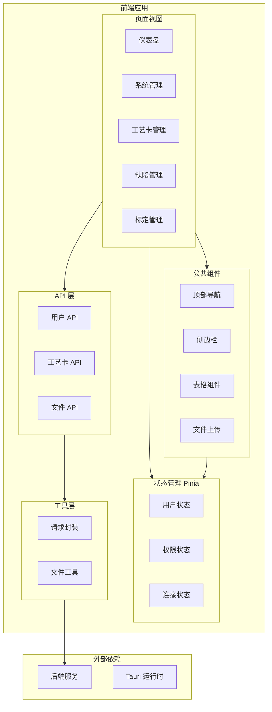

本文档介绍 `process-card-frontend` 项目的目录结构和代码组织方式。

## 项目概览

```
process-card-frontend/
├── src/                    # 源代码
│   ├── api/                # API 请求模块
│   ├── assets/             # 静态资源
│   ├── components/         # 公共组件
│   ├── composables/        # 组合式函数
│   ├── constants/          # 常量定义
│   ├── router/             # 路由配置
│   ├── store/              # Pinia 状态管理
│   ├── types/              # TypeScript 类型定义
│   ├── utils/              # 工具函数
│   ├── views/              # 页面组件
│   ├── App.vue             # 根组件
│   ├── main.ts             # 入口文件
│   └── style.css           # 全局样式
├── public/                 # 公共资源
├── src-tauri/              # Tauri 桌面应用
├── index.html              # HTML 入口
├── vite.config.ts          # Vite 配置
├── tailwind.config.js      # Tailwind 配置
├── tsconfig.json           # TypeScript 配置
└── package.json            # 依赖配置
```

## 架构图



## 目录详解

### 📁 src/api/

API 请求模块，按业务领域组织。

| 文件 | 说明 |
|------|------|
| `index.ts` | API 模块统一导出 |
| `user.ts` | 用户相关 API |
| `role.ts` | 角色管理 API |
| `permission.ts` | 权限管理 API |
| `process-card.ts` | 工艺卡 API |
| `unified-file.ts` | 统一文件管理 API |
| `standard.ts` | 标准管理 API |
| `calibration.ts` | 标定管理 API |
| `health.ts` | 健康检查 API |

**示例代码：**

```typescript
// api/process-card.ts
import request from '@/utils/request'
import type { ProcessCard } from '@/types/process-card'

export const getProcessCards = () => {
  return request.get<ProcessCard[]>('/process-cards')
}

export const createProcessCard = (data: Partial<ProcessCard>) => {
  return request.post('/process-cards', data)
}

export const updateProcessCard = (id: number, data: Partial<ProcessCard>) => {
  return request.put(`/process-cards/${id}`, data)
}

export const deleteProcessCard = (id: number) => {
  return request.delete(`/process-cards/${id}`)
}
```

### 📁 src/assets/

静态资源文件。

```
assets/
├── css/           # 样式文件
├── images/        # 图片资源
└── icons/         # 图标文件
```

### 📁 src/components/

公共组件，可在多个页面复用。

| 组件 | 说明 |
|------|------|
| `header.vue` | 顶部导航栏 |
| `sidebar.vue` | 侧边菜单 |
| `tabs.vue` | 标签页管理 |
| `table-custom.vue` | 自定义表格 |
| `table-search.vue` | 表格搜索 |
| `table-edit.vue` | 表格编辑 |
| `table-detail.vue` | 表格详情 |
| `ChunkFileUploader.vue` | 分片上传组件 |
| `DefectSelector.vue` | 缺陷选择器 |
| `DefectLevelsManager.vue` | 缺陷等级管理 |
| `ModelSelector.vue` | 模型选择器 |
| `MetricCombination.vue` | 度量组合 |
| `RoughnessSelector.vue` | 粗糙度选择器 |
| `countup.vue` | 数字动画 |

**子目录：**

```
components/
└── process-card/     # 工艺卡相关组件
    ├── CardForm.vue
    ├── TraceList.vue
    └── ApprovalFlow.vue
```

### 📁 src/composables/

Vue 3 组合式函数（Composables），封装可复用的状态逻辑。

| 文件 | 说明 |
|------|------|
| `useUser.ts` | 用户状态与认证 |
| `useProcessCards.ts` | 工艺卡列表管理 |
| `useProcessCardPermission.ts` | 工艺卡权限检查 |
| `useFileUpload.ts` | 分片文件上传 |
| `useSimpleFileUpload.ts` | 简单文件上传 |
| `useModelFile.ts` | 3D 模型文件处理 |
| `useStandardCache.ts` | 标准数据缓存 |
| `useTraceDialogs.ts` | 轨迹对话框管理 |

**示例代码：**

```typescript
// composables/useProcessCardPermission.ts
import { computed } from 'vue'
import { useUserStore } from '@/store/user'

export function useProcessCardPermission() {
  const userStore = useUserStore()
  
  const canCreate = computed(() => 
    userStore.hasPermission('41')
  )
  
  const canEdit = computed(() => 
    userStore.hasPermission('43')
  )
  
  const canDelete = computed(() => 
    userStore.hasPermission('42')
  )
  
  const canReview = computed(() => 
    userStore.hasPermission('45')
  )
  
  const canConfirm = computed(() => 
    userStore.hasPermission('46')
  )
  
  return {
    canCreate,
    canEdit,
    canDelete,
    canReview,
    canConfirm
  }
}
```

### 📁 src/constants/

常量定义。

```typescript
// constants/index.ts
export const API_BASE_URL = '/api/v1/vt-process-card-software'

export const PERMISSION_CODES = {
  // 系统管理
  SYSTEM_MANAGEMENT: '1',
  USER_MANAGEMENT: '11',
  ROLE_MANAGEMENT: '12',
  
  // 工艺卡
  PROCESS_CARD_CREATE: '41',
  PROCESS_CARD_DELETE: '42',
  PROCESS_CARD_EDIT: '43',
  PROCESS_CARD_EXECUTE: '44',
  PROCESS_CARD_REVIEW: '45',
  PROCESS_CARD_CONFIRM: '46',
  PROCESS_CARD_EXPORT: '47',
  PROCESS_CARD_VIEW: '48'
}
```

### 📁 src/router/

Vue Router 路由配置。

```typescript
// router/index.ts
import { createRouter, createWebHistory } from 'vue-router'
import { useUserStore } from '@/store/user'

const routes = [
  {
    path: '/login',
    name: 'Login',
    component: () => import('@/views/pages/login.vue'),
    meta: { requiresAuth: false }
  },
  {
    path: '/',
    component: () => import('@/views/home.vue'),
    meta: { requiresAuth: true },
    children: [
      {
        path: '',
        name: 'Dashboard',
        component: () => import('@/views/dashboard.vue')
      },
      {
        path: 'system/users',
        name: 'UserManagement',
        component: () => import('@/views/system/users.vue'),
        meta: { permission: '11' }
      },
      // ...更多路由
    ]
  }
]

const router = createRouter({
  history: createWebHistory(),
  routes
})

// 路由守卫
router.beforeEach((to, from, next) => {
  const userStore = useUserStore()
  
  if (to.meta.requiresAuth && !userStore.isLoggedIn) {
    next('/login')
  } else if (to.meta.permission && !userStore.hasPermission(to.meta.permission)) {
    next('/403')
  } else {
    next()
  }
})

export default router
```

### 📁 src/store/

Pinia 状态管理。

| 文件 | 说明 |
|------|------|
| `user.ts` | 用户状态（登录、权限） |
| `permiss.ts` | 权限状态 |
| `connection.ts` | 后端连接状态 |
| `sidebar.ts` | 侧边栏状态 |
| `tabs.ts` | 标签页状态 |
| `theme.ts` | 主题状态 |

**示例代码：**

```typescript
// store/user.ts
import { defineStore } from 'pinia'
import { ref, computed } from 'vue'
import { login, logout, getUserInfo } from '@/api/user'

export const useUserStore = defineStore('user', () => {
  const token = ref(localStorage.getItem('token') || '')
  const userInfo = ref<UserInfo | null>(null)
  const permissions = ref<string[]>([])
  
  const isLoggedIn = computed(() => !!token.value)
  
  const hasPermission = (code: string) => {
    return permissions.value.includes(code)
  }
  
  const doLogin = async (username: string, password: string) => {
    const res = await login({ username, password })
    token.value = res.data.accessToken
    localStorage.setItem('token', token.value)
    await fetchUserInfo()
  }
  
  const fetchUserInfo = async () => {
    const res = await getUserInfo()
    userInfo.value = res.data
    permissions.value = res.data.permissions || []
  }
  
  const doLogout = () => {
    token.value = ''
    userInfo.value = null
    permissions.value = []
    localStorage.removeItem('token')
  }
  
  return {
    token,
    userInfo,
    permissions,
    isLoggedIn,
    hasPermission,
    doLogin,
    fetchUserInfo,
    doLogout
  }
})
```

### 📁 src/types/

TypeScript 类型定义。

| 文件 | 说明 |
|------|------|
| `process-card.ts` | 工艺卡相关类型 |
| `defect.ts` | 缺陷相关类型 |
| `calibration.ts` | 标定相关类型 |
| `acceptanceStandard.ts` | 验收标准类型 |
| `detectionStandard.ts` | 检测标准类型 |
| `file.ts` | 文件相关类型 |
| `role.ts` | 角色相关类型 |
| `menu.ts` | 菜单相关类型 |
| `table.ts` | 表格相关类型 |
| `form-option.ts` | 表单选项类型 |

**示例代码：**

```typescript
// types/process-card.ts
export interface ProcessCard {
  processCardId: number
  name: string
  productId: string
  productQuantity: number
  graphNumber: string
  texture: string
  description?: string
  workpieceModelPath?: string
  stcpPath?: string
  acceptanceStandardId?: number
  detectionStandardId?: number
  currentApprovalLevel: number
  traces?: Trace[]
  approvalInfos?: ApprovalInfo[]
}

export interface Trace {
  traceId: number
  name: string
  type: string
  erdFilePath?: string
  erpFilePath?: string
  enabled: boolean
  traceOrder: number
}

export interface ApprovalInfo {
  id: number
  approvedBy: number
  approvalLevel: number
  approvalType: 'create' | 'review' | 'confirm'
  approvalTime: string
  comments?: string
  signPhotoPath?: string
}
```

### 📁 src/utils/

工具函数。

| 文件 | 说明 |
|------|------|
| `index.ts` | 通用工具函数 |
| `request.ts` | Axios 请求封装 |
| `file.ts` | 文件处理工具 |
| `china.ts` | 中国地图数据（ECharts） |

**Axios 封装示例：**

```typescript
// utils/request.ts
import axios from 'axios'
import { ElMessage } from 'element-plus'
import { useUserStore } from '@/store/user'
import router from '@/router'

const request = axios.create({
  baseURL: '/api/v1/vt-process-card-software',
  timeout: 30000
})

// 请求拦截器
request.interceptors.request.use(
  config => {
    const userStore = useUserStore()
    if (userStore.token) {
      config.headers.Authorization = `Bearer ${userStore.token}`
    }
    return config
  },
  error => Promise.reject(error)
)

// 响应拦截器
request.interceptors.response.use(
  response => response,
  error => {
    if (error.response?.status === 401) {
      const userStore = useUserStore()
      userStore.doLogout()
      router.push('/login')
      ElMessage.error('登录已过期，请重新登录')
    } else if (error.response?.status === 403) {
      ElMessage.error('没有权限执行此操作')
    } else {
      ElMessage.error(error.response?.data?.message || '请求失败')
    }
    return Promise.reject(error)
  }
)

export default request
```

### 📁 src/views/

页面组件，按功能模块组织。

```
views/
├── home.vue              # 主布局
├── dashboard.vue         # 仪表盘
├── pages/                # 独立页面
│   ├── login.vue         # 登录页
│   ├── 403.vue           # 无权限
│   └── 404.vue           # 未找到
├── system/               # 系统管理
│   ├── users.vue         # 用户管理
│   ├── roles.vue         # 角色管理
│   └── permissions.vue   # 权限管理
├── defect/               # 缺陷管理
│   ├── types.vue         # 缺陷类型
│   └── standards.vue     # 缺陷标准
├── calibration/          # 标定管理
│   ├── roughness.vue     # 粗糙度标定
│   └── length.vue        # 长度标定
├── product/              # 产品管理
│   ├── process-cards.vue # 工艺卡列表
│   ├── create.vue        # 创建工艺卡
│   └── detail.vue        # 工艺卡详情
├── model/                # 3D 模型
├── table/                # 表格示例
├── chart/                # 图表示例
└── connection/           # 连接设置
```

## Tauri 桌面应用

### src-tauri/ 目录

```
src-tauri/
├── src/
│   ├── main.rs           # Rust 入口
│   └── lib.rs            # Tauri 命令
├── icons/                # 应用图标
├── capabilities/         # 权限配置
├── tauri.conf.json       # Tauri 配置
├── Cargo.toml            # Rust 依赖
└── build.rs              # 构建脚本
```

### Tauri 配置

```json
// tauri.conf.json
{
  "productName": "工艺卡管理系统",
  "identifier": "com.ustb.process-card",
  "build": {
    "devUrl": "http://localhost:5173",
    "frontendDist": "../dist"
  },
  "app": {
    "windows": [
      {
        "title": "工艺卡管理系统",
        "width": 1280,
        "height": 800,
        "resizable": true
      }
    ]
  }
}
```

## 代码规范

### 文件命名

| 类型 | 规范 | 示例 |
|------|------|------|
| 组件 | PascalCase 或 kebab-case | `UserList.vue` / `user-list.vue` |
| 组合函数 | use 前缀 + PascalCase | `useUserStore.ts` |
| 类型文件 | 小写 + kebab-case | `process-card.ts` |
| 工具函数 | 小写 + kebab-case | `request.ts` |

### 组件结构

```vue
<script setup lang="ts">
// 1. 导入
import { ref, computed, onMounted } from 'vue'
import { useUserStore } from '@/store/user'
import type { User } from '@/types/user'

// 2. Props & Emits
const props = defineProps<{
  userId: number
}>()

const emit = defineEmits<{
  (e: 'update', user: User): void
}>()

// 3. 组合函数
const userStore = useUserStore()

// 4. 响应式状态
const loading = ref(false)
const user = ref<User | null>(null)

// 5. 计算属性
const displayName = computed(() => user.value?.displayName || '')

// 6. 方法
const fetchUser = async () => {
  loading.value = true
  // ...
}

// 7. 生命周期
onMounted(() => {
  fetchUser()
})
</script>

<template>
  <!-- 模板 -->
</template>

<style scoped>
/* 样式 */
</style>
```

## 下一步

- [后端连接配置](/frontend/connection-config) - 配置后端 API 连接
- [权限控制](/frontend/permission-control) - 前端权限控制实现
- [表格组件](/frontend/table-components) - 表格组件使用指南
