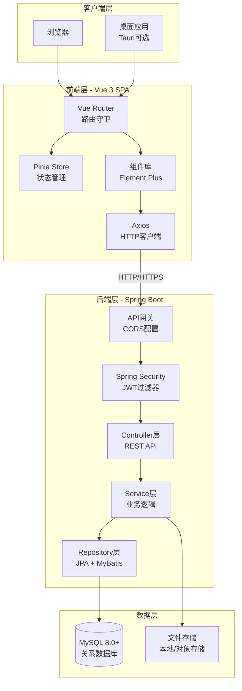
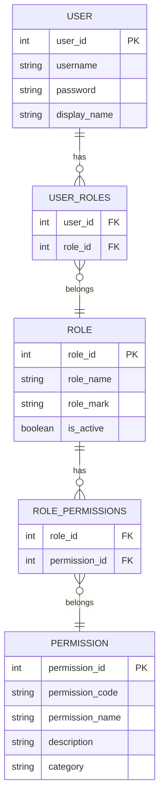
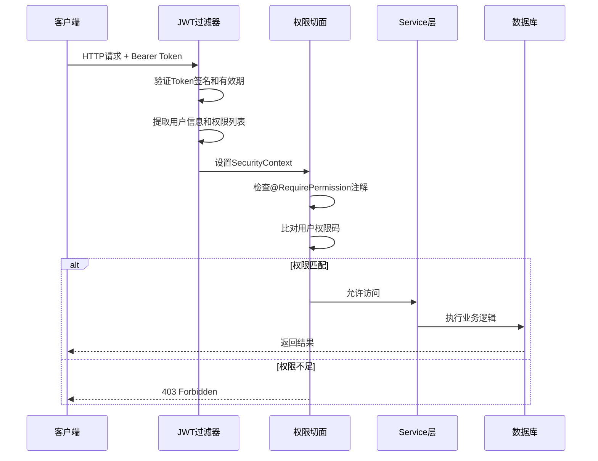
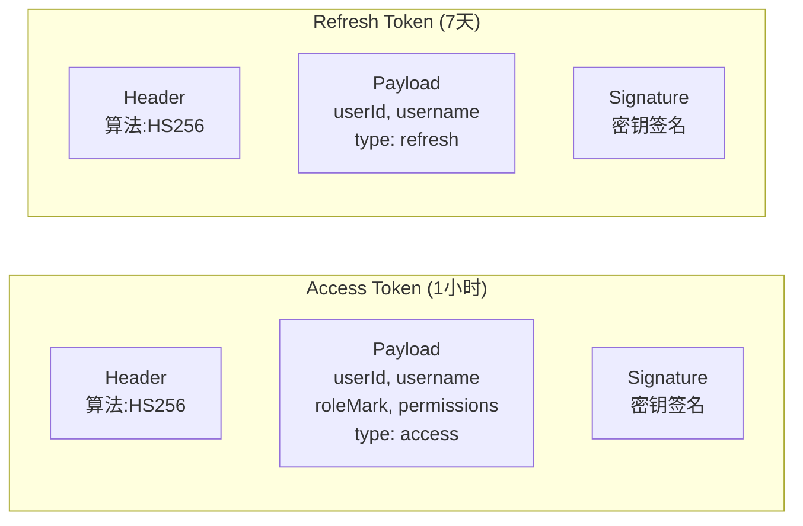
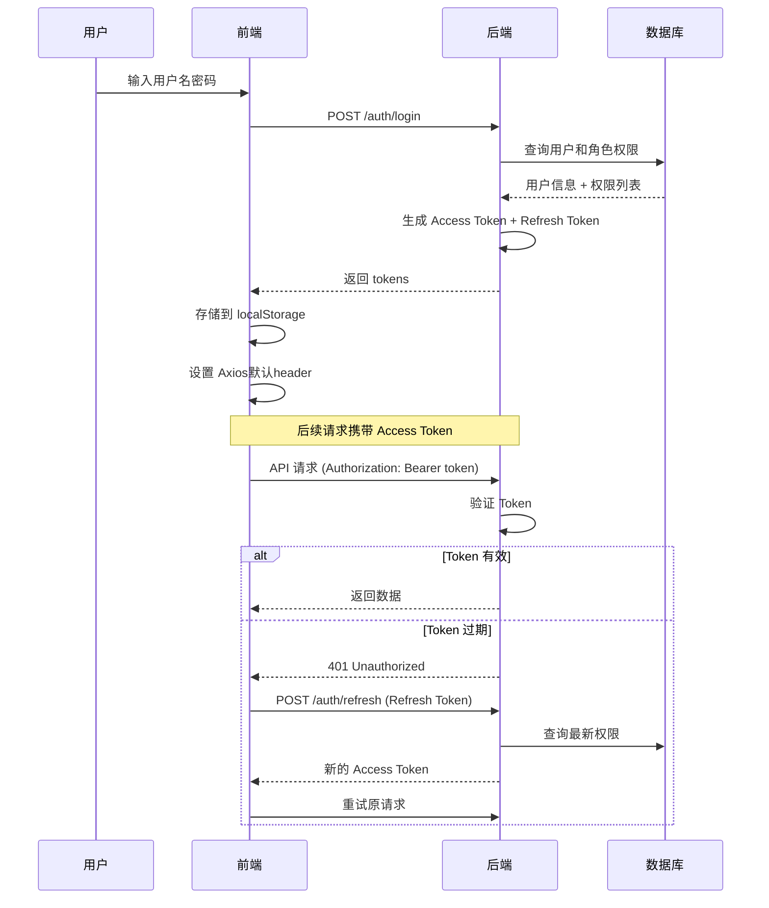
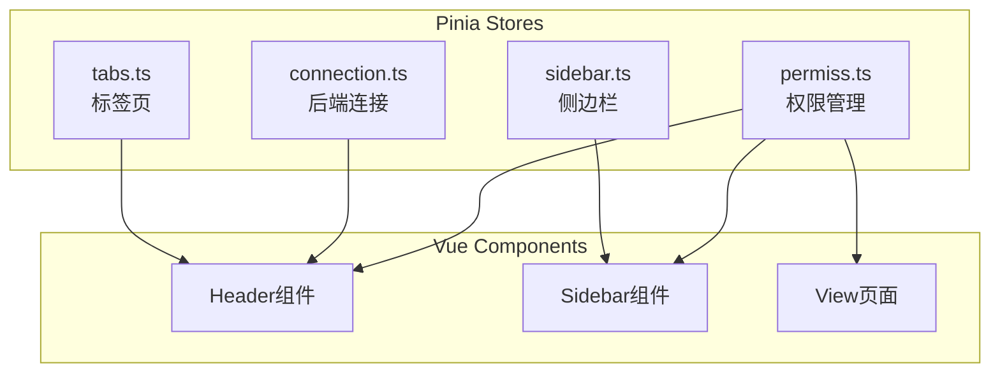
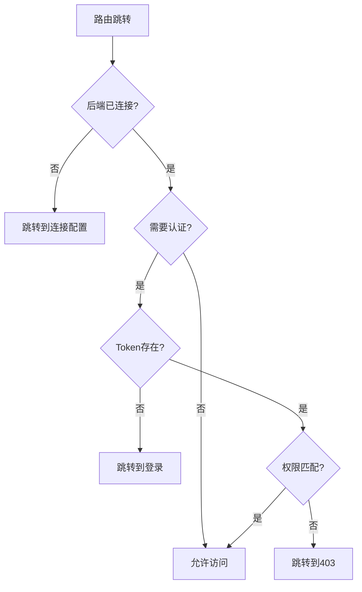
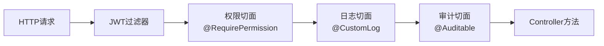
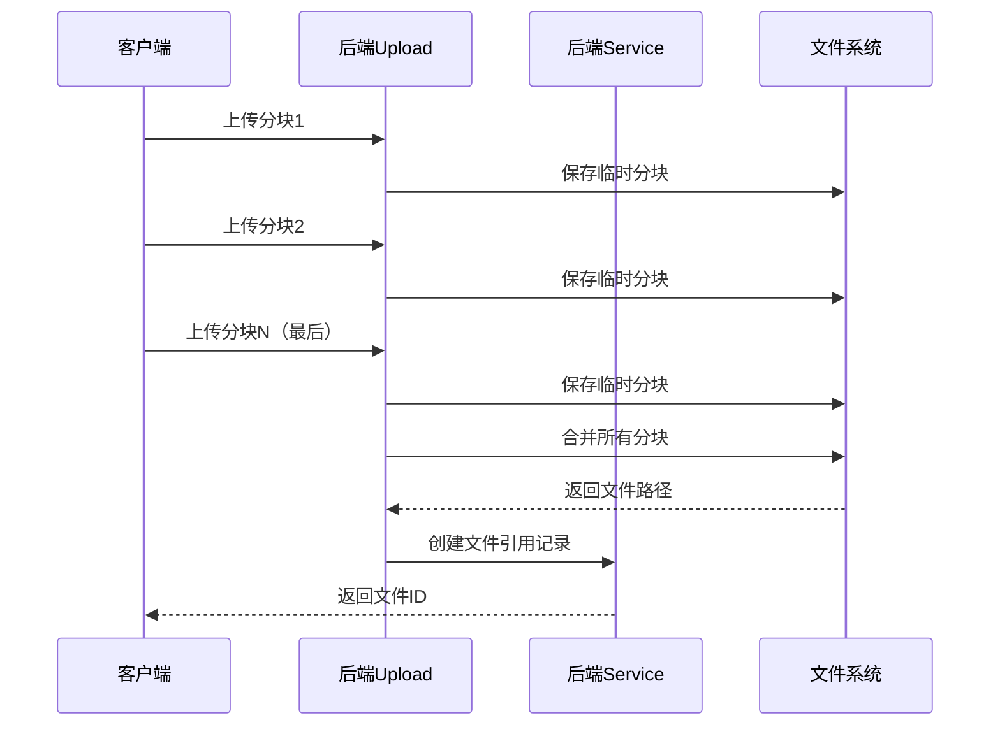

Process-Card 采用**前后端分离**的经典架构，前端 Vue 3 SPA 通过 RESTful API 与后端 Spring Boot 进行交互。



## 前后端分离设计

### 通信方式

- **协议**：HTTP/HTTPS
- **数据格式**：JSON
- **认证方式**：JWT Bearer Token
- **跨域处理**：CORS 配置

### 前端职责

1. **用户界面渲染**：Vue 3 组件化开发
2. **路由管理**：Vue Router + 权限守卫
3. **状态管理**：Pinia Store（用户信息、权限、连接配置）
4. **HTTP 请求**：Axios + 请求/响应拦截器
5. **权限控制**：v-permiss 指令 + 路由守卫

### 后端职责

1. **业务逻辑处理**：Service 层
2. **数据持久化**：JPA + MyBatis
3. **权限验证**：@RequirePermission 注解 + AOP 切面
4. **用户认证**：JWT Token 生成和验证
5. **API 接口提供**：RESTful 风格

## 权限架构

### 三级权限模型



### 权限验证流程



## JWT 认证架构

### Token 结构



### 认证流程



## 前端架构设计

### 目录结构

```plaintext
src/
├── api/              # API 接口封装
├── components/       # 可复用组件
├── composables/      # 组合式函数（业务逻辑复用）
├── constants/        # 常量（权限码等）
├── router/           # 路由配置 + 守卫
├── store/            # Pinia 状态管理
├── types/            # TypeScript 类型定义
├── utils/            # 工具函数
└── views/            # 页面视图
```

### 状态管理



### 路由守卫



## 后端架构设计

### 分层架构

```plaintext
Controller 层（接收HTTP请求）
    ↓
Service 层（业务逻辑处理）
    ↓
Repository/Mapper 层（数据访问）
    ↓
Database（数据持久化）
```

### 切面编程（AOP）



### 数据访问层

Process-Card 混合使用 **JPA** 和 **MyBatis**：

| 场景 | 技术选择 | 原因 |
|------|---------|------|
| 简单 CRUD | Spring Data JPA | 自动生成 SQL，代码简洁 |
| 复杂查询 | MyBatis | 灵活的 SQL 控制，性能优化 |
| 关联查询 | MyBatis | 避免 N+1 问题 |
| 批量操作 | MyBatis | 原生 SQL 性能更好 |

## 环境隔离设计

### 三环境配置

```yaml
# application.yaml
spring:
  profiles:
    active: dev  # 默认开发环境

---
# application-dev.yaml（开发环境）
server:
  port: 6062
spring:
  jpa:
    hibernate:
      ddl-auto: create-drop  # 每次重启重建数据库
    show-sql: true
  datasource:
    url: jdbc:mysql://localhost:3306/vt_process_card_dev

---
# application-test.yaml（测试环境）
server:
  port: 6061
spring:
  jpa:
    hibernate:
      ddl-auto: validate  # 仅验证，不修改结构
  datasource:
    url: jdbc:mysql://localhost:3306/vt_process_card_test

---
# application-prod.yaml（生产环境）
server:
  port: 6060
spring:
  jpa:
    hibernate:
      ddl-auto: validate
    show-sql: false  # 关闭SQL日志
  datasource:
    url: jdbc:mysql://production-server:3306/vt_process_card_prod
```

### 前端环境切换

前端通过 **连接配置页面** 动态设置后端地址，支持：

- IP 地址
- 端口
- Context Path（URL 前缀）

存储在 `localStorage` 中，刷新页面不丢失。

## 文件处理架构

### 文件存储

- **存储路径**：`/Users/erikssonhou/storage`（可配置）
- **文件类型**：模型文件、图片、Excel 等
- **分块上传**：支持大文件（5MB 分块）
- **软删除**：逻辑删除，30 天后物理删除

### 文件上传流程



## 性能优化设计

### 前端优化

- **路由懒加载**：`() => import('./views/xxx.vue')`
- **组件懒加载**：按需加载 Element Plus 组件
- **请求去重**：Axios 拦截器防止重复请求
- **缓存机制**：标准数据缓存到 Store

### 后端优化

- **分页查询**：所有列表接口支持分页
- **索引优化**：主键、外键、查询字段建立索引
- **连接池**：HikariCP 数据库连接池
- **异步处理**：文件生成、邮件发送等使用异步

## 安全架构

### 安全措施

1. **认证**：JWT Token + 签名验证
2. **授权**：@RequirePermission + 权限切面
3. **CSRF 防护**：无状态 API 禁用 CSRF
4. **SQL 注入防护**：JPA Criteria + MyBatis 预编译
5. **XSS 防护**：前端输入验证 + 后端转义
6. **防暴力破解**：LoginAttempt 记录登录尝试
7. **密码加密**：BCrypt 哈希存储

### CORS 配置

允许跨域访问，支持前后端分离部署：

```java
@Configuration
public class WebConfig {
    @Bean
    public CorsConfigurationSource corsConfigurationSource() {
        CorsConfiguration config = new CorsConfiguration();
        config.addAllowedOriginPattern("*");  // 允许所有域名
        config.addAllowedMethod("*");         // 允许所有HTTP方法
        config.addAllowedHeader("*");         // 允许所有请求头
        config.setAllowCredentials(true);     // 允许携带凭证
        return source;
    }
}
```

## 日志和审计

### 日志体系

- **操作日志**：`@CustomLog` 注解记录关键操作
- **审计日志**：`@Auditable` 注解记录 CRUD 操作
- **异常日志**：全局异常处理器记录

### 审计信息

所有重要操作记录到 `audit_logs` 表：

- 操作人（user_id）
- 操作类型（CREATE/UPDATE/DELETE）
- 目标资源（PERMISSION/ROLE/USER）
- 操作描述
- 时间戳

## 下一步

- 查看 [技术栈详解](./tech-stack) 了解具体技术选型
- 阅读 [后端权限系统](../backend/permission-system) 深入理解权限实现
- 学习 [前端权限控制](../frontend/permission-control) 掌握前端权限

---

**提示**：本架构设计遵循"关注点分离"原则，前后端、各层级职责清晰，便于维护和扩展。
