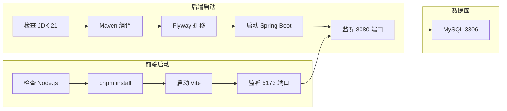

本指南将帮助你配置开发环境并运行工艺卡管理系统。

## 环境要求

### 必需软件

| 软件 | 版本要求 | 说明 |
|------|----------|------|
| **JDK** | 21+ | 推荐使用 Eclipse Temurin 或 Amazon Corretto |
| **Node.js** | 18+ | 推荐使用 LTS 版本 |
| **MySQL** | 8.0+ | 数据库服务 |
| **Maven** | 3.9+ | 后端构建工具 |
| **pnpm** | 8+ | 推荐的包管理器（也可使用 npm/yarn） |
| **Git** | 2.x | 版本控制 |

### 可选软件

| 软件 | 说明 |
|------|------|
| **Docker** | 容器化部署 |
| **Rust** | Tauri 桌面应用开发需要 |
| **VS Code** | 推荐的代码编辑器 |
| **IntelliJ IDEA** | 后端开发 IDE |

## 安装步骤

### 1. 安装 JDK 21

::tabs
  ::div{label="macOS"}
  使用 Homebrew 安装：
  ```bash
  # 安装 Temurin JDK 21
  brew install --cask temurin@21
  
  # 验证安装
  java -version
  ```
  ::

  ::div{label="Windows"}
  1. 下载 [Eclipse Temurin JDK 21](https://adoptium.net/)
  2. 运行安装程序
  3. 设置环境变量 `JAVA_HOME`
  4. 验证安装：
  ```powershell
  java -version
  ```
  ::

  ::div{label="Linux"}
  ```bash
  # Ubuntu/Debian
  sudo apt install openjdk-21-jdk
  
  # 验证安装
  java -version
  ```
  ::
::

### 2. 安装 Node.js

::tabs
  ::div{label="macOS"}
  ```bash
  # 使用 Homebrew
  brew install node@18
  
  # 或使用 nvm（推荐）
  nvm install 18
  nvm use 18
  ```
  ::

  ::div{label="Windows"}
  1. 下载 [Node.js LTS](https://nodejs.org/)
  2. 运行安装程序
  3. 验证安装：
  ```powershell
  node -v
  npm -v
  ```
  ::

  ::div{label="Linux"}
  ```bash
  # 使用 nvm（推荐）
  curl -o- https://raw.githubusercontent.com/nvm-sh/nvm/v0.39.0/install.sh | bash
  nvm install 18
  nvm use 18
  ```
  ::
::

### 3. 安装 pnpm

```bash
# 使用 npm 安装
npm install -g pnpm

# 验证安装
pnpm -v
```

### 4. 安装 MySQL 8.0

::tabs
  ::div{label="macOS"}
  ```bash
  # 使用 Homebrew
  brew install mysql
  
  # 启动服务
  brew services start mysql
  
  # 设置 root 密码
  mysql_secure_installation
  ```
  ::

  ::div{label="Windows"}
  1. 下载 [MySQL Installer](https://dev.mysql.com/downloads/installer/)
  2. 选择 "MySQL Server" 进行安装
  3. 配置 root 密码
  ::

  ::div{label="Docker"}
  ```bash
  # 使用 Docker 运行 MySQL
  docker run -d \
    --name mysql-dev \
    -e MYSQL_ROOT_PASSWORD=123456 \
    -e MYSQL_DATABASE=vt_process_card \
    -e MYSQL_USER=vt_admin \
    -e MYSQL_PASSWORD=123456 \
    -p 3306:3306 \
    mysql:8.0
  ```
  ::
::

### 5. 创建数据库用户

```sql
-- 连接 MySQL
mysql -u root -p

-- 创建数据库（Flyway 会自动创建，但可以手动创建）
CREATE DATABASE IF NOT EXISTS vt_process_card 
  CHARACTER SET utf8mb4 
  COLLATE utf8mb4_unicode_ci;

-- 创建用户
CREATE USER 'vt_admin'@'localhost' IDENTIFIED BY '123456';

-- 授权
GRANT ALL PRIVILEGES ON vt_process_card.* TO 'vt_admin'@'localhost';
FLUSH PRIVILEGES;
```

## 项目配置

### 克隆项目

```bash
git clone <repository-url> develop
cd develop
```

### 后端配置

1. **配置数据库连接**

编辑 `process-card-backend/src/main/resources/application.yaml`：

```yaml
spring:
  datasource:
    url: jdbc:mysql://127.0.0.1:3306/vt_process_card?createDatabaseIfNotExist=true
    username: vt_admin
    password: 123456  # 修改为你的密码
```

2. **配置文件存储路径**

```yaml
file:
  base-save-path: /your/storage/path  # 修改为你的存储路径
```

3. **配置 JWT 密钥**（生产环境必须修改）

```yaml
jwt:
  secret: your-secret-key-must-be-at-least-256-bits-long
```

### 前端配置

1. **安装依赖**

```bash
cd process-card-frontend
pnpm install
```

2. **配置 API 地址**（如需要）

编辑 `vite.config.ts` 中的代理配置：

```typescript
server: {
  proxy: {
    '/api': {
      target: 'http://localhost:8080',
      changeOrigin: true
    }
  }
}
```

## 启动项目

### 启动后端

```bash
cd process-card-backend

# 使用 Maven Wrapper（推荐）
./mvnw spring-boot:run

# 或使用系统 Maven
mvn spring-boot:run
```

后端启动后访问：
- API 服务：`http://localhost:8080`
- API 文档：`http://localhost:8080/swagger-ui.html`

### 启动前端

```bash
cd process-card-frontend

# 开发模式
pnpm dev

# 或
npm run dev
```

前端启动后访问：`http://localhost:5173`

### 启动流程图



## 常见问题

### Q: 启动后端报错 "Access denied for user"

**解决方案**：检查 MySQL 用户权限和密码配置

```sql
-- 重置用户密码
ALTER USER 'vt_admin'@'localhost' IDENTIFIED BY '123456';
FLUSH PRIVILEGES;
```

### Q: 前端请求后端 API 报 CORS 错误

**解决方案**：确保后端配置了 CORS，或使用 Vite 代理

```typescript
// vite.config.ts
export default {
  server: {
    proxy: {
      '/api': {
        target: 'http://localhost:8080',
        changeOrigin: true
      }
    }
  }
}
```

### Q: Flyway 迁移失败

**解决方案**：
1. 检查数据库连接是否正常
2. 如果是首次运行，确保数据库为空
3. 如果需要重置，删除 `flyway_schema_history` 表

```sql
DROP TABLE IF EXISTS flyway_schema_history;
```

### Q: Node.js 版本不兼容

**解决方案**：使用 nvm 管理 Node.js 版本

```bash
nvm install 18
nvm use 18
```

### Q: Maven 下载依赖慢

**解决方案**：配置阿里云镜像

编辑 `~/.m2/settings.xml`：

```xml
<mirrors>
  <mirror>
    <id>aliyunmaven</id>
    <mirrorOf>*</mirrorOf>
    <name>阿里云公共仓库</name>
    <url>https://maven.aliyun.com/repository/public</url>
  </mirror>
</mirrors>
```

## 开发工具推荐

### VS Code 插件

| 插件 | 说明 |
|------|------|
| **Vue - Official** | Vue 3 语言支持 |
| **TypeScript Vue Plugin** | Vue TypeScript 支持 |
| **Tailwind CSS IntelliSense** | Tailwind 智能提示 |
| **ESLint** | 代码检查 |
| **Prettier** | 代码格式化 |

### IntelliJ IDEA 插件

| 插件 | 说明 |
|------|------|
| **Lombok** | Lombok 注解支持 |
| **MapStruct Support** | 对象映射支持 |
| **Database Navigator** | 数据库管理 |

## 下一步

- [后端项目结构](/backend/project-structure) - 了解后端代码组织
- [数据库设计](/backend/database) - 数据库表结构与 Flyway
- [前端项目结构](/frontend/project-structure) - 了解前端代码组织
