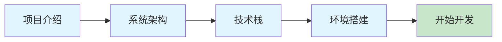

本章节将帮助你快速了解项目并搭建开发环境。

## 章节概览

::card-group
  ::card{title="项目介绍" icon="i-heroicons-information-circle" to="/getting-started/introduction"}
  了解项目背景、目标和核心功能
  ::

  ::card{title="系统架构" icon="i-heroicons-cube-transparent" to="/getting-started/architecture"}
  理解前后端分离架构和三级权限设计
  ::

  ::card{title="技术栈详解" icon="i-heroicons-wrench-screwdriver" to="/getting-started/tech-stack"}
  深入了解后端 Spring Boot 和前端 Vue 3 技术选型
  ::

  ::card{title="环境搭建" icon="i-heroicons-command-line" to="/getting-started/environment-setup"}
  配置开发环境并运行项目
  :: s
::

## 学习路径

## 推荐阅读顺序

| 步骤 | 文档 | 说明 | 预计时间 |
|------|------|------|----------|
| 1 | [项目介绍](/getting-started/introduction) | 了解项目背景和核心功能 | 10 分钟 |
| 2 | [系统架构](/getting-started/architecture) | 理解整体架构设计 | 15 分钟 |
| 3 | [技术栈详解](/getting-started/tech-stack) | 熟悉技术选型 | 10 分钟 |
| 4 | [环境搭建](/getting-started/environment-setup) | 配置并运行项目 | 30 分钟 |

## 快速链接

完成快速开始后，你可以：

- 深入 [后端开发](/backend) 了解 Spring Boot 实现
- 学习 [前端开发](/frontend) 掌握 Vue 3 开发
- 参考 [开发指南](/development-guide) 进行功能扩展
