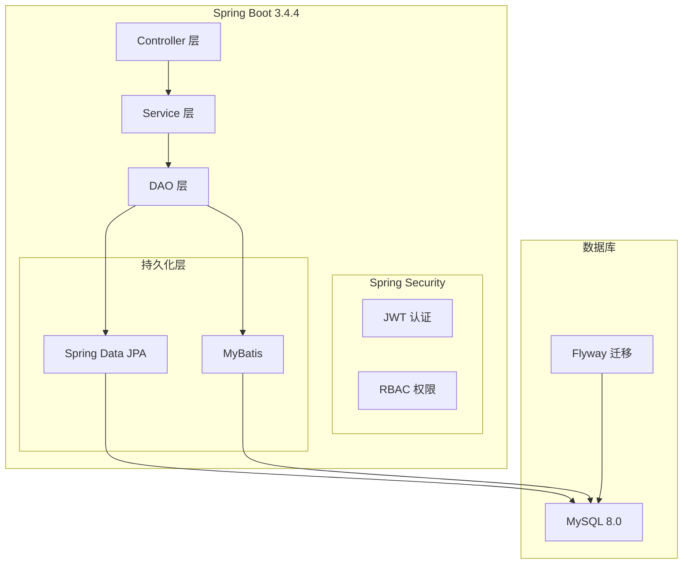
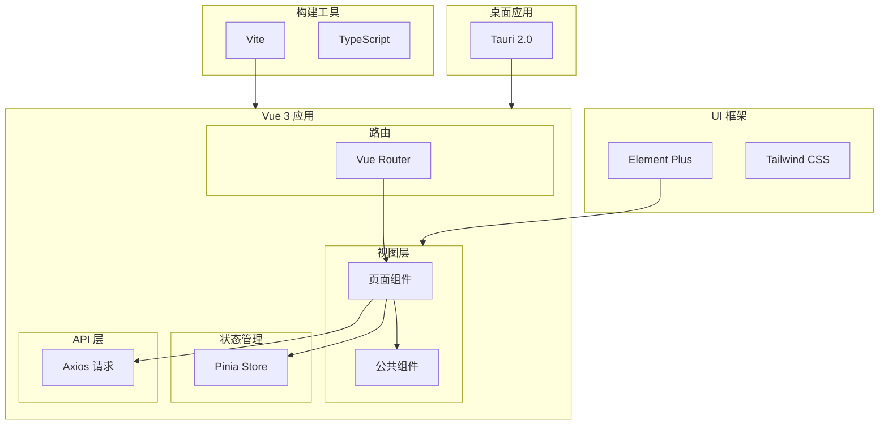

本项目采用现代化的前后端分离架构，选用成熟稳定的技术栈，确保系统的可维护性和可扩展性。

## 后端技术栈

### 核心框架

| 技术 | 版本 | 说明 |
|------|------|------|
| **Java** | 21 | 采用最新 LTS 版本，支持虚拟线程等新特性 |
| **Spring Boot** | 3.4.4 | 企业级应用开发框架 |
| **Spring Security** | 6.x | 安全框架，处理认证与授权 |
| **Spring Data JPA** | 3.x | ORM 框架，简化数据库操作 |
| **MyBatis** | 3.0.3 | SQL 映射框架，处理复杂查询 |

### 数据库与持久化

| 技术 | 版本 | 说明 |
|------|------|------|
| **MySQL** | 8.0+ | 主数据库 |
| **Flyway** | 10.x | 数据库版本管理与迁移 |
| **H2 Database** | - | 测试环境内存数据库 |

### 安全与认证

| 技术 | 版本 | 说明 |
|------|------|------|
| **JWT (jjwt)** | 0.12.6 | JSON Web Token 实现 |
| **Spring Security** | 6.x | 权限控制与认证 |

### 工具库

| 技术 | 版本 | 说明 |
|------|------|------|
| **Lombok** | - | 简化 Java 代码 |
| **ModelMapper** | 3.2.2 | 对象映射工具 |
| **Apache POI** | 5.3.0 | Excel 文件处理 |
| **SpringDoc OpenAPI** | 2.8.13 | API 文档生成 |
| **WebSocket** | - | 实时通信支持 |

### 后端架构图

## 前端技术栈

### 核心框架

| 技术 | 版本 | 说明 |
|------|------|------|
| **Vue.js** | 3.4.5 | 渐进式 JavaScript 框架 |
| **TypeScript** | 5.x | 类型安全的 JavaScript 超集 |
| **Vite** | 3.0 | 下一代前端构建工具 |
| **Pinia** | 2.1.7 | Vue 官方状态管理 |
| **Vue Router** | 4.x | 官方路由管理 |

### UI 框架

| 技术 | 版本 | 说明 |
|------|------|------|
| **Element Plus** | 2.6.3 | 基于 Vue 3 的组件库 |
| **Tailwind CSS** | 3.x | 原子化 CSS 框架 |
| **ECharts** | 5.6.0 | 数据可视化图表库 |

### 功能库

| 技术 | 版本 | 说明 |
|------|------|------|
| **Axios** | 1.6.8 | HTTP 请求库 |
| **WangEditor** | 5.1.23 | 富文本编辑器 |
| **Vue Cropper** | 1.1.4 | 图片裁剪组件 |
| **html2canvas** | 1.4.1 | 网页截图工具 |
| **jsPDF** | 2.5.2 | PDF 生成库 |

### 桌面应用

| 技术 | 版本 | 说明 |
|------|------|------|
| **Tauri** | 2.1.0 | Rust 桌面应用框架 |

### 前端架构图

## 开发工具

### 构建与打包

| 工具 | 说明 |
|------|------|
| **Maven** | 后端项目构建 |
| **Vite** | 前端项目构建 |
| **Tauri CLI** | 桌面应用打包 |

### 代码质量

| 工具 | 说明 |
|------|------|
| **ESLint** | JavaScript/TypeScript 代码检查 |
| **Prettier** | 代码格式化 |
| **SpringDoc** | API 文档自动生成 |

### 版本控制

| 工具 | 说明 |
|------|------|
| **Git** | 版本控制系统 |
| **Flyway** | 数据库版本管理 |

## 技术选型理由

### 为什么选择 Spring Boot 3.4 + Java 21？

1. **性能提升**：Java 21 虚拟线程显著提升并发性能
2. **长期支持**：Java 21 是 LTS 版本，企业级项目更稳定
3. **现代特性**：支持 Record、Pattern Matching 等新特性
4. **生态成熟**：Spring Boot 3.x 全面支持 Jakarta EE

### 为什么选择 Vue 3 + TypeScript？

1. **类型安全**：TypeScript 提供编译时类型检查
2. **组合式 API**：更好的代码组织和逻辑复用
3. **性能优化**：Vue 3 响应式系统重构，性能提升
4. **生态完善**：Pinia、Vite 等工具链完善

### 为什么使用 JPA + MyBatis 双持久化方案？

1. **JPA 优势**：简单 CRUD 操作代码量少，对象映射自动化
2. **MyBatis 优势**：复杂 SQL 查询更灵活，性能可控
3. **互补使用**：简单操作用 JPA，复杂查询用 MyBatis

### 为什么选择 Tauri 而非 Electron？

1. **包体积小**：Tauri 打包后只有几 MB，Electron 上百 MB
2. **性能更好**：使用系统 WebView，内存占用低
3. **安全性高**：Rust 编写，内存安全有保障
4. **原生体验**：更接近原生应用的体验

## 下一步

- [环境搭建指南](/getting-started/environment-setup) - 配置开发环境
- [后端项目结构](/backend/project-structure) - 了解后端代码组织
- [前端项目结构](/frontend/project-structure) - 了解前端代码组织
